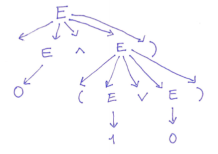
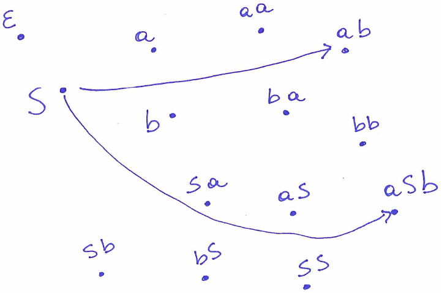
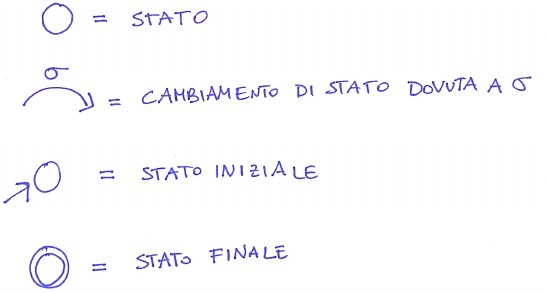
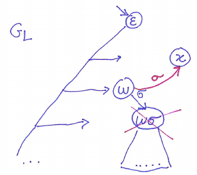
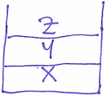
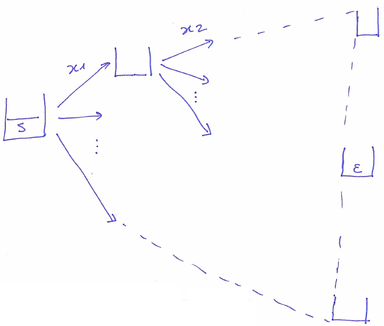

---
title: Linguaggi formali e automi
date: a.a. 2023-2024
author: Gabriele Fioco
geometry: margin=1.5in
toc: true
toc-depth: 3
numbersections: true
header-includes: |
    \usepackage{fancyhdr}
    \pagestyle{fancy}
...

# Concetti di base sui linguaggi

## Alfabeti, parole e insiemi di parole

Si danno le seguenti definizioni:

- Alfabeto: insieme finito di simboli, denotato con: $\Sigma = \{a_1, a_2, ..., a_k \}$.
- Parola su $\Sigma$: sequenza finita di simboli appartenenti a $\Sigma$. Una parola formata dallo stesso simbolo $n$ volte si può scrivere come $a^n, a \in \Sigma$.
- Parola vuota: parola non contenente nessun simbolo indicata col simbolo $\varepsilon$.
- Lunghezza di una parola: sia $W$ una parola, si denota con $|W|$ la sua lunghezza.
- $\Sigma^*$: insieme delle parole su $\Sigma$ compresa $\varepsilon$.
- $\Sigma^+$: insieme delle parole su $\Sigma$ esclusa $\varepsilon$. Vale $\Sigma^+ = \Sigma^* \backslash \{\varepsilon\}$.

## Prodotto di giustapposizione tra parole

Date le parole $x = x_1...x_n$ e $y = y_1...y_m$ si dice prodotto di $x,y$ la parola $x \cdot y = x_1...x_n y_1...y_m$.

Il prodotto ha le seguenti proprietà:

- Chiuso rispetto a $\Sigma^*$.
- Vale la proprietà ssociativa: $(x \cdot y) \cdot z = x \cdot (y \cdot z), \forall x,y,z \in \Sigma^*$.
- Ammette elemento neutro $e$: $e = \epsilon$
- $|x \cdot y| = |x| + |y|$

Dunque $(\Sigma^*, \cdot)$ forma un monoide.

## Prefisso e suffisso

Date $x,y \in \Sigma^*$ si definiscono:

- Prefisso: $x$ è prefisso di $y$ quando $y = x \cdot z$ per qualche $z \in \Sigma^*$
- Suffisso: $x$ è suffisso di $y$ quando $y = z \cdot x$ per qualche $z \in \Sigma^*$
- Fattore: $x$ è fattore di $y$ quando $y = z \cdot x \cdot w$ per qualche $z, w \in \Sigma^*$

Si osserva che data $x \in \Sigma^*$, le parole $x$ e $\varepsilon$ sono contemporaneamente prefisso, suffisso e fattore di $x$.

## Linguaggi

Un linguaggio $L$ sull'alfabeto $\Sigma$ è un qualunque sottoinsieme di $\Sigma^*$. Ovvero $L \subseteq \Sigma^*$. $L$ può avere quantità di parole finita o infinita.

Un linguaggio infinito del tipo $L = \{\varepsilon, a, aa, ..., a^n, ...\}$ si può scrivere anche $L = \{a^n : n \in \mathbb{N} \}$ dove $a^0 = \varepsilon$ oppure $L = \Sigma^* = \{a\}^* = a^*$

Casi particolari di linguaggi sono:

- Linguaggio vuoto: $L = \emptyset$.
- Liguaggio della parola vuota: $L = \{ \varepsilon \}$. 

## Operazioni sui linguaggi

Siano $A,B, L \subseteq \Sigma^*$ tre linguaggi si possono effettuare due tipi di operazioni: insiemistiche e tipiche dei linguaggi formali.

Le operazioni insiemistiche sono:

- Unione: $A \cup B = \{w \in \Sigma^* : w \in A \lor w \in B\}$
- Intersezione: $A \cap B = \{w \in \Sigma^* : w \in A \land w \in B\}$
- Complemento: $L^c = \{w \in \Sigma^* : w \notin L\}$

Si nota che le operazioni di unione e intersezioni di due linguaggi finiti danno un linguaggio finito, viceversa l'operazione di complemento su un linguaggio finito da un linguaggio infinito.

Le operazioni tipiche dei linguaggi formali sono:

- Prodotto: $A \cdot B = \{xy \in \Sigma^* : x \in A \land y \in B\}$
- Potenza: la potenza è definita ricorsivamente:
$$ L^k =
\biggl\{
\begin{aligned}
& \{ \varepsilon \} \ \ \ \ \ \ \ \ \ \ \text{se} \ k = 0 \\
& L \cdot L^{k-1} \ \ \text{se} \ k > 0
\end{aligned}
$$
- Chiusura di Kleene, di due tipi:
	+ $L^* = L^0 \cup L^1 \cup L^2 \cup\  ... \ \cup L^k \cup \ ... = \bigcup\limits_{k=0}^{\infty}L^k$
	+ $L^+ = L^1 \cup L^2 \cup\  ... \ \cup L^k \cup \ ... = \bigcup\limits_{k=1}^{\infty}L^k$

Con la chiusura di Kleene si può definire formalmente $\Sigma^* = \bigcup\limits_{k=0}^{\infty}\Sigma^k$. Infatti si osserva che $\Sigma^k$ è composto dalle parole di lunghezza $k$ componibili con $\Sigma$.

## Codici

Un linguaggio $L$ è un codice quando ogni parola in $L^+$ è decomponibile in un unico modo come prodotto di parole in $L$. Se ogni parola di $L$ non è prefisso di altre parole di $L$, allora $L$ si dice codice prefisso.

I codici prefissi sono importanti perchè ammettono un algoritmo di decodifica istantaneo.

# Linguaggi ricorsivi e ricorsivamente enumerabili

## Costruire un linguaggio

Un linguaggio $L$ può essere costruito con due metodi:

- Estensivo: $L = \{w_1, w_2, ..., w_n\}$ solo se $L$ è finito.
- Intensivo: $L = \{w \in \Sigma^* : P(w) = 1\}$ per $L$ infinito (ma anche finito).

Nel metodo intensivo $P$ esprime cosa debba soddisfare $w$ per appartenere ad $L$. Dunque ad ogni $L$ è associato un problema di decisione $P_L$, bisogna infatti decidere se $P(w)$ sia vero o falso.

$P_L$ è così definito:

- input: $w \in \Sigma^*$; 
- output: $1$ o $0$ a seconda che $P(w)$ sia vero/falso. 

Se $w$ appartiene ad $L$ allora $w$ soddisfa $P$, viceversa non soddisfa $P$. Siamo interessati a sapere se $P_L$ ammette una soluzione automatica e quindi trovare quella migliore.

Se $L$ ammette un sistema formale questo può essere di due tipi:

- Sistema riconoscitivo: si stabilisce se $w \in L$.
- Sistema generativo: si generano le parole di $L$.

## Riconoscitori

Un sistema riconoscitivo rappresenta un linguaggio $L \subseteq \Sigma^*$ utilizzando un algoritmo. Questo prende in ingresso uan parola $w \in \Sigma^*$ e da in uscita $1 \ \text{se} \ w \in L$, $0 \ \text{se} \ w \notin L$. 

L'algoritmo quindi calcola la funzione $X_L$ caratteristica di $L$ definita come segue:

$$
X_L(w) =
\biggl\{
\begin{aligned}
& 1 \ \text{se} \ w \in L \\
& 0 \ \text{se} \ w \notin L
\end{aligned}
$$

## Procedure e algoritmi

Un programma presenta due connotazioni: dal punto di vista sintattico è una parola binaria $w \in \{0, 1\}^*$ rappresentante il codice ASCII delle istruzioni; dal punto di vista semantico è una procedura. La funzione $F_w : \{0, 1 \}^* \rightarrow \{0, 1\}$ è la semantica del programma.

Si definisce procedura una sequenza finita di istruzioni che generano dei passi di calcolo che possono terminare dando un risultato.

Data una procedura rappresentata dal codice ASCII $w$, considerando per semplicità un input $x \in \{0, 1 \}^*$ si denotata con $F_w(x)$ il risultato della procedura su input $x$ e si usa la notazione:

- $F_w(x) \uparrow$: $w$ su input $x$ non termina.
- $F_w(x) \downarrow$: $w$ su input $x$ termina.
- $F_w(x) = 1$: $w$ su input $x$ da risultato 1
- $F_w(x) = 0$: $w$ su input $x$ da risultato 0

Si osserva che:

- l'input è una parola binaria $x \in \{0,1\}^*$;
- dal punto di vista sintattico anche $w \in \{0,1\}^*$, quindi $w$ può essere un input per un altro programma.

Un algoritmo è una procedura che termina su qualsiasi input.

## Linguaggi ricorsivi

Un linguaggio $L$ è detto ricorsivo quando esiste un algoritmo $w$ tale che:

$$
F_w(x)=
\biggl\{
\begin{aligned}
& 1 \ \text{se} \ x \in L \\
& 0 \ \text{se} \ x \notin L
\end{aligned}
$$

Dunque l'algoritmo $w$ calcola la funzione caratteristica $X_L$ di $L$ e termina sempre, permettendo di sapere per ogni $x$ se essa appartiene o meno ad $L$.

Inoltre se $L$ è ricorsivo:

- Il problema di decisione $P_L$ è detto decidibile.
- $L$ ammette un sistema riconoscitivo, si può dire se una parola appartiene o meno al linguaggio.

## Linguaggi ricorsivamente enumerabili

Un linguaggio $L$ è ricorsivamente enumerabile quando esiste una procedura $w$ tale che:

$$
F_w(x)=
\biggl\{
\begin{aligned}
& 1 \ \ \ \text{se} \ x \in L \\
& \uparrow \ \text{se} \ x \notin L
\end{aligned}
$$

Se $L$ è ricorsivamente enumerabile allora:

- Il problema $P_L$ è detto semidecidibile.
- $L$ ammette un sistema generativo, se ne possono elencare le parole.

## Teorema di inclusione dei linguaggi ricorsivi nei ricorsivamente enumerabili

### Enunciato

Se $L$ è un linguaggio ricorsivo, allora $L$ è un linguaggio ricorsivamente enumerabile.

### Osservazioni

Se $L$ ammette un sistema riconoscitivo allora ammette un sistema generativo.

### Dimostrazione

Per ipotesi $L$ è ricorsivo quindi ammette un algoritmo $A(x)$. Per definizione un linguaggio è ricorsivamente enumerabile quando ammette una procedura. Mostro quindi una procedura $P(x)$ per $L$.

Procedura $P(x)$:

```
y = A(x)

if (y = 1) {
	return 1
}

loop
```

Recupero il risultato dell'algoritmo $A(x)$ che darà sempre $1$ o $0$. Se il risultato è $1$ allora $x \in L$ e ritorno 1, se il risultato è $0$ allora $x \notin L$ e vado in loop.

## Teorema: il linguaggio complemento di un linguaggio ricorsivo è ricorsivo

### Enunciato

Se $L$ è ricorsivo allora $L^C$ è ricorsivo.

### Dimostrazione

Per ipotesi $L$ è ricorsivo quindi ammette un algoritmo $A(x)$. Devo costruire un algoritmo $A'(x)$ per $L^C$.

$A'(x)$:

```
return 1 - A(x);
```

# Problema dell'arresto

## Interpreti

Un interprete è un programma $u$ che prende in input la coppia (programma, dato) e da in uscita il risultato dell'esecuzione del programma sul dato. La funzione che ne rappresenta il comportamento è:

$$
F_u(w\$x) =
\biggl\{
\begin{aligned}
& F_w(x) \ \text{se} \ w \ \text{è un programma} \\
& \bot \ \text{altrimenti}
\end{aligned}
$$

L'interprete è un programma sempre costruibile.

## Linguaggio dell'arresto ristretto

Dato un programma $w$ e un dato $x$ ci si chiede se $F_w(x) \downarrow$. Questo problema è descritto dal linguaggio dell'arresto che si può dimostrare essere indecidibile. Per fare ciò però va prima costruito il linguaggio dell'arresto ristretto. 

Il linguaggio dell'arresto ristretto si descrive come $D = \{x \in \{0,1\}^* : F_u(x \$ x) \downarrow\}$. Quindi sono quei programmi che su input uguali a se stessi terminano l'esecuzione.

Si può definire il complemento di $D$ come $D^C = \{x \in \{0,1\}^* : F_u (x \$ x) \uparrow\}$

## Teorema: il linguaggio dell'arresto ristretto è ricorsivamente enumerabile ma non ricorsivo

### Enunciato

Il linguaggio dell'arresto ristretto è ricorsivamente enumerabile ma non è ricorsivo. Per dimostrarlo si mostrano i tre punti:

1) $D$ è ricorsivamente enumerabile.
2) $D$ non è ricorsivo.
3) $D^C$ non è ricorsivamente enumerabile. 

### Dimostrazione 1

Per dimostrare che $D$ sia ricorsivamente enumerabile bisogna esibirne una procedura.

Procedura $RICNUM(x \in \{0,1\}^*)$:

```
y = F_u(x$x)
return 1
```

L'interprete $F_u$ esegue il programma $x$ su sè stesso (definizione di linguaggio dell'arresto ristretto). Se termina ritorna $1$, altrimenti rimane in loop.

### Dimostrazione 2

Si assume per assurdo che $D$ sia ricorsivo. Quindi esiste un algoritmo $ASSURDOA(x)$ per $D$.

Algoritmo $ASSURDOA(x)$:

```
if (x \in D)  {
	return 1 - F_u(x$x)
} else {
	return 0
}
```

Il codice precedente che codifica $ASSURDOA$ viene chiamato $e$.

Si passa in input ad $ASSURDOA$ la parola $e$ stessa. Quindi $ASSURDOA(e) = F_e(e) = F_u(e \$ e) (\star)$. Si considerano due casi: $e \in D$ e $e \notin D$.

Se $e \in D$ allora $F_u(e \$ e) \downarrow = \{ 0, 1 \}$. Per la $\star$ risulta $ASSURDOA(e) = F_u(e \$ e) = 1 - F_u(e \$ e)$ che è una contraddizione, infatti per $F_u(e \$ e) = 1$ risulta $1 = 0$; er $F_u(e \$ e) = 0$ risulta $0 = 1$.

Se $e \notin D$ allora $F_u(e \$ e) \uparrow$. Per la $\star$ vale $ASSURDOA(e) = F_e(e) = 0$. Ma $F_e(e) \uparrow$ quindi si ottiene $\uparrow = 0$ che è una contraddizione.

Entrambi casi sono assurdi e si conclude che $e$ non esiste cioè non posso creare l'algoritmo riconoscitivo per D.

### Dimostrazione 3

Si assume per assurdo che $D^C$ sia ricorsivamente enumerabile. Quindi esiste una procedura $z$ per $D^C$; inoltre $D$ è stato dimostrato essere ricorsivamente enumerabile quindi esiste una procedura $y$ per $D$.

Per definizione di procedura:

- $z$ termina se $x \in D^C$, va in loop se $x \notin D^C$;
- $y$ termina se $x \in D$, va in loop se $x \notin D$.

Dunque data una parola $w$ questa si può dare in input a $y$ e a $z$: se $y$ termina $w$ è in $D$; se $z$ termina allora $w$ non è in $D^C$ e quindi è in $D$. Abbiamo quindi appena creato un algoritmo per $D$ che è stato dimostrato non essere ricorsivo, quindi è assurdo, quindi $D^C non è ricorsivamente enumerabile. Si scrive il codice di questo algoritmo.

Algoritmo $ASSURDOB(x)$:

```
k = 1; // numero di passi
while (z(x) non termina in k passi AND y(x) non termina in k passi) {
	k = k + 1
}

if (ha terminato y) {
	return 1
} else {
	return 0
}
```

## Linguaggio dell'arresto

Il linguaggio dell'arresto si definisce come $A = \{w \$ x \in \{0,1\}^* : F_w(x) \downarrow\} = \{ w \$ x \i  \{ 0,1 \}^* : F_u(w \$ x) \}$

## Teorema: il linguaggio dell'arresto non è ricorsivo

### Enunciato

$A$ non è ricorsivo.

Di conseguenza il problema dell'arresto è indecidibile.

### Dimostrazione

Per assurdo $A$ sia ricorsivo quindi ammette algoritmo $ASSURDOC$. Se questo algoritmo esiste allora termina con input $x \$ x$.

$ASSURDOC(x)$:

```
if (x$x \in A) {
	return 1
} else {
	return 0
}
```

Ma ASSURDOC è un algoritmo per $D$ che si è dimostrato essere ricosivamente enumerabile. Quindi è assurdo, quindi $A$ non ammette un algoritmo e quindi non è ricorsivo.

## Risultati più importanti della teoria della calcolabilità

Dalle precedenti trattazioni sui linguaggi ricorsivi e ricorsivamente enumerabili e sul problema dell'arresto si può concludere che:

- Esiste un linguaggio ricorsivamente enumerabile ma non ricorsivo.
- Esiste un linguaggio nè ricorsivo nè ricorsivamente enumerabile.

Queste conclusioni forniscono degli importanti risultati teorici:

- Non è possibile verificare per via automatica la correttezza semantica dei programmi.
- Non è possibile verificare per via automatica l'equivalenza di due programmi.
- Non è possibile verificare per via automatica la terminazione di un programma (il problema dell'arresto non è decidibile).
- Ci sono teoremi matematici non dimostrabili.

# Grammatiche

## Definizione

Una grammatica è una quadrupla $G = <\Sigma, M, S, P>$ dove:

- $\Sigma$ insieme finito di simboli terminali (alfabeto)
- $M$ insieme finito dei metasimboli (le variabili)
- $S \in M$: assioma o simbolo di partenza
- $P$: insieme finito delle regole di produzione

Si osserva che deve valere $\Sigma \cap M = \emptyset$.

## Regola di produzione

Una regola di produzione è un elemento della forma $\alpha \rightarrow \beta$ dove $\alpha \in (\Sigma \cup M)^+, \beta \in (\Sigma \cup M)^*$.

Una regola di produzone si dice dipendente dal contesto se è in formato $\alpha \setminus \{S\} \rightarrow \beta$.

### Passo di derivazione

Si dice che $w$ è derivabile da $z$ in un passo e si scrive $z \Rightarrow w$ quando dati $z = x \alpha y$ e $w = x \beta y$ vale $(\alpha \rightarrow \beta) \in P$.

Ovvero da $x \alpha y \Rightarrow x \beta y$ grazie a $\alpha \rightarrow \beta$.

### Derivazione in zero o più passi

$w$ si dice derivabile da $z$ in zero o più passi e si scrive $z \Rightarrow^* w$ quando $w = z$ oppure $\exists k \in \mathbb{N} \setminus \{0\} \ \exists w_1, w_2,...,w_k : z \Rightarrow w_1 \Rightarrow w_2 \Rightarrow ... \Rightarrow w_k = w$

## Grammatiche come generatori di linguaggi

Le grammatiche generano linguaggi. Il linguaggio $L$ generato da una grammatica $G$ si scrive $L(G) = \{w \in \Sigma^* : S \Rightarrow^* w\}$.

Osservazioni:

- Un linguaggio può ammettere più grammatiche che lo generano.
- Due grammatiche $G_1$ e $G_2$ si dicono equivalenti se $L(G_1) = L(G_2)$.
- È possibile individuare per un dato linguaggio la grammatica migliore.

## Albero di derivazione

Dato un linguaggio $L$ generato da una grammatica $G$ e una parola $w \in L$, si può disegnare un albero di derviazione per $w$ che segue 4 regole:

1. Radice = assioma
2. Nodi interni = variabili
3. Foglie = simboli
4. È ammesso il sottoalbero con radice $A$ e foglie $B_1, ..., B_k$ solo se $A \rightarrow B_1 ... B_k$ è una regola di $G$

{ width = 250px }

Si osserva che per avere un albero did erivazioen una grammatica deve essere di tipo 2.

## Teorema: le grammatiche generano linguaggi ricorsivamente enumerabili

### Enunciato

Un linguaggio $L$ è ricorsivamente enumerabile $\iff$ $L$ è generato da una grammatica $G$

# Classificazione di Chomsky

## Grammatiche di tipo $k$

Data una grammatica $G = <\Sigma, M, S, P>$ essa si può classificare come:

- Tipo 0: nessun vincolo sulle regole. Qualsiasi grammatica è di tipo 0.
- Tipo 1: ogni regola $\alpha \rightarrow \beta$ è tale che $|\beta| \geq |\alpha|$; è ammessa la regola $S \rightarrow \varepsilon$ solo se $S$ non compare a destra di nessun'altra regola.
- Tipo 2: ogni regola $\alpha \rightarrow \beta$ è tale che $\alpha \in M$.
- Tipo 3: ogni regola è del tipo $A \rightarrow \sigma B$, $A \rightarrow \sigma$ o $A \rightarrow \varepsilon$ dove $A,B \in M$ e $\sigma \in \Sigma$

All'aumentare dei vincoli una grammatica diventa più semplice, infatti un tipo 0 senza vincoli può avere regole arbitrariamente complesse a differenza di un tipo 3.

## Linguaggi di tipo $k$ e insiemi $R_k$

Un linguaggio si dice di tipo $k$ se ammette $G$ di tipo $k$ che lo genera. Si definisce l'insieme dei linguaggi di tipo $k$, $R_k = \{L \subseteq \Sigma^* : L \ \text{è di tipo} \ k\}$. I linguaggi in $R_k$ si chiamano:

- $R_0$: linguaggi ricorsivamente enumerabili
- $R_1$: linguaggi dipendenti dal contesto/ricorsivi
- $R_2$: linguaggi liberi dal contesto
- $R_3$: linguaggi regolari

Un linguaggio di tipo $R_k$ è anche di tipo $R_{k -1}$ ovvero $R_3 \subseteq R_2 \subseteq R_1 \subseteq R_0$. Il teorema successivo dimostra che l'inclusione è propria.

Si osservano due fatti:

- Se $L$ è di tipo $k$ allora anche $L \cap \{\varepsilon \}$ è di tipo $k$. Data $G$ di tipo $k$ che genera $L$ si può costruire $G'$ di tipo $k$ cambiando l'assioma $S$ con $S'$ e introducendo le regole $S' \rightarrow S$ e $S' \rightarrow \varepsilon$.
- Se $G$ è una grammatica di tipo $k = 2$ o $k = 3$, allora posso ottenere una grammatica $G'$ equivalente di tipo $k$ che rispetta l'assioma $(S)$.

## Teorema sugli $R_k$

### Enunciato

$R_3 \subset R_2 \subset R_1 \subset R_0$

Ovvero una grammatica di tipo $k$ è anche di tipo $k - 1$ ed esistono linguaggi di tipo $k$ che non sono di tipo $k + 1$ (l'inclusione è propria).

### Dimostrazione: $\exists L_2 \in R_2$ ma $L_2 \notin R_3$

Dato $L_2 = \{a^n b^n : n > 0\}$ è generato dalla grammatica $G = <\{a, b\}, \{S, B, C\}, \{S \rightarrow aSb, S \rightarrow ab\}, S>$ che è di tipo 2.
 
Si dimostrerà più avanti con gli automi a stati finiti che $L_2$ non ammette grammatica di tipo 3.

### Dimostrazione: $\exists L_1 \in R_1$ ma $L_1 \notin R_2$

Dato $L_1 = \{a^n b^n c^n : n > 0\}$ è generato dalla grammatica $G = <\{a, b, c\}, \{S\}, \{S \rightarrow aSBC, S \rightarrow aBC, CB \rightarrow BC, aB \rightarrow ab, bB \rightarrow bb, bC \rightarrow bc, cC \rightarrow cc\}$ che è di tipo 1.

Si dimostrerà più avanti che $L_1 \notin R_2$ perchè non soddisfa il pumping lemma per i linguaggi di tipo 2.

### Dimostrazione: $\exists L_0 \in R_0$ ma $L_0 \notin R_1$

$L_0 = D = \{x \in \{0, 1\}^* : F_u(x\$x) \downarrow \}$

Abbiamo dimostrato che $L_0 = D$ (il linguaggio dell'arresto ristretto) è ricorsivamente enumerabile ma non ricorsivo. Si può dimostrare che i linguaggi in $R_1$ sono ricorsivi quindi $D \notin R_1$.

## Grafo di derivazione

Data una grammatica $G = <\Sigma, M, S, P>$ si definisce grafo di derivazione per una parola $x \in Sigma^*$ la tupla $GR(x) = <V_x, E_x>$ con:

- $V_x = \{ y \in (\Sigma \cup M)^* : |y| \leq |x| \}$ (vertici)
- $E_x = \{ (y, y') : y \Rightarrow^* y' \}$ (archi)

{ width=250px }

Si può creare un algoritmo per stabilire se $x$ appartiene a $L$:

Algoritmo $W(x)$:

```
COSTRUISCI_GR(x)

if (esiste un cammino dall'assioma a $x$ nel grafo) {
	return 1
} else {
	return 0
}
```

Dunque il problema della generazione di $x$ diventa cercare un cammino nel grafo di $x$.

## Teorema: i linguaggi in $R_1$ sono ricorsivi

### Enunciato

Sia $L$ un linguaggio, se $L \in R_1$ allora $L$ è un linguaggio ricorsivo.

### Dimostrazione (TODO)

## Forme equivalenti per il tipo 3 (TODO)

Una grammatica $G = <\Sigma, M, S, P>$ per $L$ è di tipo 3 per definizione se vale la (i), che è equivalente a (ii) e (iii):

- (i) ogni regola di produzione è del tipo $A \rightarrow \sigma B$, $A \rightarrow \sigma$ o $A \rightarrow \varepsilon$ con $A,B \in M$ e $\sigma \in \Sigma$.
- (ii) ogni regola di produzione è del tipo $A \rightarrow \sigma B$ o $A \rightarrow \varepsilon$ con $A,B \in M$ e $\sigma \in \Sigma$.
- (iii) ogni regola di produzione è del tipo $A \rightarrow \sigma B$ o $A \rightarrow \sigma$ con $A,B \in M$ e $\sigma \in \Sigma$. Solo se $\varepsilon \notin L$.

Si può passare da (i) a (ii) eliminando le regole del tipo $A \rightarrow \sigma$ attraverso questi passi:

1. Introduco una nuova variabile $x \in M$.
2. Introduco la regola $x \rightarrow \varepsilon$
3. Ogni regola del tipo $A \rightarrow \sigma$ si trasforma in $A \rightarrow \sigma x$

Si può assare da (i) a (iii) eliminando le regole del tipo $A \rightarrow \varepsilon$ attraverso questi passi:

1. Per ogni regola del tipo $A \rightarrow \sigma B$ con $(B \rightarrow \varepsilon) \in P$ introduco una regola $A \rightarrow \sigma$.
2. Elimino ogni regola del tipo $A \rightarrow \varepsilon$.

# Automi a stati finiti

## Introduzione

Concettualmente un automa a stati finiti può essere visto come un sistema che modella un robot che si muove su una griglia. Il robot è telecomandato da segnali che ne indicano la direzione. 

Le postazioni nella griglia sono i possibili stati dell'automa; i segnali $(N, S, E, O)$ inviati all'automa sono gli input. La posizione prossima del robot dipende dalla posizione attuale e dal simbolo inviato. Un percorso sulla griglia diventa una parola.

Per noi gli automi sono riconoscitori di linguaggi formali di tipo 3. Un automa a stati finiti $A$ ha $w \in \Sigma^*$ in input e un bit $x \in \{0,1\}$ in uscita che indica se $w$ è rifiutata o accettata.

$A$ si trova in un particolare stato in un dato istante $t$. Inizialmente si trova in uno stato iniziale fissato $q_0$.

In funzione del simbolo letto e dello stato attuale $A$ cambia stato. Si definisce la funzione $\delta(q, \sigma) = \text{stato prossimo di} \ A \ \text{essendo in} \ q \ \text{e leggendo sigma}$

Una volta letta l'intera parola $w$, $A$ raggiunge uno stato $p$. L'uscita dipende da $p$. Si definisce la funzione di uscita $\lambda(p) = \{0, 1\}$.

## Definizione

Un automa a stati è una tupla $A = <\Sigma, Q, \delta, q_0, \lambda / F>$ dove:

- $\Sigma$: alfabeto di input
- $Q$: insieme degli stati
- $\delta : Q \mathbb \times \Sigma \rightarrow Q$: funzione di transizione
- $q_0 \in Q$: stato iniziale
- $\lambda$ oppure $F \subseteq Q$:
	+ $\lambda : Q \rightarrow \{0, 1\}$: funzione di uscita
	+ $F$: stati finali o accettanti

Se $Q$ è finito $A$ si dice a stati finiti.

Si osserva che:

- Da $\lambda$ posso avere $F$. Definisco $F = \{q \in Q : \lambda(q) = 1\}$.
- Da $F$ posso avere $\lambda$. Definisco $\lambda : Q \rightarrow \{0, 1\}$ come:

$$
\lambda(q) =
\biggl\{
\begin{aligned}
& 1 \ \text{se} \ q \in F \\
& 0 \ \text{se} \ q \notin F 
\end{aligned}
$$

## Rappresentare la funzione di transizione

Posso rappresentare la funzione di transizione $\delta$ per un'automa $A$ in forma tabellare o con un diagramma degli stati.

La funzione $\delta$ in formata bellare si può rappresentare come segue, mettendo sulle righe gli stati $Q$ e sulle colonne i valori dell'alfabeto $\Sigma$.

| $\delta$ | $\sigma_1$ | $\sigma_2$ | ... | $\sigma_j$              | ... | $\sigma_h$ |
|----------|------------|----------|-----|-----------------------|-----|----------|
| $q_0$     |            |          |     |                       |     |          |
| $q_1$     |            |          |     |                       |     |          |
| ...      |            |          |     |                       |     |          |
| $q_i$     |            |          |     | $\delta(q_i, \sigma_j)$ |     |          |
| ...      |            |          |     |                       |     |          |
| $q_k$    |            |          |     |                       |     |          |

## Diagramma di transizione degli stati

Si può disegnare un diagramma di transizione degli stati che descrive $A$ e $\delta$. Il diagramma comprende i seguenti elementi:

{ width=350px }

## Funzione di transizione sulle parole

Si può introdurre una funzione di transizione sulle parole chiamata $\delta^*$.

$\delta^*: Q \times \Sigma^* \rightarrow Q$, definita induttivamente:

$$
\delta^* =
\biggl\{
\begin{aligned}
& \delta^*(q, \varepsilon) = q \\
& \delta^*(q, w \sigma) = \delta(\delta^*(q, w), \sigma) \ \text{con} \ w \in \Sigma^*, \sigma \in \Sigma
\end{aligned}
$$

## Linguaggio riconosciuto da un automa

Gli automi a stati finiti sono riconoscitori di linguaggi: una parola è accettata se partendo dallo stato iniziale induce un cammino verso uno stato finale.

Un linguaggio riconosciuto da un automa $A$ è formalmente definito come $L(A) = \{w \in \Sigma^* : \delta^*(q_0, w) \in F\} = \{w \in \Sigma^* : \gamma(\delta^*(q_0, w)) = 1\}$

## Stati particolari

Dai due stati $q, p \in Q$ si definisce:

- Stato trappola: $q$ si dice stato trappola se valgono:
	+ $\forall \sigma \in \Sigma \ (\delta (q, \sigma) = q)$
	+ $q \notin F$
- Stato osservabile: $p$ si dice stato osservabile se $\exists w \in \Sigma^* \ (\delta^* (q_0, w) = p)$
- Stati indistinguibili: $q$ e $p$ si dicono stati indistinguibili se $\forall w \in \Sigma^* \ \gamma(\delta^*(q, w)) = \gamma(\delta^*(p, w))$. Si denota con $q \approx p$
- Stati distinguibili: $q$ e $p$ si dicono stati distinguibili se $\exists w \in \Sigma^* \ \gamma(\delta^*(q, w)) \neq \gamma(\delta^*(p, w))$. Si denota con $q \not\approx p$.

## Relazione di indistinguibilità su $Q$

Data la relazione di indistinguibilità denotata precedentemente $\approx$, è una relazione binaria su $Q$ di equivalenza, infatti valgono:

- Riflessiva: $\forall q \in Q, \ q \approx q$
- Simmetrica: $\forall q, q' \in Q, \ q \approx q' \implies q' \approx q$
- Transitiva: $\forall q, q', q'' \in Q, \ q \approx q' \land q' \approx q'' \implies q \approx q''$

Pertanto $\approx$ induce una partizione in classi $c_i$ su $Q$:

- $\forall i c_i, \ \neq \emptyset$
- $\forall i,j : i \neq j, \ c_i \cap c_j = \emptyset$
- $\bigcup\limits_i c_i = Q$

Una classe di equivalenza che contiene $q$ si denota con $[q]_{\approx}$.

## Automa equivalente

Sia $A = <\Sigma, Q, q_o, \delta, F>$ un automa.

Posso costruire un automa equivalente $A_{\approx} = <\Sigma, Q_{\approx}, [q_0]_{\approx}, \delta_{\approx}, F_{\approx}>$ dove:

- $Q_{\approx}$ : contiene le classi di equivalenza degli stati
- $F_{\approx} = \{[q]_{\approx} : q \in F\}$
- $\delta_{\approx} : Q_{\approx} \times \Sigma \rightarrow Q_{\approx} \ \text{con} \ \delta_{\approx}([q]_{\approx}, \sigma) = [\delta(q, \sigma)]_{\approx}$

# Sintesi di automi

Dato un linguaggio $L$ si vuole ricavare un automa $A$ per $L$. Ci si chiede com'è fatto l'automa massimo e come ricavarne l'automa minimo (il nostro obiettivo).

## Definizione e costruzione dell'automa massimo

L'automa massimo per $L$ è l'automa col maggior numero di stati, si denota con $G_L$.

Per costruirlo definisco $G_L = <\Sigma^*, \Sigma, [ \varepsilon ], \delta_{G_L}, F_{G_L}>$, dove:

- $F_{G_L} = \{[w] \in Q : w \in L\}$
- $\delta_{G_L} ([w], \sigma) = [w \sigma]$

L'idea per ottenere l'automa massimo è raggiungere uno stato sempre diverso per ogni parola in input, ovvero $\forall w, w' \in \Sigma^* \delta^* (q_0, w) \neq \delta^*(q_0, w') \ (Q = \Sigma^*)$. Per non perdere stati tutti gli elementi di $Q$ devono essere osservabili: $\forall q \in Q \exists w : q = \delta^*(q_0, w)$

La struttura dell'automa massimo è la stessa per ogni $L$ ma cambiano gli stati finali. L'automa massimo ha infiniti stati.

## Definizione e costruzione dell'automa minimo

L'automa minimo per $L$ è l'automa col minor numero di stati che genera $L$. Si denota con $M_L$.

Per ottenere l'automa minimo si possono utilizzare due tecniche:

- Si usa l'automa massimo $G_L$
- Si usa un generico automa $A$ per $L$ a stati finiti

## Teorema: l'automa massimo equivalente per $L$ è l'automa minimo per $L$

### Enunciato

Sia $L$ un linguaggio, allora $G_{L \approx} = M_L$

### Dimostrazione (TODO)

## Teorema di irriducibilità di un automa con soli stati osservabili e distinguibili

### Enunciato

Sia $A$ un automa a stati finiti per $L$ t.c:

- Gli stati di $A$ siano tutti osservabili
- Gli stati di $A$ siano tutti distinguibili

Allora $A$ è l'automa minimo per $L$.

### Corollario

Dato un'automa generico $A$ per $L$, se $A$ ha tutti stati osservabili allora $A_{\approx} = M_L$.

### Dimostrazione (TODO)

## Algoritmi di sintesi ottima di automi

Per sintetizzare un'automa $A$ per un linguaggio $L$ esistono due tecniche:

1. Se ho $A$ a stati finiti per $L$ elimino gli stati non osservabili e costruisco $A_{\equiv} = M_L$
2. Se non ho $A$ per $L$ costruisco $G_L$ automa massimo e poi $G_{L \equiv} = M_L$

Algoritmi:

1. Si possono confrontare gli stati seguendo un'ordine casuale perchè gli stati sono finiti.
2. Devo applicare un algoritmo sui confronti ben preciso perchè gli stati sono infiniti. Algoritmo per $G_{L \equiv}$:
	- Si parte dalla radice e si visitano i nodi (stati) in ampiezza (ovvero si controllano i nodi sullo stesso livello).
	- Si confronta il nodo attuale con i nodi precedentemente visitati verificando se i nodi sono indistinguibili oppure no.
	- Sia $[w \sigma]$ ($w \in \Sigma^*$ e $\sigma \in \Sigma$), il nodo attuale. Se $[w \sigma]$ è indistinguibile dal nodo $[x]$ allora:
		+ Cancello $[w \sigma]$ e il relativo sottoalbero
		+ Resta pendente l'arco uscente da $[w]$ etichettato con $\sigma$, che si ridireziona verso $[x]$.

{ width=300px }

Si osserva che:

- Lo stato iniziale resta $[\varepsilon]$
- Gli stati finali sono i sopravvissuti etichettati con parole di $L$

## Teorema: un automa a stati finiti riconosce un linguaggio di tipo 3

### Enunciato

Un linguaggio $L$ è generato da una grammatica $G$ di tipo 3 $\leftrightarrow$ $L$ è riconosciuto da un automa $A$ a stati finiti.

### Corollario: linguaggio in $R_2$ ma non in $R_3$

Si può ora dimostrare che esiste un linguaggio $L \in R_2$ ma $L \notin R_3$. In particolare $L = \{a^n b^m \}$.

L'automa $G_{L \approx}$ ha infiniti stati, quindi $L$ non ammette un automa a stati finiti, quindi non è di tipo 3.

### Dimostrazione $\Leftarrow$ (dall'automa a stati finiti alla grammatico di tipo 3) (TODO CORRETTEZZA)

Dall'automa $A = <\Sigma, Q, q_o, \delta, F>$ costruisco una grammatica di tipo 3 $G = <T, V, S, P>$ con:

- $T = \Sigma$
- $V = Q$
- $S = q_o$
- Gli elementi di $P$ sono i $q$ tali che:
	+ $q \rightarrow \varepsilon \iff q \in F$
	+ $q \rightarrow \sigma P \iff \delta(q, \sigma) = P$

Si mostra ora che questa costruzione è corretta.

### Dimostrazione $\Rightarrow$ (dalla grammatica di tipo 3 all'automa a stati finiti)

Inverto la costruzione precedente, che si è dimostrato essere equivalente.

Dalla grammatica di tipo 3 $G = <\Sigma, M, S, P>$ costruisco l'automa $A = <T, Q, q_o, \delta, F>$ con:

- $T = \Sigma$
- $Q = M$
- $q_0 = S$
- $\delta$ definita come: $\delta(A, \sigma) = B \iff A \rightarrow \sigma B$
- $F = \{ A : A \rightarrow \varepsilon \in P \}>$

# Automi a stati finiti non deterministici

## Definizione

Un automa a stati finiti non deterministico (NFA) è una tupla $A = <\Sigma, Q, \delta, q_0, F>$ con:

- $\Sigma$: alfabeto finito di input
- $Q$: insieme degli stati
- $R: Q \times \Sigma \times Q \rightarrow \{0, 1\}$: relazione di transizione definita come:
$$
R(q, \sigma, P) =
\biggl\{
\begin{aligned}
& 1 \ \text{se} \ q \rightarrow^{\sigma} P \\
& 0 \ \text{altrimenti}
\end{aligned}
$$
- $q_0 \in Q$: stato iniziale
- $F \subseteq Q$: insieme degli stati finali o accettanti

Un automa a stati finiti $A = <\Sigma, Q, \delta, q_o, \lambda / F>$ è un particolare caso di NFA detto automa a stati finiti deterministico (DFA) in cui $R$ è una funzione $\delta: Q \times \Sigma \rightarrow Q$ ed ogni parola induce un singolo cammino. Viceversa in un NFA una parola $w$ in input ad $A$ potrebbe portare a più cammini differenti.

## Linguaggio riconosciuto da NFA

Dato un $A$ di tipo NFA una parola è accettata da $A$ se esiste un cammino che porta a uno stato finale. Il linguaggio riconosciuto è dato dalle parole che rispettano il criterio di accettazione.

Con un DFA riconosco una parola; con un NFA riconosco testi che contengono una certa parola.

Si denota con $L(DFA)$ le classi dei linguaggi riconosciuti da DFA; si denota con $L(NFA)$ la classe dei linguaggi riconosciuti da NFA.

## Teorema: ogni linguaggio riconosciuto da un NFA è riconosciuto da un DFA equivalente

### Enunciato

Per ogni $L$ riconosciuto da un automa NFA esiste un automa DFA equivalente che lo riconosce.

### Corollario

$R_3 = L(DFA) = L(NFA)$

### Dimostrazione (da NFA a DFA)

Dato un NFA $A = <\Sigma, Q, q_o, R, F>$ costruisco il DFA equivalente $A' = <\Sigma, 2^Q, \{ q_o \}, \delta_R, F'>$ con

- $2^Q$ insieme dei sottoinsiemi di $Q$.
- $\delta_R : 2^Q \times \Sigma \rightarrow 2^Q$ definita come $\delta_R (x, \sigma) = \bigcup \{ p \in Q : R(q, \sigma, P) = 1 \}$
- $F' = \{ y \in 2^Q : y \cap F \neq \emptyset \}$

# Espressioni regolari

## Definizione

Un'espressione regolare su $\Sigma$ si definisce induttivamente come:

- Base: $\emptyset$, $\varepsilon$, $\sigma \in \Sigma$ sono espressioni regolari
- Passo: siano $p$ e $q$ espressioni regolari, allora $(p + q)$, $(p \cdot q)$ e $(p^*)$ sono espressioni regolari.

Un espressione regolare denota un linguaggio induttivamente:

- Base: $\emptyset$ denota il linguaggio $\emptyset$; $\varepsilon$ denota il linguaggio $\{ \varepsilon \}$; $\sigma$ denota il linguaggio $\{ \varepsilon \}$
- Passo: siano $p$ e $q$ espressioni regolari che denotano rispettivamente i linguaggi $L_p$ e $L_q$, allora:
	+ $p + q$ denota il linguaggio $L_p \cup L_q$
	+ $p \cdot q$ denota il linguaggio $L_p \cdot L_q$
	+ $p^*$ denota il linguaggio $L_p^*$

## Teorema di Kleene

### Enunciato

Un linguaggio $L$ è denotato da un'espressione regolare $\iff$ $L$ è riconosciuto da un DFA

### Dimostrazione $\Rightarrow$ (dall'espressione regolare al DFA) (TODO)

### Dimostrazione $\Leftarrow$ (dal DFA all'espressione regolare)

Dato un DFA $A = <\Sigma, Q, q_o, \delta, F>$ con $Q = \{ q_0, ..., q_k \}$ posso associargli i seguenti DFA:

- $A_0 = <\Sigma, Q, q_0, \delta, F>$
- ...
- $A_k = <\Sigma, Q, q_k, \delta, F>$

Ogni DFA $A_i$ riconosce un linguaggio denotato dall'espressione regolare $X_i = \sum \sigma X_j [+ \varepsilon]$ tale che:

- $\delta (q_i, \sigma) = q_j$
- si inserisce $[+ \varepsilon] \iff q_i \in F$

Dunque $L(A) = L(A_0) = X_0$

Gli $x_i$ danno un sistema di $k + 1$ equazioni e $k + 1 incognite$.

$$
\begin{cases}
  x_0 = \sum \sigma X_j [+ \varepsilon] \\
       ... \\
  x_k = \sum \sigma X_j [+ \varepsilon]
\end{cases}
$$

Il sistema si risolve impostando equazioni del tipo $x = Ax + B$, la cui soluzione è $x = A^* B$. Se $\varepsilon \in A$ allora la soluzione è unica; se $\varepsilon \notin A$ allora è la soluzione minima.

## Chiusura dei linguaggi regolari

I linguaggi regolari sono chiusi rispetto alle operazioni $\text{complemento}$, $+ = \cup$, $\cdot$ e $*$

# Grammatiche ambigue

## Definizione

Una grammatica $G$ di tipo 2 è detta ambigua se genera una parola che ammette due alberi di derivazione. $G$ è detta non ambigua se ogni parola generata da $G$ ammette un solo albero di derivazione.

## Linguaggi interamente ambigui

Un linguaggio si dice interamente ambiguo se ammette soltanto grammatiche ambigue.

## Teorema: tutti i linguaggi regolari non sono interamente ambigui

### Enunciato

Un linguaggio regolare non può essere interamente ambiguo.

### Dimostrazione

Ad ogni linguaggio regolare associo un DFA; da un DFA associo una grammatica di tipo 3 non ambigua. Una grammatica 3 non è ambigua perchè è sempre associata un'unica derivazione leftmost.

# Forme normali per linguaggi di tipo 2

Sia $G = <\Sigma, M, S, P>$ una grammatica di tipo 2. Allora essa può essere in forma normale di Chomsky o in forma normale di Greibach.

## Forma normale di Chomsky

Una grammatica di tipo 2 si dice in forma normale di Chomsky (FNC) se le sue regole di produzione sono del tipo $A \rightarrow BC$ o $A \rightarrow \sigma$ con $A, B, C \in M$ e $\sigma \in \Sigma$.

## Forma normale di Greibach

Una grammatica di tipo 2 si dice in forma normale di Greibach (FNG) se le sue regole di produzione sono del tipo $A \rightarrow \sigma W$ con $\sigma \in \Sigma$, $W \in M^*$.

# Riconoscitori a pila

## Introduzione

Si vuole dare un riconoscitore per i linguaggi di tipo 2. Useremo delle pile, delle strutture LIFO (Last In First Out).

{ width=50px }

\

Sia $P$ una pila, si possono effettuare operazioni di modifica e di interrogazione di $P$:

- PUSH: inserisco un elemento in cima. $P = \text{PUSH}(X, P) = XP$
- POP: estraggo l'elemento in cima alla pila
$$
P = \text{POP}(P) =
\biggl\{
\begin{aligned}
& P \ \text{se} \ P = XW \\
& \bot \ \text{se} \ P = \varepsilon
\end{aligned}
$$
- TOP: leggo l'elemento in cima alla pila
$$
\text{TOP}(P) =
\biggl\{
\begin{aligned}
& X \ \text{se} \ P = XW \\
& \bot \ \text{se} \ P = \varepsilon
\end{aligned}
$$
- ISEMPTY: chiedo se la pila è vuota
$$
\text{ISEMPTY}(P) =
\biggl\{
\begin{aligned}
& 1 \ \text{se} \ P = \varepsilon \\
& 0 \ \text{se} \ P \neq \varepsilon
\end{aligned}
$$

## Definizione

Un riconoscitore a pila è una tupla $A = <\Sigma, K, S, \delta>$ con:

- $\Sigma$: alfabeto di input
- $K$: alfabeto della pila
- $S$: simbolo iniziale della pila
- $\delta: K \times \Sigma \rightarrow 2^{K^*}$: funzione di evoluzione della pila

La scrittura $\delta(x, \sigma) = \{ w_1, ..., w_s \}$ indica che

1. $x \in K$ è l'elemento letto dalla cima della pila (TOP);
2. $\sigma \in Sigma$ è letto in input;
3. $x$ viene cancellato dalla pila (POP);
4. viene scelto non deterministicamente un $w_i \in K^*$ da inserire nella pila (PUSH).

Si definisce configurazione di una pila la situazione $\text{PILA} \cdot \text{INPUT}$.

Si introduce la notazione di passo di computazione: $\text{configurazione} \vdash \text{configurazione successiva}$. La notazione $\vdash^*$ indica zero o più passi di computazione. Vale $x w \cdot \sigma w \vdash \alpha w \cdot w \iff \alpha \in \delta(x, \sigma)$.

## Linguaggio riconosciuto da una pila

Una parola $x$ si dice accettata da un riconoscitore a pila $A$ se vale $S \cdot x \vdash \varepsilon \cdot \varepsilon$. Ovvero se dalla configurazione iniziale dello stato $S \cdot x$ arrivo alla pila vuota. Si osserva che la parola$x$ è un insieme di simboli $x_1, ..., x_n$, dunque per riconoscerla consiste nel leggere $x_1, ..., x_n$ ad ogni passo.

Il linguaggio $L$ riconosciuto da una pila $A$ è dato da $L(A) = \{ x \in \Sigma^* : S \cdot x \vdash^* \varepsilon \cdot \varepsilon \}$

## Grafo di computazione

Un grafo di computazione del riconoscitore a pila rappresenta graficamente i passi di computazione per riconoscere una parola $x = \{ x_1, ..., x_n \} \in \Sigma$. Si può vedere come un albero che ha:

- Radice: la pila col simbolo $S \in K$ iniziale
- Archi: i simboli in input $x_i \in x$
- Vertici: le pile $P_i$ ottenute come $P_{i - 1} \cdot x_{i - 1} \vdash P_i \cdot x_i$

Se nel grafo di computazione arrivo alla pila vuota allora $x$ è riconosciuta.

{ width=250px }

## Teorema: i riconoscitori a pila riconoscono i linguaggi di tipo 2

### Enunciato

Un linguaggio $L$ è generato da una grammatica $G$ di tipo 2 $\iff$ $L$ è riconosciuto da un riconoscitore a pila.

### Dimostrazione $\Rightarrow$ (da grammatica di tipo 2 a riconoscitore a pila)

Data una grammatica di tipo 2 $G$ la trasformo in una grammatica $G' = <T, V, S_{G'}, P>$ in forma normale di Greibach. Costruisco poi il riconoscitore a pila $A = <\Sigma, K, S, \delta>$ con:

- $\Sigma = T$
- $K = V$
- $S = S_{G'}$
- $\delta (x, \sigma) = \{ w : x \rightarrow \sigma w \in P \}$

### Dimostrazione $\Leftarrow$ (da riconoscitore a pila a grammatica di tipo 2)

Dato un riconoscitore a pila $A = <\Sigma, K, S_A, \delta>$ costruisco una grammatica di tipo 2 $G = <T, V, S_G, P>$ con:

- $T = \Sigma$
- $V = K$
- $S_G = S_A$
- $P$ contiene le regole $x \rightarrow \sigma w \iff w \in \delta (x, \sigma)$

## Teorema: i linguaggi regolari ammettono un riconoscitore a pila

### Enunciato

Un linguaggio regolare ammette un riconoscitore a pila.

# Pumping lemma

## Introduzione

Il pumping lemma è una condizione necessaria perchè un linguaggio $L$ sia di tipo 2. Dunque se $L$ non rispetta il pumping lemma allora non è di tipo 2; se $L$ rispetta il pumping lemma allora potrebbe essere di tipo 2.

## Enunciato

Sia $L$ un linguaggio di tipo 2, allora:

$\exists H > 0$ tale che $\forall z \in L : |z| > H$ esiste una scomposizione per $z = u \cdot v \cdot w \cdot x \cdot y \cdot z$ con:

- $|v \cdot x| \geq 1$
- $| v \cdot w \cdot x | \leq H$
- $\forall k \geq 0 \ u \cdot v^k \cdot w \cdot x^k \cdot y \in L$ 

## Dimostrazione (TODO)

# ESEMPI

## Definizione induttiva di linguaggio booleano

Il linguaggio booleano $E$ si costruisce a partire da $\Sigma = \{0, 1, \land, \lor, \lnot, (, )\}$ ed è così definito:

1. $0, 1 \in E$
2. Siano $x, y \in E$ allora:
	+ $(x \land y) \in E$
	+ $(x \lor y) \in E$
	+ $\lnot x \in E$
3. Nient'altro appartiene ad $E$

## Grammatica del linguaggio booleano

Si costruisce una grammatica $G$ per il linguaggio booleano $L$:

- $\Sigma = \{0,1,\land,\lor, (, )\}$
- $M = \{E\}$
- $P = \{E \rightarrow 0, E \rightarrow 1, E \rightarrow (E \land E), E \rightarrow (E \lor E)\}$
- $E \ \text{è l'assioma}$

## Esempio di codice

$L = \{aa, ab, b\}$ allora $P = aa|ab|b|ab \in L^+$ si decompone in un solo modo nelle suddivisioni indicate da $|$ dunque $L$ è un codice.

## Codice ASCII esteso

Il codice ASCII esteso è un codice prefisso che codifica ogni carattere della tastiera in sequenze di 8 bit. Si può vedere come $C_A = \{x \in \{0,1\}^* : |x| = 8\}$.

## Grammatica del linguaggio palindromo

Data una parola $w = w_1 ... w_n$ si definisce $w^R = w_n ... w_1$. Si definisce il linguaggio $L = \{ ww^R : w_i \in \{0, 1 \} \}$. La grammatica di $L$ è data da $G = <\Sigma, M, S, P>$ con:

- $\Sigma = \{ 0, 1 \}$
- $M = \{ S, A, B \}$
- $S = S$
- $P = \{ S \rightarrow aSA, S \rightarrow bSB, S \rightarrow aA, B \rightarrow bB, A \rightarrow a, B \rightarrow b \}$

$G$ è di tipo 2.