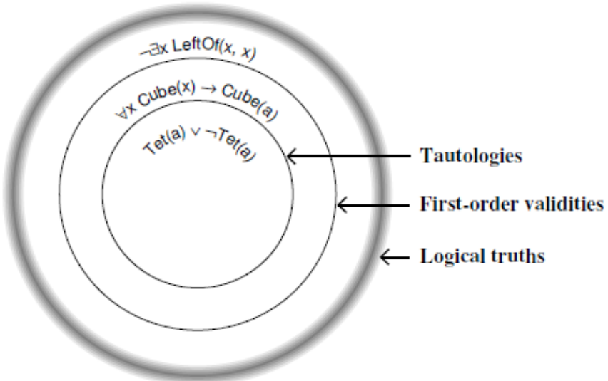

---
title: Logica Matematica
date: a.a. 2023-2024
author: Gabriele Fioco
geometry: margin=1.5in
toc: true
toc-depth: 3
numbersections: true
header-includes: |
    \usepackage{fancyhdr}
    \pagestyle{fancy}
...

# Logica proposizionale

## Definizione

La logica proposizionale è un linguaggio formato da:

- lettere proposizionali;
- connettivi logici.

Combinati formano una proposizione (o enunciato). Un enunciato è una formula che può essere interpretata come vera o falsa. Una proposizione atomica è una proposizione che non può essere scissa in proposizioni più semplici.

Un'insieme finito o infinito $\Gamma$ di enunciati è detto teoria.

Le proposizioni sono trattate in modo astratto e vanno trattati tutti i casi veri/falsi (es. tabella di verità).

## Formule ben formate

Una formula ben formata (fbf, in inglese wff = well formatted formula) del linguaggio si definisce induttivamente come:

- Base: una qualsiasi proposizione atomica.
- Passo: si ottiene riempiendo con fbf i posti dei costrutti.

Il valore di verità di una fbf si ottiene sostituendo le atomiche con i rispettivi valori di verità. Applicando le tavole di verità dei costrutti e procedendo per strati si ottiene il valore finale della fbf per ogni interpretazione booleana delle atomiche.

# Verità, conseguenze ed equivalenze tautologiche

## Proposizioni tautologicamente vere, possibili e impossibili

Sia $P$ una proposizione:

- $P$ è tautologicamente vera (o tautologica) se e solo se $P$ è vera in tutte le interpretazioni booleane.
- $P$ è tautologicamente possibile (o soddisfacibile) se e solo se esiste almeno un'interpretazione booleana in cui $P$ è vera.
- $P$ è tautologicamente impossibile (o insoddisfacibile) se e solo se $P$ è falsa in tutte le interpretazioni booleane.

Si osserva che $P$ è tautologicamente impossibile se e solo se $P$ non è tautologicamente vera.

Proposizionalmente è sinonimo di tautologicamente.

## Conseguenze tautologiche

Siano $Q$ e $P_1,...,P_n$ delle proposizioni.

Si dice che $Q$ è conseguenza tautologica di $P_1,...,P_n$ se e solo se $Q$ è vera in ogni interpretazione booleana in cui $P_1,...,P_n$ sono vere. Si denota con $P_1,...,P_n \vDash_T Q$

Si osserva che se $P$ è tautologicamente vera allora $\vDash_T P$.

## Equivalenze tautologiche

Siano $P$ e $Q$ delle proposizioni.

Esse si dicono tautologicamente equivalenti se e solo se hanno lo stesso valore di verità in tutte le interpretazioni booleane. Si denota con $P \Longleftrightarrow_T Q$.

Se vale $P \Longleftrightarrow_T Q$ allora posso effettuare il rimpiazzamento di $P$ con $Q$ in una formula $F$.

# Connettivi vero funzionali

La logica proposizionale decide la verità degli enunciati composti attraverso i connettivi vero-funzionali. Il valore di verità (la semantica) di un enunciato viene determinato a partire dai valori di verità dei componenti mediante una tavola di verità.

I connettivi vero-funzionali e i relativi simboli sono:

- Negazione: $\lnot$
- Congiunzione: $\land$
- Disgiunzione: $\lor$
- Implicazione: $\rightarrow$
- Coimplicazione: $\leftrightarrow$
- Assurdo: $\bot$

Ogni connettivo ha delle regole dette di introduzione e di eliminazione.

## Negazione

La negazione in italiano assume il significato di "non $P$". Utilizza il simbolo $\lnot$ e ammette le regole:

- Introduzione: $\bot P \vDash_T \lnot P$
- Eliminazione: $\lnot \lnot P$

## Congiunzione

La congiunzione in italiano assume il significato di "$P$ e $Q$". Utilizza il simbolo $\land$ e ammette le regole:

- Introduzione: $P, Q \vDash_T P \land Q$
- Eliminazione: $P \land Q \vDash_T P, Q$

## Disgiunzione

La disgiunzione in italiano assume il significato di "$P$ o $Q$". Utilizza il simbolo $\lor$ e ammette le seguenti regole:

- Introduzione: $P \vDash_T P \lor Q$ e $Q \vDash_T Q \lor P$
- Eliminazione: $(P \lor R), (P \rightarrow Q), (R \rightarrow Q), \vDash_T Q$. Ovvero se $P$ implica $Q$ ed anche $R$ implica $Q$, e sono vere $P$ o $R$ allora $Q$ deve essere vera. Modella il ragionamento per casi.

## Assurdo

Assurdo non è un connettivo ma una proprietà logicamente impossibile dunque falsa in ogni circostanza di un contesto. L'assurdo proposizionale è la contraddizione $P \land \lnot P$ falsa in tutte le interpretazioni booleane.

Il simbolo logico di assurdo è $\bot$. Ammette le regole:

- Introduzione: $P, \lnot P \vDash_T \bot$
- Eliminazione: $\bot \vDash_T P$. Dall'assurdo derivo qualsiasi cosa.

## Condizionali: implicazione e coimplicazione

Un asserzione del tipo "se $P$ allora $Q$" è detta condizionale. In logica proposizionale corrisponde al connettivo implica e si scrive $P \rightarrow Q$. La contrapposta è $\lnot Q \rightarrow \lnot P$.

Viceversa un'asserzione "$P$ se $Q$" vuol dire $Q \rightarrow P$, "$Q$ solo se $P$".

Le due asserzioni unite formano la coimplicazione che si può leggere come "$P$ se e solo se $Q$" e si denota col simbolo $P \leftrightarrow Q$.

Si nota che l'implicazione $P \rightarrow Q$ vuol dire "$Q$ è vera ogni qualvolta $P$ è vera". Dunque può accadere che $Q$ sia vera e $P$ falsa, ma non il viceversa. $P$ è infatti una condizione necessaria ma non sufficiente purché $Q$ sia vera; nella coimplicazione invece $P$ è condizione necessario e anche sufficiente affinché $Q$ sia vera e viceversa.

Le tabelle di verità corrispondenti sono le seguenti.

| $P$ | $Q$ | "Se $P$ allora $Q$"  $P \rightarrow Q$ | "$P$ se $Q$"  $Q \rightarrow P$ | "$P$ se e solo se $Q$"  $P \leftrightarrow Q$ |
|:---:|:---:|:-------------------------------------:|:-------------------------------:|:--------------------------------------------:|
|  T  |  T  |                   T                   |                T                |                       T                      |
|  T  |  F  |                   F                   |                T                |                       F                      |
|  F  |  T  |                   T                   |                F                |                       F                      |
|  F  |  F  |                   T                   |                T                |                       T                      |

### Teorema di deduzione

Il teorema di deduzione afferma che $(P_1, ..., P_n \vDash Q) \leftrightarrow (\vDash (P_1 \land ... \land P_n) \rightarrow Q)$

L'implicazione infatti in un certo senso cattura la conseguenza logica: dalle premsse $P_1, ..., P_n$ ottengo $Q$ corrisponde a scrivere $ (P_1 \land ... \land P_n) \rightarrow Q$. E di fatti la regola di introduzione di implica richiamerà questo teorema.

Corollario: $P \leftrightarrow_C Q \leftrightarrow \vDash_C (P \leftrightarrow Q)$ dove $C$ è un contesto (si vede nella seconda parte del corso).

### Regole di implicazione e coimplicazione

Implicazione:

- Introduzione: $P \vDash_T Q \leftrightarrow P \rightarrow Q$
- Eliminazione: $P, P \rightarrow Q \vDash_T Q$

Coimplicazione:

- Introduzione: $P \rightarrow Q, Q \rightarrow P \vDash_T P \leftrightarrow Q$
- Eliminazione: $P, P \leftrightarrow Q \vDash_T Q$ e $Q, P \leftrightarrow Q \vDash_T P$.

# Conseguenze ed equivalenze tautologiche notevoli

Si danno alcune conseguenze ed equivalenze tautologiche notevoli:

- Principio del terzo escluso: $\vDash_T P \lor \lnot P$
- Contrapposizione: $\vDash_T (P \rightarrow Q) \leftrightarrow (\lnot Q \rightarrow \lnot P)$
- Moud Ponens: $P, P \rightarrow Q \vDash_T Q$
- Modus Tollens: $\lnot Q, P \rightarrow Q \vDash_T \lnot P$
- Modus Tollens Esteso: $\lnot Q, P \leftrightarrow Q \vDash_T \lnot P$ e $\lnot Q, Q \leftrightarrow P \vDash_T \lnot P$
-  Principio di on contraddizione: $\vDash_T \lnot (P \land \lnot P)$

# Completezza della logica proposizionale

## Il calcolo $F_T$, notazione esistenza di una prova

Il calcolo logico $F_T$ consiste nelle argomentazioni provabili usando tutte e solo le regole di introduzione ed eliminazione dei connettivi.

La notazione $P_1,...,P_n \vdash_T Q$ indica che esiste una prova in $F_T$ per $Q$ con premesse $P_1,...,P_n$.

## Teorema di validità

Il teorema di validità afferma: se $P_1,...,P_n \vdash_T Q$ allora $P_1,...,P_n \vDash_T Q$

Ovvero se esiste una prova per $Q$ con premesse $P_1, ..., P_n$ allora $Q$ è conseguenza delle premesse $P_1, ..., P_n$.

Contrapposta: se $Q$ non è conseguenza logica delle premesse $P_1,...,P_n$ allora non esiste una prova di $Q$ con premesse $P_1,...,P_n$.

## Teorema di completezza

Il teorema di completezza afferma: se $P_1,...,P_n \vDash_T Q$ allora $P_1,...,P_n \vdash_T Q$

Ovvero se $Q$ è conseguenza delle premesse $P_1,...,P_n$ allora esiste una prova per $Q$ con premesse $P_1,...,P_n$.

Contrapposta: se non esiste una prova per $Q$ con premesse $P_1,...,P_n$ allora $Q$ non è conseguenza logica di $P_1,...,P_n$.

## Teorema di validità e completezza per teorie

Il teorema di validità e completezza vale anche per le teorie infinite $\Gamma$ e afferma: $\Gamma \vdash_T Q \leftrightarrow \Gamma \vDash_T Q$.

Inoltre:

- $(\Gamma \cup \{P\} \vDash_T Q) \leftrightarrow (\Gamma \vDash_T P \rightarrow Q)$
- $(\Gamma \cup \{P\} \vdash_T Q) \leftrightarrow (\Gamma \vdash_T P \rightarrow Q)$

# Logica del primo ordine 

## Definizione

La logica del primo ordine è un linguaggio che estende la logica proposizionale introducendo alcuni elementi:

- Variabili: insieme infinito di simboli scelti arbitrariamente.
- Costanti: denotano oggetti dell'universo.
- Quantificatori esistenziali e universali.
- Predicati: denotano relazioni tra oggetti. I predicati istanziati con costanti sono le proposizioni atomiche della logica proposizionale.
- Funzioni: denotano oggetti in maniera indiretta.

Si ricorda che gli altri elementi utilizzati ereditati dalla logica proposizionale sono:

- Lettere proposizionali.
- Connettivi logici.

Variabili, connettivi e quantificatori sono comuni a tutti i linguaggi; viceversa costanti, predicati e funzioni sono caratteristici di ogni linguaggio e lo caratterizzano. Dato un linguaggio del primo ordine $L$ si denota con:

- $C(L) = \{c_1, ..., c_h\}$ l'insieme delle $h$ costanti di $L$.
- $P(L) = \{p_1/n, ..., p_h/m\}$ l'insieme degli $h$ predicati di $L$. Gli interi $n$ e $m$ indicano l'arità del predicato $p_i$.
- $F(L) = \{f_1/n, ..., f_h/m\}$ l'insieme delle $h$ funzioni di $L$. Gli interi $n$ e $m$ indicano l'arità della funzione $f_i$.

Ogni linguaggio del primo ordine è stratificato in due livelli:

- Termini: servono a denotare gli oggetti dell'universo. Sono costruiti da variabili, costanti e simboli di funzioni.
- Formule: denotano frasi che possono essere vere o false. Sono costruite a partire dai termini usano connettivi, predicati e funzioni.

## Termini

L'insieme dei termini $T(L)$ di un linguaggio del primo ordine $L$ si definisce induttivamente come:

- Ogni variabile $x$ appartiene a $T(L)$.
- Ogni costante $c$ appartiene a $T(L)$.
- Sia $f$ un simbolo di funzione n-ario di $L$, siano $t_1, t_2, ..., t_n$ termini di $L$ allora anche $f(t_1, t_2, ..., t_n)$ appartiene a $T(L)$.
- Nient'altro appartiene a $T(L)$.

## Formule ben formate

Dati un linguaggio del primo ordine $L$, $T(L)$ l'insieme dei suoi termini e $P(L)$ l'insieme dei suoi predicati, si definisce $FBF(L)$ l'insieme delle formule ben formate del linguaggio in modo induttivo:

- Siano $P \in P(L)$ e $t_1, t_2, ... t_n \in T(L)$ allora $P(t_1, t_2, ... t_n) \in FBF(L)$ ed è detta atomica.
- Siano $P, Q \in FBF(L)$ allora anche $(P \land Q), (P \lor Q), (P \rightarrow Q), (P \leftrightarrow Q), (\lnot P), \bot \in FBF(L)$
- Siano $P \in FBF(L)$ e $x$ una variabile allora $(\forall x \ P), (\exists x \ P) \in FBF(L)$
- Nient'altro è in $FBF(L)$

Si noti che una funzione in FOL non da un valore di verità ma restituisce soltanto un altro elemento del discorso. Per tanto una formula del tipo $\lnot f(a)$ non è ben formata.

## Variabili libere e vincolate

Le variabili libere e vincolate si definiscono induttivamente come:

- Base: le occorrenze di variabili libere in $P(t_1, t_2, ... t_n)$ sono tutte le occorrenze di variabili in $t_1, t_2, ... t_n$. $\bot$ non ha variabili libere.
- Passo:
	+ Le occorrenze di variabili libere in $(P \land Q), (P \lor Q), (P \rightarrow Q), (P \leftrightarrow Q), (\lnot P)$ sono tutte le occorrenze di variabili libere in $P$ e $Q$.
	+ Le occorrenze di variabili libere in $\forall v P$ sono tutte le occorrenze di variaili libere in $P$ ad eccezione di $v$; ogni occorrenza di $v$ in $P$ è una variabile vincolata in $\forall v \ P$
	+ Le occorrenze di variabili libere in $\exists v \ P$ sono tutte le occorrenze di variaili libere in $P$ ad eccezione di $v$; ogni occorrenza di $v$ in $P$ è una variabile vincolata in $\exists v \ P$

## Formule ben formata chiuse e aperte

Una formula ben formata si dice:

- Chiusa se non contiene occorrenze di variabili libere.
- Aperta se contiene almeno un'occorrenza di variabile libera.

## Enunciati

Una fbf è detta enunciato (o proposizione) se e solo se è chiusa. Infatti a una fbf chiusa è possibile attribuire un valore vero o falso in una data circostanza; a una fbf aperta non è possibile attribuire un valore di verità.

Inoltre sia $L$ un linguaggio, si chiamano:

- L-enunciato: un enunciato in $L$.
- L-teoria: un insieme $\Gamma$ di L-enunciati.

## Forma vero funzionale di un enunciato

Sia $L$ un linguaggio e $A \in FBF(L)$.

$A$ si dice forma atomica generalizzata se e solo se non è in una delle seguenti forme: $A = \lnot B, A = B \lor C, A = B \land C, A = B \rightarrow C, A = B \leftrightarrow C, A = \bot$. Dunque $A$ è forma atomica generalizzata se è un'atomica $P(t_1, ..., t_n)$ o è nella forma $A = \exists x B$ o $A = \forall x B$.

La forma vero funzionale di $A$, denotata con $fvf(A)$, si ottiene rimpiazzando ogni forma atomica generalizzata con una lettera proposizionale introdotta e associata a una e una sola forma atomica generalizzata. Sia $Q$ una lettera proposizionale:

- $fvf(P(t_1, ..., t_n) = Q$
- $fvf(\forall x B) = Q$
- $fvf(\exists B) = Q$
- $fvf(\bot) = \bot$
- $fvf(A \lor B) = fvf(A) \lor fvf(B)$
- $fvf(A \land B) = fvf(A) \land fvf(B)$
- $fvf(A \rightarrow B) = fvf(A) \rightarrow fvf(B)$
- $fvf(A \leftrightarrow B) = fvf(A) \leftrightarrow fvf(B)$

## Predicato identità

In FOL il predicato di identità $=$ è l'unico con un'interpretazione prefissata: $a = b$ in una circostanza è vero se e solo se in quella circostanza $a$ e $b$ sono nomi dello stesso oggetti. Ha le seguenti regole:

- Introduzione (Riflessiva dell'identità): $n = n$.
- Eliminazione (Identità degli indiscernibili): $P(n), n = m \vDash_{FO} P(m)$.

# Quantificatori

La logica del primo ordine introduce due espressione dette quantificatori:

- Quantificatore esistenziale $\exists$
- Quantificatore universale $\forall$

Anch'essi hanno le loro regole in maniera similare ai connettivi proposizionali.

## Quantificatore esistenziale

Il quantificatore esistenziale in FOL può essere tradotto in linguaggio naturale come "esiste", "almeno un", "qualche". Una proposizione $\exists x (P(x))$ è vera se e solo se esiste almeno un elemento che soddisfa $P$.

Ammette le regole:

- Introduzione (Generalizzazione esistenziale): $S(c) \vDash_{FO} \exists x S(x)$
- Eliminazione (Particolarizzazione esistenziale): $\exists x S(c), ([c] S(c) \vDash Q]) \vDash_{FO} Q$

## Quantificatore universale

Il quantificatore universale in FOL si traduce in linguaggio naturale come "per ogni", "comunque io prenda". Una proposizione $\forall x (P(x))$ è vera se e solo se preso un qualunque oggetto $x$ questo soddisfa $P$.

Ammette le regole:

- Introduzione (Generalizzazione universale):
	+ $([c] \vDash_{FO} P(c)) \vDash_{FO} \forall x P(x)$
	+ $([c] P(c) \vDash_{FO} Q(c)) \vDash_{FO} \forall x (Q(x) \rightarrow P(x))$
- Eliminazione (Particolarizzazione universale): $\forall x S(x) \vDash_{FO} S(c)$

## Forme aristoteliche

Le quattro formule aristoteliche permettono di costruire delle formule a partire da frasi del linguaggio naturale comuni. Sono le seguenti:

- Ogni $P$ è $Q$: $$\forall x (P(x) \rightarrow Q(x))$$
- Qualche $P$ è $Q$: $$\exists x (P(x) \land Q(x))$$
- Nessun $P$ è $Q$: $$\forall x (P(x) \rightarrow \lnot Q(x))$$
- Qualche $P$ non è $Q$: $$\exists x (P(x) \land \lnot Q(x))$$

## Quantificazione numerica

In logica del primo ordine si possono esprimere proposizioni che parlano di quantità numeriche:

- Esiste uno e uno solo per cui vale $P$ (notazione: $\exists ! x P(x)$): $$\exists x (P(x) \land \forall y (P(y) \rightarrow x = y))$$
- Esistono al minimo $n$ per cui vale $P$ (notazione: $\exists^{\leq n} x P(x)$): $$\exists x_1, ..., \exists x_n (P(x_1) \land ... \land P(x_n) \land x_1 \neq x_2, ... \land x_{n - 1} \neq x_n$$
- Esistono al massimo $n$ per cui vale $P$ (notazione: $\exists^{\geq n} x P(x)$): $$\forall x_1, ..., \forall x_n, \forall x_{n + 1} ((P(x_1) \land ... \land P(x_n) \land P(x_{n + 1})\ \rightarrow (x_1 = x_2 \lor ... \lor x_n = x_{n + 1})$$
- Esistono esattamente $n$ per cui vale $P$ (notazione: $\exists^{!n} x P(x)$): $$\exists^{\leq n} x P(x) \land \exists^{\geq n} x P(x)$$ $$\Leftrightarrow_{FO}$$ $$\exists x_1, ..., \exists x_n \forall_{n + 1} ((x_1 \neq x_2 \land ... \land x_{n - 1} \neq x_n \land P(x_{n + 1})) \leftrightarrow (x_{n + 1} = x_1 \lor ... \lor x_{n + 1} = x_n))$$

# Strutture

## Perché formalizzare le strutture

Si è fissata in modo formale la sintassi dei linguaggi del primo ordine, si vuole formalizzare la modalità con cui assegnare un valore di verità agli enunciati. Nella logica proposizionale basta assegnare un valore di verità alle atomiche, in logica del primo ordine questo non è possibile.

Al fine di assegnare un valore di verità a un enunciato di un linguaggio del primo ordine $L$ bisogna:

- Formalizzare i mondi in cui interpretare ogni elemento di $L$ come un concetto insiemistico sull'universo del discorso $U$. In questo modo si fa una "fotografia" del mondo stesso 
- Amplicare $L$ con un nuovo linguaggio $L_U$ che assegna ad ogni oggetto del mondo un nome. Questo permette di far fronte a variabili libere e oggetti senza nome.

## Definizione

Sia $L$ un linguaggio del primo ordine dato da $C(L), F(L), P(L)$, si definisce L-struttura una coppia $(U,I)$ dove:

- $U$ è un insieme non vuoto detto universo del discorso.
- $I$ è la funzione interpretazione definita come:
	+ Per ogni costante $c \in C(L)$,  $I(c) \in U$.
	+ Per ogni simbolo di funzione n-ario $f \in F(L)$, $I(f) : U^n \rightarrow U$ ($I(f)$ è una funzione n-aria su $U$).
	+ Per ogni predicato n-ario $P \in P(L)$, $I(P) \subseteq U^n$ ($I(P)$ è un predicato n-ario su $U$).

Un contesto $C$ è un insieme di L-strutture.

Una struttura si può vedere come una riga della tabella di verità.

## Strutture isomorfe

Due strutture $S = (U, I)$ e $R = (V, J)$ sono isomorfe se e solo se esiste una funzione biettiva $\sigma: U \rightarrow V$ tale che:

- $\sigma(I(c)) = J(c)$ $\forall c \in C(L)$
- $\sigma((I(f)) (a_1, ..., a_n)) = (J(f))(\sigma(\sigma(a_1), ..., \sigma(a_n)))$ $\forall f \in F(L), \forall a_1, ..., a_n \in U$
- $(a_1, ..., a_n) \in I(P) \leftrightarrow (\sigma(a_1), ..., \sigma(a_n)) \in J(P)$ $\forall P \in P(L), \forall a_1, ..., a_n \in U$

Informalmente, due strutture sono isomorfe se e solo se rappresentano la stessa struttura.

## Strutture elementarmente equivalenti

Sia $L$ un linguaggio, due L-strutture $S = (U, I)$ e $R = (V, J)$ si dicono elementarmente equivalenti se e solo se non sono distinguibili tramite enunciati di $L$ (ovvero se modellano gli stessi L-enunciati).

Due L-strutture isomorfe sono elementarmente equivalenti, ma non necessariamente viceversa.

## Teorema di compattezza

Il teorema di compattezza enuncia: sia $L$ un linguaggio, sia $\Gamma$ una L-teoria, sia $S$ una L-struttura, allora se ogni sottoinsieme di $\Gamma$ è modellato da $S$, $\Gamma$ è modellato da $S$.

Il teorema di compattezza trova applicazione:

- Nella deduzione automatica, data una teoria infinita $\Gamma$ ci si chiede se $\Gamma \vDash A$. Posso ridurre il problema a stabilire $\Gamma' \vdash A$ con $\Gamma'$ sottoinsieme finito di $\Gamma$.
- Per provare che esistono modelli non standard di PA elementarmente equivalenti a $N$ con stessa cardinalità del modello standard (si veda aritmetica di Peano).

## Teorema di Lowenheim-Skolem

Il teorema di Lowenheim-Skole enuncia: se $\Gamma$ ha almeno un modello infinito allora $\Gamma$ ha modelli di ogni cardinalità infinita elementarmente equivalenti al primo.

# Interpretare gli enunciati

## Interpretazione dei termini chiusi

Dato un linguaggio del primo ordine $L$ si vuole dare una semantica ai suoi enunciati. Al fine di dare un nome ad ogni oggetto del mondo, si espande $L$ con $L_U$ dato da $C(L_U) = C(L) \cup \{c_a : a \in U \}, F(L_U) = F(L), P(L_U) = P(L)$.

Si definisce induttivamente $GT(L_U)$ l'insieme dei termini chiusi di $L_U$ come:

- Ogni costante $c \in C(L_U)$ è in $GT(L_U)$.
- Sia $f \in F(L_U)$ n-aria, siano $t_1, ..., t_n \in GT(L_U)$, allora $f(t_1, ..., t_n) \in GT(L_U)$.
- Nient'altro è termine chiuso di $L_U$.

L'interpretazione $I(t)$ per ogni $t \in GT(L_U)$ è data induttivamente come:

- Per ogni $c \in C(L)$, $I(c)$ è già definita.
- Per ogni $a \in U$, $I(c_a) = a$.
- Sia $f \in F(L)$, siano $t_1, ..., t_n$ \in $GT(L_U)$ allora $I(f(t_1, ..., t_n)) = (I(f)(I(t_1), ..., I(t_n))$

Questa definizione di $I(t)$ garantisce che per ogni termine $t \in GT(L_U)$ valga $I(t) \in U$.

## Interpretazione degli enunciati

Sia $E(L_U) = \{A \in FBF(L_U) : libere(A) = \emptyset \}$ l'insieme delle fbf su $L_U$ prive di variabili libere, ovvero gli enunciati di $L_U$. Si denota con $A[x:c]$ una fbf ottenuta sostituendo ad ogni occorrenza libera di $x$ la costante $c$. Si osserva che se $\text{libere}(A) \subseteq \{x\}$ allora $A[x:c] \in E(L_U)$.

Siano $A, B, Q \in E(L_U)$ allora l'interpretazione $I(Q)$ è definita induttivamente come:

- Siano $P \in P(L)$ e $t_1, ..., t_n \in GT(L_U)$ allora:
	+ $I(P(t_1, ..., t_n) = T$ se $(I(t_1), ..., I(t_n)) \in I(P)$
	+ $I(P(t_1, ..., t_n) = F$ se $(I(t_1), ..., I(t_n)) \notin I(P)$
- $I(\bot) = F$
- $I(\lnot A) =$
	+ $T$ se $I(A) = F$
	+ $F$ se $I(A) = T$
- $I(A \land B) =$
	+ $T$ se $I(A) = T$ e $I(B) = T$
	+ $F$ altrimenti
- $I(A \lor B) =$
	+ $T$ se $I(A) = T$ o $I(B) = T$
	+ $F$ altrimenti
- $I(A \rightarrow B) =$
	+ $T$ se $I(A) = F$ o $I(B) = T$
	+ $F$ altrimenti
- $I(A \leftrightarrow B)=$
	+ $T$ se $I(A) = I(B)$
	+ $F$ altrimenti
- $I(\forall x A) =$
	+ $T$ se per ogni $a \in U$ vale $I(A[x:c_a]) = T$
	+ $F$ altrimenti
- $I(\exists x A) =$
	+ $T$ se per qualche $a \in U$ vale $I(A[x:c_a]) = T$
	+ $F$ altrimenti

$Q$ è vero nella struttura $S$ se e solo se $I(Q) = T$.

# Modelli e contromodelli

Sia $L$ un linguaggio e sia $S = (U, I)$ una L-struttura. Si danno le seguenti definizioni:

- $S$ è modello di un L-enunciato $A$ se e solo se $A$ è vero in $S$, ovvero $I(A) = T$. Si denota con $S \vDash A$.
- $S$ è modello di una L-teoria $\Gamma$ se e solo se per ogni $A \in \Gamma$ allora $A$ è vero in $S$, ovvero $I(A) = T \forall A \in \Gamma$. Si denota con $S \vDash \Gamma$.
- $S$ è contromodello di una L-teoria $\Gamma$ se e solo se esiste un'enunciato $A \in \Gamma$ falso in $S$. 

# Verità, conseguenze ed equivalenze logiche in FO e in un contesto

## Verità logiche in FO e in un contesto

Sia $L$ un linguaggio e sia $A$ un L-enunciato, si dice che:

- $A$ è logicamente vero in FO se e solo se $S \vDash A$ per ogni L-struttura $S = (U, I)$. Si denota con $\vDash_{FO} Q$.
- $A$ è logicamente vero in un contesto $C$ se e solo se $S \vDash A$ per ogni L-struttura $S = (U, I)$ in $C$. Si denota con $\vDash_C A$.

Inoltre si dice che $A$ è vero in una L-teoria $\Gamma$ in FO se e solo se per ogni L-struttura $S = (U, I)$ vale $(S \vDash \Gamma) \rightarrow (S \vDash A)$. Si denota con $\Gamma \vDash_{FO} A$.

## Conseguenze logiche in FO e in un contesto

Sia $L$ un linguaggio, si dice che:

- $Q$ è conseguenza logica in FO delle premesse $P_1, ..., P_n$ se e solo se $Q$ è vera nella L-teoria $\{P_1, ..., P_n \}$. Si denota con $P_1, ..., P_n \vDash_{FO}$
- $Q$ è una conseguenza logica in un contesto $C$ delle premesse $P_1, ..., P_n$ se e solo se $Q$ è vera in ogni L-struttura che appartiene a $C$ che modella $\{P_1, ..., P_n \}$. Si denota con $P_1, ..., P_n \vDash_C Q$.

## Equivalenze logiche in FO e in un contesto

Sia $L$ un linguaggio, si dice che:

- $P$ e $Q$ sono logicamente equivalenti in FO se e solo se $P$ e $Q$ coincidono in ogni interpretazione. Si denota con $P \Leftrightarrow_{FO} Q$.
- $P$ e $Q$ sono logicamente equivalenti in un contesto $C$ se e solo se le interpretazioni di $P$ e $Q$ coincidono in ogni L-struttura che appartiene a $C$. Si denota con $P \Leftrightarrow_{C} Q$.

## Equisoddisfacibilità

Due enunciati $A$ e $B$ sono detti equisoddisfacili se e solo se sono entrambi soddisfacibili o entrambi insoddisfacibili. Si nota che se $A$ e $B$ sono logicamente equivalenti allora sono equisoddisfacbili (ma non viceversa).

## Quadro complessivo: verità, conseguenze ed equivalenze in TAUT, FO e in un contesto

Sono appena state introdotte le nozioni di verità, conseguenze ed equivalente logiche in FO e in un contesto. Nella prima parte del corso si sono date nozioni simili per le tautologie.

Si osserva che:

- Se $Q$ è tautologicamente vero allora $Q$ è logicamente vero in FO; se $Q$ è logicamente vero in FO allora $P$ è logicamente vero in un qualsiasi contesto.
- Se $Q$ è conseguenza tautologica delle $P_1, ..., P_n$ allora $Q$ è conseguenza logica in FO di $P_1, ..., P_n$; se $Q$ è conseguenza logica in FO di $P_1, ..., P_n$ allora è conseguenza logica di $P_1, ..., P_n$ in qualsiasi contesto.
- Se $P$ e $Q$ sono tautologicamente equivalenti allora $P$ e $Q$ sono logicamente equivalenti in FO; se $P$ e $Q$ sono logicamente equivalenti in FO allora sono logicamente equivalenti in qualsiasi contesto.

In pratica da tautologie (logica proposizionale) si va giù a cascata; viceversa se qualcosa non è logicamente vero/conseguenza logica/logicamente equivalente in un contesto, allora non lo è neanche ai livelli superiori su FO e in TAUT.

{width=300px}

# Conseguenze ed equivalenze logiche notevoli

## Rimpiazzamento

Data una proposizione $P$ tautologicamente equivalente a $Q$ ($P \Leftrightarrow_T Q$) allora posso rimpiazzare $P$ e $Q$ con enunciati del primo ordine.

In generale siano $P_1, ..., P_n, Q$ enunciati di un linguaggio $L$ se vale $fvf(P_1), ..., fvf(P_n) \vDash_T fvf(Q)$ allora vale $P_1, ..., P_n \vDash_T Q$.

Ad esempio sappiamo che vale $P \rightarrow Q \Leftrightarrow_T \lnot P \lor Q$ quindi siano $P = \forall x Cube(x), Q = \exists y Tet(y)$ ottengo $\forall x Cube(x) \rightarrow \exists y Tet(y) \Leftrightarrow_{T} \lnot \forall x Cube(x) \lor \exists y Tet(y)$.

## De Morgan per i quantificatori e le formule aristoteliche

Valgono le seguenti leggi di De Morgan per i quantificatori.

$$\lnot \forall x P(x) \Leftrightarrow_{FO} \exists x \lnot P(x)$$

$$\lnot \exists x P(x) \Leftrightarrow_{FO} \forall x \lnot P(x)$$

$$\forall x P(x) \Leftrightarrow_{FO} \lnot \exists x \lnot P(x)$$

$$\exists x P(x) \Leftrightarrow_{FO} \lnot \forall x \lnot P(x)$$

Applicando alle formule aristoteliche: 

- Nessun $P$ è $Q$: $$\forall x (P(x) \rightarrow \lnot Q(x)) \Leftrightarrow_{FO} \forall x (\lnot P(x) \lor \lnot Q(x)) \Leftrightarrow_{FO} \forall x \lnot (P(x) \land Q(x)) \Leftrightarrow_{FO} \lnot \exists x (P(x) \land Q(x))$$
- Qualche $P$ non è $Q$: $$\exists x (P(x)) \land \lnot Q(x)) \Leftrightarrow_{FO} \exists x \lnot(P(x)) \lor Q(x)) \Leftrightarrow_{FO} \exists x \lnot (P(x) \rightarrow Q(x)) \Leftrightarrow_{FO} \lnot \forall x (P(x) \rightarrow Q(x))$$

## Spostare i quantificatori

Si possono spostare i quantificatori. Valgono i seguenti:

- Quantificatore universale con $\land$: $$\forall x (P(x) \land Q(x)) \Leftrightarrow_{FO} \forall x P(x) \land \forall x Q(x)$$

- Quantificatore esistenziale con $\lor$: $$\exists x (P(x) \lor Q(x)) \Leftrightarrow_{FO} \exists x P(x) \lor  \exists x Q(x)$$

Inoltre:

- Doppia quantificazione universale: $$\forall x \forall y P(x, y) \Leftrightarrow_{FO} \forall y \forall x P(x, y)$$
- Doppia quantificazione esistenziale: $$\exists x \exists y P(x, y) \Leftrightarrow_{FO} \exists y \exists x P(x, y)$$

## Quantificazione vacua

Se $x$ non appare libera in $P$ allora $$\forall x P \Leftrightarrow_{FO} P \Leftrightarrow_{FO} \exists x P$$.

Ne consegue:

- $\forall x \forall x P(x) \Leftrightarrow_{FO} \forall x P(x) \Leftrightarrow_{FO} \exists x \forall x P(x)$
- $\exists x \exists x P(x) \Leftrightarrow_{FO} \exists x P(x) \Leftrightarrow_{FO} \forall x \exists x P(x)$
- $\forall x (P \lor Q(x)) \Leftrightarrow_{FO} P \lor \forall x Q(x)$
- $\exists x (P \land Q(x)) \Leftrightarrow_{FO} P \land \exists x Q(x)$

## Rinomina di variabili

Se $y$ non appare in $P$ allora:

- $\forall x P(x) \Leftrightarrow_{FO} \forall y P(y)$
- $\exists x P(x) \Leftrightarrow_{FO} \exists y P(y)$

# Elementi utili ad arricchiere un linguaggio

## Tipizzazione

In alcuni casi nasce la necessità di tipizzare il linguaggio. Si supponga di voler parlare degli animali domestici e i loro proprietari, allora assumiamo un linguaggio $L$ tale che $P(L)$ contenga $\text{Appartiene} / 2$ con $I(\text{Appartiene}) = \{a, b \in U : a \ \text{appartiene a} \ b \}$. Sia poi $S = (U, I)$ una L-struttura con $U$ insieme degli oggetti rappresentanti gli animali domestici e le persone.

Per dire "ogni animale domestico ha un proprietario" si potrebbe scrivere $\forall x \exists y(Appartiene(x,y)$. Ma questo non escluderebbe che un animale domestico possenga un umano in quanto $x$ può essere sia animale che persona, e lo stesso per $y$.

Per tipizzare il predicato precedente si può estendere $P(L)$ con $\text{Persona}/1$ e $\text{Animale}/1$ tali che $I(Persona) = \{a \in U : a \} \text{è una persona} \}$ e $I(Animale) = \{a \in U : a \ \text{è un animale} \}$. Il precedente enunciato viene ora scritto $\forall x (Animale(x) \rightarrow \exists y (Persona(y) \land Appartiene(x,y))$.

Al fine di rendere più succinta la scrittura si utilizza la notazione $\forall x : \text{Animale} \exists y : \text{Persona} \text{Appartiene}(x, y)$ che tipizza $C(L), F(L) e P(L)$.

Un linguaggio tipizzato è anche detto multisortato.

## Assiomatizzazione

Assimoatizzare un insieme di circostanze vuol dire fornire una teoria $\Gamma$ tale che tutti i modelli di $\Gamma$ (ovvero le strutture tali che $S \vDash \Gamma$) siano tutte e sole le L-Strutture che descrivono astrattamente l'insieme desiderato di circostanze.

# Induzione e ricorsione

## Definizioni induttive

Dato un linguaggio $L$ si possono definire i suoi elementi usando gli elementi stessi. Una definizione induttiva di un insieme $S$ avviene definendo i seguenti:

- Base: qualche elemento $b_1, ..., b_k$ appartiene a $S$.
- Passo: se gli elementi $e_1, ..., e_n$ appartengono a $S$ allora anche $p(e_1, ..., e_n)$ appartiene a $S$.
- ...
- Passo: se gli elementi $e_1, ..., e_m$ appartengono a $S$ allora anche $r(e_1, ..., e_m)$ appartiene a $S$.
- Chiusura: nient'altro appartiene a $S$.

## Principio di induzione

Dalla definizione induttiva degli elementi di $L$ vale la seguente.

Sia $H(x)$ una fbf con $\text{libere}(H) = \{x\}$. Se valgono:

- Base: $H(b_1), ..., H(b_k)$
- Passo: $\forall x_1, ..., x_n ((H(x_1) \land ... \land H(x_n) \rightarrow (H(p(x_1, ..., x_n))))$
- ...
- Passo: $\forall x_1, ..., x_m ((H(x_1) \land ... \land H(x_m)) \rightarrow (H(r(x_1, ..., x_m))))$

Allora vale $\forall x H(x)$

# Aritmetica di Peano

## Definizione induttiva dei naturali

Un esempio di utilizzo dell'induzione è sui numeri naturali, definiti come:

- Base: $0 \in \mathbb{N}$
- Passo: $n \in \mathbb{N} \rightarrow n + 1 \in \mathbb{N}$
- Chiusura: nient'altro appartiene a $\mathbb{N}$.

## Principio di induzione sui naturali

Sia $P(n)$ una fbf tale che $\text{libere}(P) = \{n\}$. Se valgono:

- Base: $P(0)$
- Passo: $\forall n (P(n) \rightarrow P(n + 1))$

Allora  vale $\forall n P(n)$.

## Definizione induttiva di funzioni sui naturali

Sia $f : \mathbb{N}^n \rightarrow \mathbb{N}$ una funzione, essa si può definire per induzione:

- Base: $\forall y_1, ..., \forall y_{n - 1} f(0, y_1, ..., y_{n - 1}) = g(y_1, ..., y_{n - 1})$
- Passo: $\forall y_1, ..., \forall y_{n - 1} \forall n f(n + 1, y_1, ..., y_{n - 1}) = h(n, y_1, ..., y_{n - 1}, f(n, y_1, ..., y_{n - 1})$

Con $g : \mathbb{N}^{n - 1} \rightarrow \mathbb{N}$ e $h : \mathbb{N}^{n + 1} \rightarrow \mathbb{N}$ funzioni ausiliarie.

## Il modello standard e il linguaggio di Peano

Si vuole ora assiomatizzare una struttura dei naturali in primo ordine. Il modello creato dovrebbe essere un modello unico (o modello standard), ma si vedrà che ciò non è possibile in quanto in primo ordine vi sono modelli non standard ineliminabili.

Gli elementi del linguaggio del primo ordine $L(PA)$ dell'Aritmetica di Peano sono:

- $C(L(PA)) = \{ 0 \}$
- $F(L(PA)) = \{ s/1 \, +/2, \times / 2 \}$ ($s$ è la funzione successore)
- $P(L(PA)) = \{ =/2 \}$

I termini $0, s(0), s(s(0)), ...$ sono detti numerali.

Definiamo ora la struttura $N = (\mathbb{N}, I)$ dove:

- $\mathbb{N}$ è l'insieme dei numeri naturali
- $I(0) = 0$
- $I(s(...(s(0))...) = n$ ($n$ volte $s$ è uguale a $n$)

$N$ ha cardinalità infinita ($U$ contiene infiniti elementi) dunque per il teorema di Lowenheim-Skolem esistono altri modelli elementarmente equivalenti.

## Assiomi di Peano

Si danno i seguenti assiomi:

- PA1: $\forall x \lnot (s(x) = 0)$ ($0$ non è il successore di nessun naturale)
- PA2: $\forall x \forall y (s(x) = s(y) \rightarrow x = y))$ ($s$ è una funzione iniettiva)
- PA3: $\forall x (x + 0 = x)$
- PA4: $\forall x \forall y (x + s(y) = s(x + y))$
- PA5: $\forall x (x \times 0 = 0)$
- PA6: $\forall x \forall y (x \times s(y) = (x \times y) + x)$
- PA7: $(\forall y_1 ... \forall y_n ((P(0, y_1, ..., y_n) \land \forall x P(x, y_1, ..., y_n)) \rightarrow \forall x (P(s(x), y_1, ..., y_n))) \rightarrow \forall x P(x, y_1, ..., y_n)$

PA1 e PA2 assicurano che nel linguaggio di peano i numerali formino una sequenza infinita di elementi distinti.

PA3-6 implementano somma e prodotto.

PA7 implementa il principio di induzione, non generalizzato (induzione di Peano): $(P(0) \land \forall x (P(x) \rightarrow P(s(x))) \rightarrow \forall x P(x)$

## Ordinare i naturali in PA

Nel modello standard $N$ si può aggiungere l'ordinamento stretto $< / 2$ definito esplicitamente come: $\forall x \forall y (x < y \leftrightarrow \exists z (x + s(z) = y))$. PA prova che $<$ è una relazione di ordine, infatti valgono:

- Anti-riflessività: $\vdash_{PA} \forall x \lnot (x < x)$
- Transitività: $\vdash_{PA} \forall x \forall y \forall z ((x < y \land y < z) \rightarrow (x < z))$
- Tricotomia: $\forall x \forall y (x < y \lor x = y \ lor y < x)$

## Principio di induzione forte

Un altro principio di induzione molto utile in PA è il principio di induzione forte. Sia $P(n)$ una fbf tale che $\text(libere)(P) = \{n\}$ allora se per ogni $n$ vale che se $P(k)$ vale per ogni $k < n$ allora vale $P(n)$. Formalmente: $\forall n ((\forall k (k < n \rightarrow P(k))) \rightarrow \forall n P(n)$

# Deduzione automatica e forme normali

Data una teoria $\Gamma$ e un enunciato $A$ ci si chiede se $A$ consegua da $\Gamma$ e er determinarlo si vuole usare un algoritmo.

Vale il teorema: $A \vDash \Gamma$ se e solo se $\Gamma \cup \{\lnot A\}$ è insoddisfacibile.

Un algoritmo di tipo refutazionale lavora su questo teorema, riducendo il problema di decidere se $A \vDash \Gamma$ ad un problema di insoddisfacibilità. L'algoritmo segue una serie di passi di preprocessamento su ogni enunciato di $\Gamma \cup \{\lnot A\}$:

1. Trasforma gli enunciati in forma normale prenessa
2. Trasforma gli enunciati in forma normale prenessa in forma normale di Skol
3. Trasforma gli enunciati in forma normale di Skol in forma normale congiuntiva.

Le trasformazioni vengono effettuate da algoritmi efficienti, ovvero che lavorano in tempo polinomiale sulla lunghezza dell'input.

## Forma normale prenessa

Il primo passo di preprocessamento trasforma ogni enunciato in forma normale prenessa.

Un enunciato si dice in forma normale prenessa se e solo se ha la forma $Q_1 x_1 ... Q_n x_n B$ con $Q$ quantificatore ($\forall$ o $\exists$) e $B$ fbf tale che sia priva di quantificatori e $\text{libere}(B) = \{x_1, ..., x_n \}$.

Vale il teorema: per ogni L-enunciato esiste un L-enunciato logicamente equivalente in forma normale prenessa.

L'algoritmo trasforma un enunciato in uno logicamente equivalente in forma normale prenessa applicando ripetutamente le equivalenze logiche notevoli:

- $\lnot \forall x P \Leftrightarrow \exists x \lnot P$
- $\lnot \exists x P \Leftrightarrow \forall x \lnot P$
- $\exists x P \lor Q \Leftrightarrow \exists x (P \lor Q)$
- $\forall x P \land Q \Leftrightarrow \forall x (P \land Q)$
- $P \rightarrow \exists x Q \Leftrightarrow \exists y (P[x : y] \rightarrow Q)$
- $P \rightarrow \forall x Q \Leftrightarrow \forall y (P[x : y] \rightarrow Q)$

Se la variabile vincolata $x$ occorresse libera in $Q$ bisogna rinominarla con $y$:

- $\exists x P \land Q \Leftrightarrow \exists y (P[x : y] \land Q)$
- $\exists x P \rightarrow Q \Leftrightarrow \forall y (P[x : y] \rightarrow Q)$
- $\forall x P \lor Q \Leftrightarrow \forall y (P[x : y] \lor Q)$
- $\forall x P \rightarrow Q \Leftrightarrow \exists y (P[x : y] \rightarrow Q)$

## Forma normale universale (o di Skolem)

Dopo aver trasformato un enunciato nella sua forma normale prenessa si trasforma quest'ultima in una forma normale di Skolem.

Un enunciato è detto in forma normale di Skolem quando ha la forma $\forall x_1 ... \forall x_n C$ dove $C$ è una fbf tale che sia priva di quantificatori e $\text{libere}(C) = \{x_1, ..., x_n\}$.

Vale il teorema: per ogni enunciato esiste un enunciato equisoddisfacibile in forma normale di Skolem.

Un algoritmo trasforma un enunciato in forma normale prenessa in uno equisoddisfacibile in forma normale di Skolem applicando ripetutamente la sostituzione $\forall x_1 ... \forall x_n \exists y D$ diventa $\forall x_1 ... \forall x_n D[y : f(x_1, ..., x_n)]$ con $f$ nuovo simbolo di funzione con arità $n$.

## Forma normale congiuntiva

L'ultimo passo di preprocessamento trasforma un enunciato in forma normale di Skolem in forma normale congiuntiva. Si danno le definizioni:

- Un enunciato forma normale universale $\forall x_1 ... \forall x_n C$ si dice in forma normale congiuntiva se e solo se $fvf(C)$ è in forma normale congiuntiva proposizionale.
- Una proposizione è in forma normale congiuntiva (CNF) se e solo se ha la forma $C_1 \land ... \land C_n$ dove ogni $C_i$ ha la forma $L_{i1} \lor ... \lor L_{i k_i}$ con $L_{ij}$ lettera proposizionale o sua negata.
- Un enunciato è in forma normale disgiuntiva (DNF) se e solo se ha la forma $C_1 \lor ... \lor C_n$ dove ogni $C_i$ ha la forma $L_{i1} \land ... \land L{i k_i}$ con $L_{ij}$ lettera proposizionale o sua negata.

Vale il teorema: per ogni formula proposizionale esistono una forma normale congiuntiva e una forma normale disgiuntiva logicamente equivalenti.

Per ottenere una CNF o una DNF equivalente a una formula in input si applicano ripetutamente le conseguenze logiche notevoli:

- $\lnot \lnot C \Leftrightarrow C$
- $A \rightarrow B \Leftrightarrow \lnot A \lor B$
- $\lnot(A \lor B) \Leftrightarrow \lnot A \land \lnot B$
- $\lnot(A \land B) \Leftrightarrow \lnot A \lor \lnot B$
- $A \lor (B \land C) \Leftrightarrow (A \lor B) \land (A \lor C)$
- $A \land (B \lor C) \Leftrightarrow (A \land B) \lor (A \land C)$
- Associatività e commutatività di $\land$ e $\lor$

L'utilizzo della distributività causa una dilatazione esponenziale degli algoritmi ma vale il teorema: esiste un algoritmo efficiente che data in input una formula proposizionale produce una CNF equisoddisfacibile. (Non si conoscono algoritmi efficienti per produrre DNF equisoddisfacibili).

# Completezza della logica del primo ordine

## Calcolo $F$, notazione esistenza di una prova

Il calcolo logico $F$ indica tutte le argomentazioni che si possono dimostrare usando tutte e solo le regole di connettivi, quantificatori e identità.

La notazione $P_1, ..., P_n \vdash_{FO} Q$ indica che esiste una prova in $F$ per $Q$ con premesse $P_1, ..., P_n$.

## Teorema di validità in FO

Il teorema di validità in FO afferma: se $P_1, ..., P_n \vdash_{FO} Q$ allora $P_1, ..., P_n \vDash_{FO} Q$.

Ovvero se esiste una prova per $Q$ con premesse $P_1, ..., P_n$ allora $Q$ è conseguenza logica delle premesse $P_1, ..., P_n$

## Teorema di completezza in FO

Il teorema di completezza in FO afferma: se $P_1, ..., P_n \vDash_{FO} Q$ allora $P_1, ..., P_n \vdash_{FO} Q$.

Ovvero se $Q$ è conseguenza logica delle premesse $P_1, ..., P_n$ allora esiste una prova per $Q$ con premesse $P_1, ..., P_n$.

## Teorie formalmente complete

Una teoria $\Gamma$ si dice formalmente completa se e solo se per ogni enunciato $Q \in \Gamma$ $\Gamma \vdash_{FO} Q$ o $\Gamma \vdash_{FO} \lnot Q$. Equivalentamente per il teorema di validità e completezza $\Gamma \vDash_{FO} Q$$ o $\Gamma \vDash_{FO} \lnot Q$.

Dunque una teoria $\Gamma$ non è formalmente completa se qualche enunciato $Q \in \Gamma$ è tale che fra le strutture che modellano $\Gamma$ 

L'insieme di tutti gli enunciati veri in una struttura è una teoria formalmente completa.

# Decidibilità della logica proposizionale e semidecidibilità della logica del primo ordine

## Semidecidibilità della logica del primo ordine

Per il teorema di validità e completezza se $Q$ è una verità logica ($\vDash_{FO} Q$) allora esiste una prova per $Q$ ($\vdash_{FO} Q$). Elencando le prove una a una prima o poi trovo quella per $\vDash_{FO} Q$.

Il teorema di Church sancisce che invece non esiste un algoritmo per elencare gli enunciati $Q$ che non sono verità logiche. Se questo esistesse potrei decidere per gni enunciato $Q$ se questo è una verità logica o meno.

Pertanto esiste un algoritmo che su input $Q$: se questi è una verità logica termina; se questi non è una verità logica non da risposta.

## Decidibilità della logica proposizionale

Si nota che la logica proposizionale è invece banalmente decidibile. Dato un input $\Gamma \vDash_T Q$ con $\Gamma$ teoria finita, basta costruire la tabella di verità per deciderne la verità in un tempo finito. L'unico problema è che ad oggi non si conoscono algoritmi efficienti (polinomiali) per ogni input $\Gamma \vDash_T Q$.

# Metodi di prova

## Prova per assurdo

Le regole di negazione e di assurdo permettono di effettuare la prova per assurdo.

Si supponga di voler dimostrare $Q$. Allora posso assumere $\lnot Q$ ed arrivare a $Q$. Successivamente per introduzione di assurdo ottengo l'assurdo. Infine per introduzione di negazione arrivo a $\lnot \lnot Q \vDash_T Q$.

## Prova per casi

L'eliminazione della disgiunzione permette di effettuare una prova per casi. Ad esempio si supponga la seguente situazione.

$P = \text{"Ugo deve andare in farmacia"} \ \text{oppure} \ Q = \text{"Ugo deve andare al supermercato"}$. Sia la farmacia che il supermercato sono in via Roma quindi $P \rightarrow \text{"Ugo deve andare in via Roma"} \ \text{e anche} \ Q \rightarrow \text{"Ugo deve andare in via Roma"}$. Segue quindi che "Ugo deve andare in via Roma".
