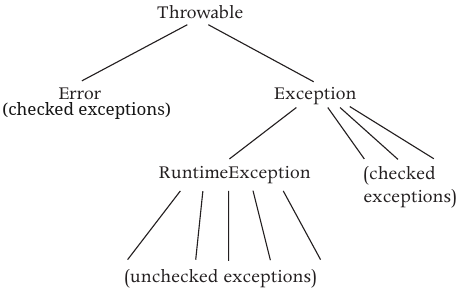

---
title: Programmazione II
date: a.a. 2023-2024
author: Gabriele Fioco
geometry: margin=1.5in
toc: true
toc-depth: 2
numbersections: true
colorlinks: true
linkcolor: blue
urlcolor: blue 
toccolor: black
header-includes: |
    \usepackage{fancyhdr}
    \usepackage{xcolor}
    \pagestyle{fancy}
...

# Introduzione

Il corso intende insegnare una metodologia per lo sviluppo di sistemi software. La metodologia affrontata è detta orientata agli oggetti e mira a creare programmi affidabili ed efficienti con codice semplice da capire, facile da modificare e manutenere.

Il processo cercato è la decomposizione (modularizzazione) del programma in parti più semplici dette moduli (sotto-problemi). Questi moduli devono essere: divisi su più livelli di separazione, ogni livello ha lo stesso livello di dettaglio; indipendenti gli uni dagli altri; componibili.

Più il programma cresce più la decomposizione diventa importante, semplificando: la comunicazione tra gli sviluppatori, che necessitano di interagire di meno; l'aggiunta di funzioni e la modifica o correzione di quelle già esistenti, senza dover modificare grosse parti del programma; la modifica del codice sia da parte dei nuovi programmatori del progetto sia da parte dei più vecchi, anche anni dopo averlo scritto.

## Astrazione

L'astrazione permette di decomporre un problema in moduli sensati. Si tratta di un processo che consente di ridurre i dettagli di un problema, gerarchizzandolo, considerando oggetti diversi come uno solo più semplice (astratti). 

Esistono due meccanismi di astrazione:

- Astrazione per parametrizzazione: si elimina il riferimento al valore concreto dei dati sostituendoli con parametri, permettendo di creare codice sorgente che rappresenta, ovvero astrae un insieme di computazioni potenzialmente infinito.
- Astrazione per specificazione: si astrae l'implementazione di qualcosa riducendolo a cosa effettivamente faccia. In pratica è un contratto tra creatore e utilizzatore di un'astrazione. Un modo per ottenere questo tipo di astrazione è inserendo dei commenti che informano gli altri utenti cosa una procedura faccia, così che non debbano esaminare il corpo. In particolare si inseriscono due asserzioni: le precondizioni che descrivono cosa si aspetta sia vero all'invocazione della procedura; le post-condizioni che descrivono cosa ci si aspetta sia vero quando la procedura termina, ammesso siano vere le precondizioni. Le precondizioni e le postcondizioni permettono agli utenti di astrarre il corpo della procedura.

Questi due metodi di astrazione permettono tre tipi di astrazione:

- Astrazione procedurale: permette di estendere un linguaggio inserendo nuove operazioni.
- Astrazione dei dati: permette di aggiungere nuovi tipi di dato (oggetti) a un linguaggio. Gli oggetti sono caratterizzati da una serie di operazioni collegate tra di loro.
- Astrazione dell'iterazione: permette di iterare attraverso gli elementi di una collezione senza preoccuparsi di come questi sono ottenuti e dell'ordine.

Può inoltre essere utile astrarre gruppi di tipi di dato in una famiglia di tipi. Tutti i membri di una famiglia hanno delle operazioni in comune, definite in un supertipo, che è detto antenato di tutti gli altri tipi del gruppo, detti sottotipi.

# Il linguaggio Java

Java è un linguaggio orientati agli oggetti con sintassi C-like.

Ai fini del corso Java sarà un semplice strumento atto a implementare le nozioni teoriche introdotte. In questa sezione segue una breve introduzione semantica al linguaggio. Si veda [JT](https://dev.java/learn/) per sintassi ed approfondimenti.

## Oggetti

Un oggetto è un costrutto del linguaggio che rappresenta un'entità. Gli oggetti contengono uno stato e delle operazioni (o metodi). I metodi permettono di alterare e visualizzare lo stato dell'oggetto. Un programma interagisce con gli oggetti invocandone i metodi. Un oggetto si dice immutabile se non può cambiare stato durante l'esecuzione ; un oggetto si dice mutabile se può cambiare stato durante l'esecuzione.

## Classi e interfacce

Un programma Java è una collezione di classi e interfacce. Le classi sono usate per definire un insieme di procedure o per definire nuovi tipi di dato. Le interfacce definiscono dei nuovi tipi di dato.

Una classe che definisce un'insieme di procedure provvede a dare un metodo per ogni procedura. Una classe o un'interfaccia che definisce un nuovo tipo di dato provvede a dare un metodo per ogni operazioni sul suo tipo di dato.

## Metodi

Un metodo ha un nome, prende degli argomenti e restituiscei un risultato. Queste informazioni sono contenute nella sua intestazione (o segnatura), così formata: `TIPO_RITORNO NOME(ARGS)`. Se un metodo non restituisce nulla allora il tipo di ritorno è `void`. Gli argomenti, listati in `ARGS`, sono detti parametri formali. Un metodo `m` su un'oggetto `e` o appartenente a una classe `e` viene chiamato con `e.m(ARGS); `ARGS` contiene i parametri formali. Tutti gli argomenti sono passati per valore, ma si vedrà più avanti che il valore è spesso un riferimento a memoria.

I metodi che non riguardano lo stato della classe sono detti statici; viceversa sono detti metodi d'istanza.

## Pacchetti e visibilità (TODO)

Classi e interfacce sono raggruppate in pacchetti che hanno lo scopo di incapsulare e denominare classi e interfacce.

L'incapsulamento raccoglie le classi che devono condividere informazioni senza andare all'esterno. Ogni classe e interfaccia, e ciò che è contenuto (es. i metodi), ha delle regole di visibilità. Solo le classi pubbliche sono visibili dagi altri pacchetti; solo ciò che è pubblico all'interno di una classe è visibile dalle altre classi. Altri tipi di visibilità sono discussi più avanti.

La denominazione distingue le classi di un pacchetto da quelle di un altro, risolvendo i problemi di omonimia tra classi di pacchetti differenti. Il nome completo di una classe è gerarchico, costruito dal path in cui è contenuta. Con la parola chiave `import NOME_PACCHETTO` si importano tutte le definizioni pubbliche di un pacchetto, o una definizione pubblica in particolare, permettendo di riferirsi a una classe del pacchetto senza usarne il nome completo. Lo stesso avviene di default tra classi nello stesso livello e quelle contenute nel pacchetto `java.lang`.

Classi, interfacce ed entità in esse dichiarate hanno una visibilità. Un'entità pubblica è accessibile anche alcodice esterno al pacchetto in cui è contenuta; un'entità privata è visibile soltanto all'interno del codice del pacchetto in cui è contenuta.

## Variabili e tipi

Tutti i dati sono accessibili tramite variabili, il cui valore è contenuto sullo stack. Una variabile dichiarata in un metodo è detta locale al metodo, è accessibile solo all'interno di esso, viene allocata alla chiamata del metodo e deallocata all'uscita.

Per usare una variabile bisogna prima dichiararla con la sintassi `TIPO_VARIABILE NOME_VARIABILE`; si può assegnarle un valore durante la dichiarazione e va comunque inizializzata prima del suo primo utilizzo.

### Tipi primitivi e per riferimento

I tipi delle variabili possono essere:

- Primitivo: definiscono un insieme di valori, sono ad esempio `int`, `float`, `char`, `boolean`, etc...
- Riferimento: definiscono insiemi di oggetti. Anche gli array sono oggetti.

I tipi primitivi contengono il loro valore effettivo. I tipi riferimento contengono sullo stack il l'indirizzo in memoria dell'oggetto a cui si riferiscono, posto sull'heap. Il garbage collector distrugge gli oggetti non più referenziati.

Un'oggetto di un tipo `I` è creato e allocato nell'heap con l'operatore `new I(ARGS)` che richiama un metodo della classe `I` detto costruttore e ritorna il riferimento al nuovo oggetto creato.

A ciascun tipo primitivo è associato un tipo riferimento (es. `int -> Integer`). Data un'espressione `t` di tipo primitivo con tipo riferimento associato `T`, posso convertire `t` al tipo riferimento con l'espressione `new T(t)` o `T.valueOf(t)`. Questa operazione è detta avvolgimento. Da oggetto a primitivo la conversione è meno omogenea e dipende dal tipo. Le versioni recenti di Java eseguono il boxing, ovvero l'avvolgimento automatico, e l'unboxing.

Gli oggetti possono inizialmente non referenziare nulla, in quel caso possono essere inizializzati col valore speciale `null`.

## Assegnamento e uguaglianza

Dal momento che i tipi riferimenti contengono indirizzi di memoria, un'assegnamento del tipo `t = s`, con `t` e `s` variabili di tipi riferimento, vuol dire che `t` contiene il valore di memoria cui si riferisce `s`, ovvero si riferiscono allo stesso oggetto. In questo caso si dice che l'oggetto è condiviso tra `s` e `t`.

L'operatore di eguaglianza `EXPR1 == EXPR2` indica se le due espressioni producono lo stesso valore. Se si confrontano due variabili di tipo riferimento che referenziano due oggetti in locazioni diverse allora produrrà falso anche se i due oggetti sono identici da un punto di vista astratto.

## Tipizzazione

### Controllo sui tipi

Ogni programma Java legale (ovvero accettato dal compilatore) è type safe, ovvero garantisce che non possano esserci errori sui tipi: non può mai accadere che il programma manipoli dati di un certo tipo come se fossero di un altro. Questa proprietà è garantita da tre meccanismi:

- Java è fortemente tipizzato: espressioni, letterali, dichiarazioni di variabili e metodi (grazie alla segnatura) hanno un tipo. Dunque il compilatore è in grado di calcolare ogni tipo.
- Java gestisce la memoria automaticamente (garbarge collector): questo evita che un'area di memoria venga deallocata mentre il programma si riferisce ancora ad essa.
- Java controlla che tutti gli array non eccedano oltre la loro grandezza.

### Gerarchia dei tipi

I tipi su Java sono organizzata in gerarchie. Un tipo è detto sottotipo (sottoclasse) dei suoi supertipi (sovraclasse) posti al di sopra di esso nelle gerarchia. La gerarchia dei tipi permette di astrarre dalle differenze di tipi diversi ai comportamenti che hanno in comune. In Java alla radice dell gerarchia vi è posto il tipo `Object` che contiene alcuni metodi.

Dati due tipi `A` e `B` con `A` sottotipo di `B`, la relazione di sottotipo si denota con $\text{A} \prec \text{B}$. $\prec$ è una relazione di ordine parziale transitiva.

$\prec$ deve soddisfare il principio di sostituzione di Liskov: se $\text{A} \prec \text{B}$ allora devo poter sostituire in qualsiasi punto `A` al posto di `B`. Per fare ciò `A` deve avere tutti i metodi che ha `B` (richiesto dal compilatore) e devono avere lo stesso comportamento (non richiesto dal compilatore, non può computarlo). è sempre possibile assegnare a un supertipo un sottotipo (polimorfismo).

### Conversioni di tipo

In virtù del principio di sostituzione Java permette di assegnare a un sottotipo il suo supertipo. Il comilatore calcola un tipo detto tipo apparente; a runtime il tipo effettivo assegnato a una variabile è detto tipo concreto. Il tipo concreto deve essere un sottotipo del tipo apparente.

Il controllo dei tipi avviene sui tipi apparenti. Se devo fare un'operazione usando un tipo concreto ma questo non coincide col tipo apparente devo fare il casting. Se il casting non è possibile viene sollevata una `ClassCastingException`.

Esempio di casting
```
String o1 = "Hello, world"; // il tipo apparente coincide col tipo concreto ed è String
Object o2 = o1; // il tipo apparente di o2 è Object; il tipo concreto è String

int lunghezza = (String) o2.length() // casting su o2 per usare lenght()
```

La conversione sui tipi primitivi è implicita

### Overloading

L'overloading, supportato da Java, è la definizione di metodi con lo stesso nome ma con tipi di parametri e/o tipo di ritorno diversi. Anche gli operatori permettono l'overloading.

Quando viene chiamato un metodo overloading potrebbero essercene più di uno validi; in questo caso viene scelto il più specifico, ovvero quello con meno conversioni da fare. Se non esiste il più specifico il compilatore da errore.

### Dispatching

Poichè il tipo apparente potrebbe differire dal tipo attuale il compilatore non sa quale metodo invocare a momento di compilazione. Qusto richiede un meccanismo di dispatching a runtime. Ogni oggetto contiene un riferimento a un "vettore di dispatch", che contiene i punti di entrata di tutti i metodi. Il compilatore risolve l'esistenza del metodo con tipo apparente e genera il codice necessario ad accedere agli elementi del vettore e fa il branch ai vettori.

## Esecuzione di codice Java

Java segue la filosofia Write Once Run Many (WORM). Dato un codice sorgente Java (estensione `.java`) uso il compilatore (comando `javac NOME_FILE`), questi produce un file bytecode (estensione .class) che viene eseguito dalla macchina virtuale (comando `java NOME_FILE`). La macchina virtuale (VM) sa dove sono le istruzioni in bytecode delle librerie, ma non segue un processo di linking perchè non produce un binario statico; le istruzioni vengono reperite durante l'esecuzione. 

Il JDK (Java Development Kit) contiene compilatore, macchina virtuale e librerie. Il JRE (java Runtime Environment) contiene solo VM e librerie.

# Astrazione procedurale

## Introduzione

Una procedura (o funzione) è una porzione di codice che ha una serie di ingressi, produce una serie di output e lavora in un ambiente che può consumare e modificare (es: lettura e quindi consumo di stdin; modifica a variabili globali o a input).

L'astrazione procedurale organizza il codice in procedure, combinando l'astrazione parametrica e l'astrazione per specifcazione.

L'astrazione per specificazione permette di descrivere e concentrarsi solo sul compito svolto dalla procedura, astraendo il dettaglio implementativo; i due benefici principali sono:

- Modificabilità: facilità di manutenzione, modifica e test del codice. Si può scrivere una funzione che svolge un determinato compito, e successivamente modificarne l'implementazione, senza dover cambiare altri livelli di astrazione che la utilizzano. Inoltre si può testare il codice in moduli indipendenti, che permettono di individuare e di conseguenza ottimizzare i bottleneck maggiori.
- Località: un livello di astrazione può essere compreso, anche all'aumentare dell'età di esso e della quantita di persone che ci lavorano, senza preoccuparsi del resto del dettaglio implementativo delle altre astrazioni.

## Specificazione

La specificazione definisce un'astrazione. Il linguaggio usato può essere formale o informale; un linguaggio formale è molto preciso, ma si utilizzano linguaggi informali che sono più facili da scrivere. In particolare si scrive cosa la procedura si aspetta in ingresso, cosa da in output e cosa succede nel contorno (l'ambiente). Si tenga in mente che il linguaggio per la specificazione non può essere un linguaggio di programmazione. Una specifica è univoca per ogni implementazione di un'astrazione; l'implementazione cambia, ma la specifica ne descrive la comunalità.

La specificazione delle procedure avviene contemporanemante in due modi:

- Pezzo sintattico: è dato dall'intestazione della procedura che specifica: visibilita, se la procedura è standalone (static), tipo di ritorno, nome, elenco ordinato dei parametri formali e lista delle eccezioni che possono essere alzate. Necessaria per controlli di tipo. 
- Pezzo semantico: l'intestazione non basta in quanto cattura solo la forma ma non cosa l'astrazione faccia. La semantica invece descrive cosa la procedura faccia.

La parte semantica di una specificazione per le procedure prevede tre parti (clausole):

- Requires (precondizione): descrive i vincoli sotto i quali la funzione fa la cosa giusta. In particolare descrive come gli input e l'ambiente della procedura debbano essere.
- Modifies (effetti collaterali): descrive le modifiche effettuate dalla proceudra agli input e all'ambiente.
- Effects (postcondizione): descrive il comportamento della procedura a patto che rispetti le precondizioni; se le precondizioni non sono verificate il comportamento è ignoto. La differenza con modifies è che quest'ultima clausola esprime esplicitamente cosa si modifica.

Una procedura che non ha la clausola requires si dice totale in quanto funziona per qualunque valore di ingresso senza vincoli; viceversa si dice parziale.

Template di specificazione di una procedura su Java.
```
Visibilita ["static" | "" ] Tipo_ritorno Nome(ARGS) {
	// REQUIRES: ...
	// MODIFIES: ...
	// EFFECTS: ...
	
	...
}
```

La specificazione di una classe avviene sintatticamente descrivendo visibilità e nome della classe; semanticamente attraverso la clausola overview che definisce lo scopo della classe.

Template di specificazione di una classe su Java
```
Visibilita Nome {
	// OVERVIEW:...
}
```

## Implementazione

L'implementazione provvede al comportamento descritto nelle specifiche. Su Java è il codice tra graffe dopo l'intestazione della p. Per le procedure l'implementazione è tale per cui, se sono soddisfatte le precondizioni, avvengono gli effetti collaterali e saranno valide le postcondizioni. Se le precondizioni sono false posso fare il cazzo che voglio.

### Procedure deterministiche e indeterministiche

L'implementazione di una procedura si dice:

- Deterministica: un'implementazione si dice deterministica se ad ogni input corrisponde sempre un risultato univoco.
- Indeterministica: un'implementazione si dice indeterministia se per qualche input la specificazione ammette più risultati.

## Progettazione

Quando si astraggono le procedure si deve tenere conto che queste abbiano un senso; a volte è controproduttivo metterne troppe.

Durante il processo di specificazione di una procedura si devono seguire tre criteri:

- Minimalità: non bisogna porre troppi vincoli (precondizioni) al fine di lasciare più liberi gli implementatori e gli utenti.
- Generalità: una procedura deve essere utile in tanti casi, non in pochi; si ottiene aumentando il nuero di parametri e facendo meno assunzioni. Inoltre 
- Semplicità: una procedura deve avere uno scopo ben preciso ed indipendente dal contesto. Di solito se non si trova un nome per la funzione questa svolge troppi compiti, dunque non è semplice.

### Procedure totali e parziali

La specifica di una procedura si dice totale o parziale:

- Totale: il comportamento è specificato per tutti gli input legali.
- Parziale: il comportamento non è specificato per tutti gli input; le procedure totali contengono sempre almeno una precondizione. Sono meno sicure e per tanto vanno evitate. Solitamente un'implementazione controlla che le precondizioni siano verificate, e solleva un'eccezione se così non fosse.

# Eccezioni

## Definizione

Se si verifica un errore un meccanismo di segnalazione dovrebbe segnalare l'errore al chiamante al fine di ottenere una graceful degradation ("andare male, ma bene") e far andare avanti il codice.

Negli anni sono stati inventati diversi meccanismi di segnalazione degli errori:

- Dato l'universo degli output di una procedura, ne seleziono un sottoinsieme da usare in caso di errori (usato in C). Ad esempio, nella procedura che calcola il fattoriale `int fat(int n)` potrei ritornare -1 se `n < 1`. Il problema principale è che non sempre c'è spazio nell'universo degli output.
- Ritorno due valori (usato in Go), uno dei quali intero o booleana segnala errori. Questo metodo è pericoloso perchè potrei non accorgermene, soprattutto in casi dove non controllo (es. l'istruzione `y = 2 + sqrt(x)` se `x < 0` l'esecuzione continua in modo imprevedibile).
- Utilizzo un meccanismo di eccezioni (usato in Java). Questo approcio garantisce: la possibilità di segnalare gli errori anche quando l'intero universo dell'output è utilizzato; che il programmatore non possa ignorare gli errori; la gestione degli errori in un flusso di controllo separato. Quando un pezzo di codice ha un problema si dice che "solleva (throws) un'eccezione".

## Specificazione

Una prima specificazione delle eccezioni avviene nell'intestazione della funzione, aggiungendo `throws E1, ..., EN`. L'intestazione finale di una procedura è così costruita: `Visibilita ["static"] Tipo_ritorno Nome(TIPO1 ARG1, ..., TIPON ARGN) "throws" E1, ..., EN`. Vanno elencate solo le eccezioni controllate.

Nella clausola effects vanno aggiunti tutti i casi in cui vengono sollevate le eccezioni elencate nell'intestazione. Si nota che adesso le eccezioni fanno parte del normale flusso della procedura, dunque vanno tolti da requires i casi coperti dalle eccezioni inserite.

Si tenga conto che un'eccezione potrebbe essere sollevata dopo che la procedura ha già modificato, anche parzialmente, l'input o l'ambiente. Questo comportamento va specificato in modifies.

Esempio di specificazione con eccezioni.
```
public static int search (int[ ] a, int x) throws NullPointerException, NotFoundException {
	// REQUIRES: a è in ordine crescente
	// EFFECTS: se a è null solleva NullPointerException; altrimenti se x non è
	// in a solleva NotFoundException; altrimenti ritorna i tale che a[i] = x.
}
```

Le eccezioni rendono totali tutte le procedure. Le procedure parziali non specificando il comportamento per certi input portano a programmi non robusti, che potrebbero anche danneggiare permanentemente dei dati.

L'implementatore deve scrivere una procedura rispettando le specifiche, sollevando le eccezioni se necessario.

## Implementazione

Si veda: [JT: Eccezioni](https://dev.java/learn/exceptions/)

Le eccezioni in Java sono degli oggetti organizzati in una gerarchia che astrae i tipi di errori, più si scende nella geararchia più si aggiungono dettagli. Al di sopra della gerarchia si trova `Throwable` che si espande nei sottotipi `Exception` ed `Error`; `Exception` si espande in `Runtime`.

{ width=250px }

La semantica dei sottotipi è la seguente:

- `Exception`: casi eccezionali interni al programma, prevedibili e che andrebbero risolti
- `Error`: errori esterni al programma non prevedibili e irrisolvibili.
- `RuntimeException`: casi eccezionali interni al programma, non prevedibili e irrisolvibili, spesso dovuti a bug. Tendenzialmente ha senso eliminare il bug.

Exception e i suoi sottotipi si dicono eccezioni controllate (checked); `Error`, `RuntimeException` e i loro sottotipi sono detti non controllati (unchecked). Le eccezioni controllate necessitano di essere elencate nell'intestazione e gestite se del codice potrebbe sollevarle, altrimenti si verifica un errore di compilazione; le eccezioni non controllate non hanno bisogno nè di esere elencate nell'intestazione nè di essere gestite.


>**_NOTA:_** stando alla convenzione data da PDJ nell'intestazione di una procedura vanno elencate anche le eccezioni unchecked; questa tecnica di programmazione è però complicata e per tanto si può evitare.

### Creazione

La creazione di una nuova eccezione prevede la definizione di una nuova classe, sottotipo di `Throwable`, che definisica due costruttori: uno senza argomenti; uno con una stringa come argomento. Entrambi chiamano il rispettivo metodo costruttore superiore.

Template di creazione di una nuova eccezione.
```
public class NOME_ECCEZIONE extends SOTTOTIPO_THROWABLE {
	public NOME_ECCEZIONE() {
		super();
	}
	
	public NOME_ECCEZIONE(String s) {
		super(s);
	}
}
```

Il costruttore che prende una stringa ha lo scopo di spiegare perchè è stata sollevata l'eccezione.

Si preferisce inserire le nuove eccezioni in un package a parte al fine di evitare conflitti di nome e poter riutilizzare la stessa eccezione in più procedure. Per convenzione il nome di un'eccezione deve essere in snake case e terminare con "Exception".

### Utilizzo

Per sollevare un'eccezione e terminare l'esecuzione di una procedura si usa la sintassi `Throw E` dove `E` è un espressione che produce un riferimento a un oggetto di un tipo `T < Throwable`. La maggior parte delle volte si scrive `Throw new E(...)` così da creare l'oggetto inline.

Nella stringa dell'eccezione solitamente si scrive il nome della procedura, al fine di aiutare l'utente a trovarne la specificazione; se il metodo ha subito overload bisognerebbe dare anche i parametri della procedura oltre al nome.

### Gestione (sintassi)

La gestione di un'eccezione può avvenire col costrutto `try` o per propagazione.

Il costrutto `try` è riportato di seguito.

```
try {
	// codice che potrebbe sollevare un'eccezione
} catch (E1 e1) {
	// codice da eseguire se il corpo di try solleva
	// un'eccezione di tipo E1 o supertipo.
	// e1 è l'oggetto sollevato nel try di tipo E1
} catch (...) {
	...
} catch (EN en) {
	// se un catch posto sopra solleva un'eccezione
	// quelli sotto possono catturarla
}
finally {
	// codice eseguito sempre alla fine del try o di un catch
	// spesso usato per disporre delle eccezioni
}
```

Nella gestione delle unchecked si consiglia di diminuire la quantità di codice contenuta nel `try` al fine di sapere con preciso da dove provengono.

A volte l'errore non si può gestire localmente, pertanto occorre propagarlo al chiamante, che avrà una visione più ad alto livello. Se intendo propagare non bisogna fare nulla: l'eccezione verrà lanciata automaticamente dal metodo. Se l'eccezione lanciata è checked allora bisogna aggiungerla nell'intestazione.

## Gestione (metodologia)

### Gestione generica e gestione specifica

La gestione di un'eccezione può essere:

- generica: si assueme un comportamento generale come emettere un messaggio di log e chiudere il programma, senza risolvere il problema;
- specifica: prendere azioni specifiche per risolvere l'eccezione nel body del `catch (E e)`. 

### Riflessione e mascheramento

Quanso si gestisce un'eccezione essa si può riflettere (reflecting) o mascherare (masking).

Riflettere un'eccezione vuol dire che, verificata un'eccezione, si solleva la stessa o un'altra eccezione al chiamante. Questo può avvenire con meccanismo di propagazione o sollevando un'altra eccezione in un corpo `catch (E e)`. Utile se bisogna svolgere altre operazioni prima di terminare o rendere più specifica l'eccezione sollevandone un'altra.

Mascherare un'eccezione vuol dire semplicemente gestirla, senza che il chiamante si accorga di nulla.

## Progettazione

### Quando usare le eccezioni

Le eccezioni non sono sempre sono errori, ma comportamenti eccezionali del programma utili da segnalare. Allo stesso modo non goni errore potrebbe portare a un'eccezione, in questo caso lo si scrive nelle specifiche,

Lo scopo delle eccezioni è:

- rendere le procedure parziali delle procedure totali, eliminando i vincoli sull'input. Le procedure parziali si mantengono per efficienza o se il contesto d'uso è locale;
- evitare di decodificare alcune informazioni nel valore di ritorno. Decodificare ha senso se il contesto d'uso è locale.

>**_NOTA:_** contrariamente a quanto affermato sul PDJ, è sconsigliato utilizzare le eccezioni per fare flow control.

### Scegliere checked e unchecked

Si usano la unchecked in tutte le circostanze in cui è facile verificare che non venga sollevata l'eccezione. In tutti gli altri casi si preferiscono le checked.

# Astrazione dei dati

## Definizione

L'astrazione dei dati permette di estendere il linguaggio, aggiungendo nuovi tipi. Si applicano le due metodiche di astrazione per parametrizzazione e specificazione.

Astrarre per specificazione in particolare vuol dire che ci interessa solo definire il comportamento dei tipi, ovvero le operazioni su di essi. La struttura dati che li rappresenta è un dettaglio implementativo deciso dopo la specificazione del comportamento del tipo.

Quindi l'astrazione dei dati è l'insieme di oggetti costruibili e operazioni sugli oggetti; l'utente chiamerà le operazioni, senza preoccuparsi dell'implementazione.

Le operazioni sull'oggetto sono di tre tipi:

- mutazione: alterano l'oggetto;
- osservazione: ottengo lo stato dell'oggetto;
- produzione o fabbricazione: producono altri oggetti di questo tipo basati sull'oggetto corrente.

## Specificazione

La semantica di un tipo è data dalla sua specifcazione, non dall'implementazione. Per specificare un nuovo tipo si devono definire costruttori, metodi di istanza e metodi statici. I costruttori inizializzano un oggetto (o istanza) del tipo.

Su Java i nuovi tipi si definiscono con classi e interfacce, si vedono ora le classi. Il costrutto linguistico per creare una classe è `class` e si utilizza come segue.

```
VISIBILITA class NOME TIPO { 
	// OVERVIEW: descrizione di massima del comportamento  del tipo.
	// Va sempre indicato se è mutabile o immutabile.
	
	// Costruttori
	// specificazione dei costruttori
	
	// Metodi
	// specificazione dei metodi
}
```

Costruttori e metodi di istanza sono procedure che seguono la sintassi già vista, con la differenza che hanno un argomento implicito chiamato `this` che si riferisce all'oggetto su cui viene chiamato il metodo.

I costruttori hanno lo stesso nome della classe e vengono invocati ogni qualvolta si usa il costrutto `new <nome_tipo>(ARGS)`; gli argomenti ARGS vengono passati come parametri attuali al costruttore.

## Implementazione

Per implementare l'astrazione dei dati si sceglie una rappresentazione del tipo, data da un insieme di variabili dette variabili d'istanza (o attributi). Gli attributi vanno dichiarati nel corpo della classe con visibilità, tipo e nome. Gli attributi hanno un valore quando si ha un'istanza, che mantiene nell'heap lo spazio per mantenere le sue informazioni.

Si noti che la rappresentazione potrebbe non essere corretta, rappresentando qualcosa di impossibile; oppure potrebbe rappresentare astrattamente la stessa cosa, ma il linguaggio potrebbe vederli diversi (rapporto tra rappresentazione sintattica e astrazione).

Dopo aver scelto la rappresentazione si implementano costruttori e metodi usando la rappresentazione scelta.

A volte lo stesso tipo potrebbe ammettere più rappresentazioni, una più o meno efficiente dell'altra per alcune operazioni e domini del problema.

La rappresentazione non deve essere esposta, dunque gli attributi devono avere visibilità privata al fine di garantire la divisione in moduli. Il programmatore deve infatti essere libero di modificare l'implementazione.

### Record

Un record è un insieme di campi con un proprio nome e tipo. Si implementano con una classe. Segue un template con `Ci` nomi di campi di tipo `Ti`.

```
public class NOME_RECORD {
	private final T1 C1;
	...
	private final Tn Cn;

	public NOME_RECORD(T1 C1, ..., Tn Cn) {
		this.C1 = C1;
		...
		this.Cn = Cn;
	}
}
```

Solitamente si definiscono metodi `public Ci() { return this.Ci }` per accedere ai campi, oltre a: `toString()`; `equals()`; `hasCode()`.

Da Java 14 il codice viene scritto automaticamente dal compilatore guidato dal costrutto `public record NOME_RECORD() { CORPO }`. Dentro `CORPO` si può modificare la scrittura della classe da parte del compilatore. Si veda [JT: Record](https://dev.java/learn/records/).

### Implementazioni mutabili e immutabili, effetto collaterale benevole

Un'implementazione può essere resa immutabile dichiarando tutti gli attributi con la parola chiave `final` nel costrutto `final VISIBILITA_ATTRIBUTO TIPO_ATTRIBUTO NOME_ATTRIBUTO`. Un'astrazione mutabile necessita un'implementazione mutabile; un'astrazione immutabile può avere un'implementazione mutabile o immutabile. Astrazioni immutabili con implementazioni mutabili hanno lo scopo di ottiene un effetto collaterale benevolo: lo stato concreto muta tra una chiamata e l'altra, ma non cambia lo stato astratto dell'oggetto.

### Esporre la rappresentazione

Un'implementazione espone la rappresentazione se fornisce all'utente un modo per accedere ad elementi mutabili dell'implementazine. Esporre la rappresentazione è un errore implementativo, che avviene in due modi: dichiarando attributi mutabili come pubblici; fornendo un metodo che ritorna un attributo mutabile di tipo riferimento: in questo caso se questo metodo deve esistere meglio tornare una copia.

## Metodi aggiuntivi

In Java tutti gli oggetti sono dei sottotipi di `Object`, che definisce alcuni metodi. In alcuni casi questi metodi sono implementati in maniera troppo generica dal padre e pertanto diventa opportuno implementarli in maniera più specifica, con overriding, nei figli. I metodi più importanti e ora discussi sono:

- `boolean equals(Object o)`
- `Object clone()`
- `int hashcode()`
- `String toString()`

### equals()

Due oggetti si dicono equivalenti quando hanno lo stesso comportamento, ovvero non esiste nessuna sequenza di chiamate di metodi sugli oggetti che li distinguono.

Il metodo equals() implementa l'equivalenza. I tipi mutabili sono sempre indistinguibili e l'implementazione in `Object` va bene; i tipi immutabili sono uguali quando hanno lo stesso stato, il metodo `equals()` deve essere implementato di nuovo.

>**__NOTA__**: Si ricorda che l'operatore `==` non va bene per i tipi riferimento perchè confronta la posizione di memoria.

Segue un esempio di implementazione di `equals()` per un tipo generico `T`.

```
boolean equals(Object o) {
	if (! o instanceOf T) {
		return false;
	}
	
	T v = (T) o;
	
	// opportuni controlli confrontando this e v
}
```

Si osserva che: è necessario fare il cast da `Object` a `T`; i controlli sui campi possono necessitare di usare il metodo `equals()` se gli attributi sono tipi riferimento. In alternativa si può fare un metodo con segnatura `boolean equals(T o)` così che il compilatore sappia già il tipo. 

#### similarità

Due oggetti si dicono simili in un dato momento se sono indstinguibili tramite i loro metodi osservatori. In Java non è previsto un metodo per la similarità, per convenzione se ne aggiunge uno chiamato `boolean similar(Object o)`.

Per i tipi immutabili il concetto di similarità è identico a quello di equivalenza; per i tipi mutabili è meno forte.

### clone()

Il metodo `Object clone()` ritorna un nuovo oggetto che ha lo stesso stato di `this`.

L'implementazione di `Object` copia il valore tutte le variabili d'istanza di `this` a quello nuovo. Dunque non è sempre corretta, perchè si potrebbe avere un tipo riferimento che, se copiato, sarebbe lo stesso in memoria.

Per le classi immutabili l'implementazione di `Object` va bene, infatti nonostante il tipo riferimento sia lo stesso questo non può mai cambiare; per le classi mutabili va invece implementato nuovamente.

Per ereditare il metodo `Object clone()` bisogna aggiungere `implements Cloneable` nell'intestazione della classe. Si osserva ritorna `Object` dunque bisogna fare il cast del risultato.

### hashCode()

`hascode(Object o)` è un metodo per cui se due oggetti sono uguali secondo `equals()` allora produce lo stesso intero. In pratica mappa gli oggetti sugli interi, serve a creare chiavi per tabelle di hash.

L'implementazione fornita da `Object` va bene per i tipi mutabili; non va bene per i tipi immutabili.

### toString()

Il metodo `String toString()` ritorna una stringa che rappresenta lo stato corrente di `this`. L'implementazione di `Object` crea una stringa formata dal nome dell'oggetto e dal suo hascode, che non è informativo. Dunque si preferisce implementare di nuovo `toString()`.

## Legame tra implementazione e astrazione: funzione di astrazione e invariante di rappresentazione

Si ricorda che data un'astrazione (oggetti e comportamenti) si da un'implementazione (attributi e implementazione dei metodi con attributi). In questa sezione si descrivono dei metodi per mettere in relazione l'implementazione con l'astrazione.

Lo stato di un oggetto è l'insieme dato dal prodotto cartesiano di tutti i suoi attributi; si denota con $\vartheta$ l'insieme di tutti gli stati possibili. Uno stato rappresenta un certo oggetto (astrazione concreta) nell'astrazione; l'insieme degli oggetti possibili dell'astrazione si denota con $\varepsilon$.

Da questi due universi possiamo costruire due funzioni:

- Funzione di rappresentazione $\text{AF}: \vartheta \rightarrow \varepsilon$: mette in relazione lo stato concreto dell'oggetto con l'astrazione concreta che rappresenta. Si osserva che più stati potrebbero rappresentare lo stesso oggetto, dunque AF non è iniettiva. Descrive le scelte fatte circa l'implementazione.
- Invariante di rappresentazione $\text{RI}: \vartheta \rightarrow \{V, F\}$: definisce i vincoli sull'implementazione (in pratica sugli attributi), dato uno stato dice se questo rappresenta un'astrazione possibile. Si tratta di un contratto nella classe stessa. Si osserva che AF ha come dominio $\text{RI}^{-1}(V) \subseteq \vartheta$.

I record non hanno AF e RI.

### Implementare AF e RI

RI e AF sono importanti e vanno documentate con commenti nel codice. RI si documenta formalmente con la logica dei predicati; AF può essere documentata con esempi.

A volte potrebbe avere senso implementare AF e RI nel codice. AF è implementato dal metodo `toString()` già discusso; RI è implementato da un metodo privato con segnatura `private boolean repOk()` che da `true` se i vincoli sugli attributi sono rispettati, `false` altrimenti.

>**_NOTA_**: PDJ specifica `repOk()` come metodo pubblico, ma essendo RI un contratto interno è meglio privato.

### Utilizzare RI: asserzioni

L'implementazione di RI è utile in chiusura dei metodi mutazionali e di costruzione per verificare che sia tutto in piedi. Durante l'esecuzione del metodo RI potrebbe essere alterato, l'importante è che sia mantenuto prima di terminare il metodo.

Un utilizzo di RI avviene attraverso le [JT: Asserzioni](https://docs.oracle.com/javase/8/docs/technotes/guides/language/assert.html): su Java si può inserire un costrutto del tipo  `assert EXP_BOOLEAN`, se `EXP_BOOLEAN` da `false` allora la JVM solleva una AssertException (richiede flag `-ea` all'avvio della JVM). Si può quindi inserire `assert repOk()`; se controllare tutti i vincoli è dispendioso allora si possono asserire vincoli singoli.

>**_NOTA:_** PDJ consiglia, alla fine di ogni metodo, di inserire un codice del tipo `if (!repOk()) throws FailureException()`. Tuttavia le asserzioni sono più moderne.

## Correttezza del codice

Ragionare sulla correttezza del codice è un processo spesso informale. Quando si tratta un'astrazione dei dati però bisogna considerare diversi aspetti.

### Induzione sul tipo di dato

Per provare la correttezza del codice si ricorre a un modello di induzione detto induzione sul tipo di dato. Siano $e$ ed $f$ due oggetti di un tipo `T`, sia $p$ una certa proprietà, sia $\preccurlyeq$ una relazione d'ordine sul numero di chiamate di metodi fatte sugli oggetti:

- Primo passo: per ogni costruttore `p(e)`.
- Passo induttivo: per ogni metodo $p(e) \implies p(f)$ con $e \preccurlyeq f$.

Ovvero: se la proprietà `p` vale alla fine di ogni costruttore, e assumendo valga all'inizio di ogni metodo allora vale anche alla fine, allora `p` vale sempre.

### Preservare l'invariante di rappresentazione

L'invariante di rappresentazione deve essere garantito al termine di qualunque chiamata. Si applica una prova per induzione. Si prova con l'induzione sul tipo di dato:

- Primo passo: dimostro che IR è preservato per gli oggetti ritornati dai costruttori.
- Passo induttivo: assumo che l'IR valga per `this` all'inizio della chiamata di ogni metodo; dimostro che si mantiene anche alla fine per `this` e qualunque oggetto ritornato del tipo di `this`.

### Verificare la correttezza delle operazioni

Bisogna verificare che l'implementazione faccia ciò che chiede la specifica. Si osserva che mentre l'implementazione lavora sulla rappresentazione, la specifica riguarda l'astrazione. Dunque si usa l'AF.

Si argomenta la correttezza di ogni metodo, assumendo che IR e precondizioni siano giusti.

### Preservare l'invariante di astrazione

Similmente all'invariante di rappresentazione, l'invariante di astrazione è un insieme di proprietà che valgono nell'astrazione; l'implementazione non lo riguarda. Si verifica con induzione sul tipo di dato solo sui metodi che cambiano l'implementazione che fa cambiare la rappresentazione.

## Progettazione

### Mutabilità

Un'astrazione può essere mutabile o immutabile. Se l'entità che vogliamo astrarre è naturalmente immutabile allora l'astrazione è immutabile. Se può essere sia mutabile che immutabile si tenga in conto:

- sicurezza: un'astrazione immutabile è più sicura, nel senso che si rompe di meno;
- efficienza: un'astrazione mutabile è più efficiente.

### Tipi di operazioni

Le operazioni si distinguono in quattro tipi:

- Creatori: creano oggetti del proprio tipo senza prendere come parametri altri oggetti del proprio tipo. Si osserva che tutti i creatori sono costruttori, ma non tutti i costruttori sono creatori: un metodo costruttore potrebbe infatti avere tra i parametri un oggetto del proprio tipo.
- Produttori: creano oggetti del proprio tipo prendendo come parametri almeno un oggetto del proprio tipo. Possono essere costruttori o metodi.
- Mutatori: sono metodi che modificano lo stato del proprio tipo.
- Osservatori: metodi che riportano informazioni sugli oggetti del proprio tipo.

Un metodo può essere sia mutatore che osservatore.

### Adeguatezza

Un'astrazione è adeguata se fornisce tutte le operazioni necessarie affincchè l'utente possa operare sugli oggetti facendo tutto ciò di cui ha bisogno in maniera afficiente. Troppi metodi tuttavia renderebbero l'astrazione complessa e difficile da mantenere. In generale, bisognerebbe dotare l'astrazione di almeno un metodo per tre tipi di operazioni.

Bisogna garantire che il tipo sia completamente popolato. Attraverso operazioni creatori, produttori e mutatori devo poter ottenere tutti gli stati astratti.

## Località e modificabilità

Anche l'astrazione dei dati permette la località e la modificabilità, sotto certe condizioni.

La località si verifica se e solo se la rappresentazione è modificabile solo all'interno della sua stessa implementazione. Dunque quando la rappresentazione non è esposta.

La modificabilità richiede non solo la località, ma anche che tutta la rappresentazione, anche i componenti immutabili, siano accessibili solo all'interno della sua stessa implementazione. Dunque tutti gli attributi devono essere dichiarati privati e non deve esserci del codice che permette l'accesso alla rappresentazione.

# Astrazione iterazione

## Definizione

A volte si ha l'esigenza di iterare su tutti gli elementi di una collezione appartenente un certo tipo. Il tipo su cui si itera deve avere senso: ad esempio, non ha senso iterare su `Persona` ma potrebbe averlo su `InteSet`.

Alcune soluzioni e relativi problemi sono:

- Internamente: gonfio troppo la specifica.
- Esporre la rappresentazione: bisogna sempre evitare.
- Copiare il contenuto della collezione: molto oneroso.
	
La soluzione adottata consiste nel dotare la collezione di un iteratore: un metodo che genera un elemento alla volta. L'iteratore non fa una copia del contenuto della collezione ma restituisce e consuma un solo elemento per iterazione.

Gli iteratori implementano l'astrazione per specificazione incapsulando la modalità con cui gli elementi vengono generati.

## Implementazione

>**_NOTA:_** PDJ poco aggiornato, seguire anche la documentazione Java attuale.

Java non supporta direttamente l'iterazione.

Bisogna dotare il tipo di un metodo iteratore che ritorna un generatore. Un generatore è un oggetto di una classe che implementa l'interfaccia [JD: Iterator<E>](https://docs.oracle.com/en/java/javase/17/docs/api/java.base/java/util/Iterator.html) e permette di generare gli elementi. `Iterator<E>` specifica i metodi `boolean hasNext()` e `E next()` che servono rispettivamente a controllare che ci sia un elemento da generare e a consumare il prossimo elemento.

Se si suppone un tipo abbia un iteratore canonico allora esso deve implementare [JD: Iterable](https://docs.oracle.com/en/java/javase/17/docs/api/java.base/java/lang/Iterable.html). `Iterable` specifica l'iteratore `Iterator<T> iterator()` che ritorna il generatore canonico. Un tipo si dice iterabile se implementa `Iterable`.

Potrebbero anche esistere iteratori standalone, in questo caso sono metodi statici e quindi non legati all'istanza.

Bisogna accadere alla collezione su cui si adopera, mantenendola privata. Quindi è necessario utilizzare [JT: Classi Innestate](https://dev.java/learn/classes-objects/nested-classes/) con particolare riguardo alle classi anonime. Si noti infatti che se un attributo è privato questo è accessibile a qualsiasi contesto non statico all'interno della classe, anche alle classi interne (si veda [JT: Access Control](https://dev.java/learn/classes-objects/creating-classes/)). La classe interna deve continuare a garantire l'invariante di rappresentazione.

### AF e RI per i generatori

AF e RI sono simili a quelli dell'astrazione dei dati, con la sola differenza che non si implementano. Lo stato astratto di un generatore è la sequenza degli elementi da generare.

### Utilizzo

Si suppona un tipo `T`, con istanza `t`, con iteratore `Iterator<E> iteratorPrime()`.

PDJ:
```
Iterator<E> it = t.iteratorPrime();
while (it.hasNext()) { // controllo che si possa consumare ancora
	// codice da eseguire
	E obj = it.next() // accedo al prossimo
	// codice da eseguire
}
```

Nelle versioni più recenti di Java se `T` è iterabile si può usare il `for-each`, che utilizzerà l'iteratore canonico.

`for-each`:
```
for (E x : t) {
	// x è il prossimo elemento
}
```

## Specificazione

La specificazione dell'iteratore specifica il comportamento del generatore, con le solite clausole:

- EFFECTS: specifica su quali elementi itera e come usa eventuali parametri.
- REQUIRES: uno posto all'inizio è quello già usato, riguarda le condizioni prima della chiamata; il secondo è posto in fondo e specifica le condizioni affinchè funzioni. La maggior parte degli iteratori su tipi mutazionali avrà come condizione "`this` non deve mutare durante l'utilizzo". 
- MODIFIES: spesso `this` non viene modificato durante l'iterazione, ma eventuali modifiche vanno segnalate. Bisogna inoltre specificare se la modifica è effettuata dall'iteratore o dal generatore.

## Progettazione

Gli iteratori rendono l'accesso agli elementi di una collezione facile e veloce. Una collezione potrebbe avere più iteratori, uno dei quali canonico.

Primo problema: solitamente si richiede, nella specificazione degli iteratori di oggetti mutabili, che la collezione non subisca modifiche durante l'esecuzione. Se questa clausola requires fosse omessa, bisogna però definire bene il comportamento del generatore. Si potrebbe dare al generatore una copia della collezione, con problemi di efficienza. Meglio quindi mantenere la clausola requires.

Secondo problema: ci si chiede se l'iteratore possa modificare la collezione. Similmente a quanto concluso prima, in linea generale è meglio non modificarla.

# Gerarchia dei tipi

## Definizione

Una famiglia di tipi è definita da una gerarchia dei tipi. Chi sta sopra la gerarchia è detto supertipo; chi sta sotto è detto sottotipo. I supertipi specificano i comportamento comuni, i sottotipi possono:

- Dare diverse implementazioni dello stesso tipo. In questo caso i sottotipi non aggiungono nessun nuovo comportamento, a parte i costruttori.
- Estendere i comportamenti del supertipo o danr epiù specifichi.

Le famiglie di tipi devono soddisfare il principio di sostituzione: i sottotipi devono supportare tutti i comportamenti dei supertipi e si deve poter sostituire a un supertipo un suo sottotipo in qualsiasi punto. Questo principio permette di scrivere del codice seguendo le specifiche del supertipo ma che continui a funzionare sostituendo con un sottotipo. Il principio di sostituziona astrae dalle differenza tra tipi catturando i comportamenti comuni, descritti nelle specifiche del supertipo.

## Supporto all'ereditarietà in Java

### Assegnamento

Una variabile dichiarata con un certotipo può riferirsi a un sottotipo. Il tipo dichiarato e capito dal compilatore è detto tipo apparente; il tipo assegnato a tempo di esecuzione è detto tipo concreto. Il compilatore esegue il controllo sui tipi soltanto col tipo apparente, pertanto a chiamata di un metodo controlla se questo esiste - ed esegue altri controlli sui tipi dalla segnatura - basandosi sul tipo apparente.

### Dispatching

Si assuma che un supertipo abbia due sottotipi con implementazione diversa e l'oggetto abbia come tipo apparente il supertipo. Allora a chiamata a metodo il compilatore non sa quale delle due implementazioni eseguire.. Bisogna dotare il linguaggio di un meccanismo di dispatching, il compilatore non deve generare il codice per esegurie il metodo ma per trovare il metodo e poi fare una branch.

Un'implementazione di questo meccanismo consiste nell'usare un vettore di dispatching: l'oggetto, tra le atre cose, contiene un indirizzo a un vettore di dispatching. Il vettore di dispatching contiene gli indirizzi con l'implementazione dei metodi.

## Definire una gerarchia (TODO)

Il primo passo nella definizione di una gerarchia è definire e specificare il supertipo. Un supertipo potrebbe non avere un'implementazione, o potrebbe essere parziale.

I sottotipi implementano le specificazioni definite dal supertipo, e specificano i loro costruttori e i nuovi metodi che introducono. Se il sottotipo implementa un metodo specificato dal supertipo non deve riscrivere la specificazione; se cambia il comportamento deve specifiare quello nuovo.

Un supertipo può fornire ai sottotipi variabili d'istanza e metodi non chiamabili dall'utente.

Java supporta la gerarchia tramite l'eredità. Con questo meccanismo una classe è detta sottoclasse della sua superclasse, inoltre una classe può implementare una o più interfacce.

I supertipi sono definiti da classi o interfacce che provvedono alla specificazione del tipo. Un'interfaccia può soltanto definire la specificazione. Una classe è detta: concreta se implementa completamente il tipo; astratta se non implementa o implementa parzialmente il tipo. Le classi astratte non possono essere istanziate. Entrambe le classi possono contenere metodi dichiarati finali che non possono essere reimplementati dalle sottoclassi. Le classi astratte contengono metodi astratti, ovvero metodi non implementati alla cui implementazione deve provvedere il sottotipo.

Una classe dichiara la sua superclasse con la parola chiave `extends`. In questo caso la sottoclasse eredita tutti i metodi già implementati della superclasse. La sottoclasse deve implementare i metodi astratti; può reimplementare (overriding) alcuni metodi specificando la stessa segnatura, eventualmente può togliere alcune eccezioni.

La sottoclasse può accedere alla rappresentazione della superclasse se questa ha dichiarato delle variabili d'istanza con visibilità `protected`. La superclasse può dichiarare anche costruttori e metodi come `protected`, questi sono visibili dalle sottoclassi ma non dagli utenti. Le entità protette sono visibili all'interno dello stesso pacchetto, esponendone la rappresentazione. Sarebbe meglio che una sottoclasse acceda alla superclasse solo con l'interfaccia pubblica, `protected` infatti non permette di astrarre completamente.

Una sottoclasse può richiamare i metodi non sovrascritti della superclasse con `super.<nome_metodo>()` e può richiamare i costruttori con `super()`.

Ogni classe estende implicitamente `Object`.

### AF e RI nelle sottoclassi

Solitamente una sottoclasse definisce la funzione di astrazione uguale a quella della superclasse.

L'invariante di rappresentazione non contiene l'invariante della superclasse in quanto è la superclasse a garantirlo; bisognerà solo controllare `super.repOk()` in `this.repOk()`. Se la supercasse espone la rappresentazione come protetta, invece, l'invariante di rappresentazione della superclasse va citato.

### Classi astratte

Una classe astratta da un'implementazione non completa del suo tipo. Contiene sia metodi astratti che non e provvede all'implementazione dei metodi non astratti. Le implementazioni dei metodi non astratti possono richiamare i metodi astratti, implementati poi dai sottotipi. I costruttori delle classi astratte non possono essere chiamati dagli utenti in quanto non si possono istanziare.

### Interfacce

Mentre una classe definisce un tipo e provvede a un'implmenetazione parziale o totale, un'interfaccia specifica un tipo senza implementazioni. Si limita a contenere segnature di metodi pubblici non statici. Un'interfaccia è implementata da una classe che specifica `implements <nome_interfaccia>`

>**_NOTA:_** Nelle versioni recentidi Java le interfacce possono contenere altri elementi. Si veda [JT: Interfacce](https://dev.java/learn/interfaces/examples/).

## Principio di sostituzione

Il principio di sostituzione afferma che se esiste una relazione di sottotipo il programma deve comportarsi ugualmente qualora a tutte le occorrenze de sovrattipo sostituisco sottotipo. In pratica devono valere queste tre regole:

1. Regola delle segnatura: per ogni metodo nel supertipo deve esserci un metodo nel sottotipo con segnatura compatibile. La segnatura può non essere uguale, infatti i metodi nel sottotipo possono avere meno eccezioni o eccezioni di tipi più specifici; anche il tipo di ritorno può essere un sottotipo. Il compilatore verifica questa regola.
2. Regola dei metodi: ciascun metodo si comporta come quello del supertipo. Il sottotipo può fare qualcosa in più.
3. Regola delle proprietà: se vale una certa proprietà, questa deve continaure a valere sostituendo il supertipo col sottotipo.

## Progettazione (TODO)

# Polimorfismo (TODO)

## Definizione

Il polimorfismo permette di generalizzare un'astrazione, permettendone il funzionamento su più tipi di dati. L'astrazione porcedurale e l'astrazione iterazione sono poliformiche rispetto ai tipi degli argomenti; l'astrazione dei dati è poliformica rispetto ai tipi che può contenere il suo oggetto.

In Java il polimorfismo è supportato tramite la gerarchia dei tipi, in particolare posso utilizzare un supertipo e poi istanziarlo con un sottotipo specifico. Il supertipo può anche essere `Object` per ammettere qualsiasi sottotipo.

\appendix
# Javadoc (TODO)

Descrizione essenziale del tool Javadoc. Vedere [Documentazione Javadoc](https://www.oracle.com/technical-resources/articles/java/javadoc-tool.html).

Javadoc genera documentazione in pagine HTML leggibili da umani per classi, interfacce, attributi e metodi a partire dai sorgenti. Il tool riconosce i commenti così formati `/** ... */`.

Comando: `javadoc [nomi_pacchetti] [file_sorgente]`. Vedere [man javadoc](https://docs.oracle.com/en/java/javase/17/docs/specs/man/javadoc.html).

Rispettare l'ordine dei tag nei template.

Template metodo
```
/**
* Il primo paragrafo è una descrizione breve e coincisa del metodo. Javadoc
* pone questo paragrafo nella scheda iniziale coi metodi della classe.
* [lascia riga vuota]
* <p>Descrizione dettagliata. Indicare metodo parziale/totale. Si descrive la
* specificazione del metodo con requires, modifies e effects.
* [lasciare riga vuota]
* @param <nome_parametro> descrizione del primo parametro. Inserire requires
* @return descrivere cosa restituisce il metodo. Non usare se il tipo di
* ritorno è void e nei costruttori.
* @throws <nome_eccezione> descrivere quando solleva un'eccezione.
*/
<visibilita> [static] <tipo_ritorno> <nome>([ARGS]) throws [ECCEZIONI];
```

Template classe
```
```

Convenzioni:

- Usare tag `<code>` per nomi e parole chiave
- In caso di più parametri, inserire i tag `@param` nell'ordine con cui compaiono i parametri in `ARGS`
- In caso di più eccezioni, inserire i tag `@throws` in ordine alfabetico.
- Se vuoi piangere durante l'esame è sconsigliato bagnare la tastiera.

Tag utili:

- `{@link pacchetto.classe#entità etichetta}` per riferirsi ad altri elementi nelle API. Usare con discrezione.
- `{@literal testo}` per inserire Latex.
- `{@code testo}` equivalente a `<code>{@literal testo}</code>`

# Effective Java

Lista degli item EJ richiesti dal corso.

## Item 1: Costruire oggetti con metodi costruttori statici (TODO)

## Item 2: Costruire oggetti con una classe Builder (TODO)

[//]: # (!RIMOSSO!)

## Item 4: Costruttori privati per classi non istanziabili

Alcune classi potrebbero essere usate per contenere metodi e campi statici. Bisogna garantire che non siano istanziabili, riscrivendo il costruttore vuoto fornito da Java e rendendolo privato.

```
class Utility {
	private Utility() {
		throw new AssertionError();
	}
}
```

Utilizzare una classe astratta è poco consigliato perchè suggerisce all'utente che la classe è stata create per essere ereditata.

## Item 10: Aderire al contratto di `equals()` (TODO)

## Item 11: Sovrascrivere `hasCode()` quando si sovrascrivere `equals()` (TODO)

## Item 12: Sovrascrivere `toString()` (TODO)

## Item 13: Sovrascrivere `clone()` con giudizio (TODO)

## Item 15: Minimalizzare l'accesso alle classi e ai loro membri (TODO)

## Item 16: Utilizzare metodi di accesso invece di attributi pubblici nelle classi pubbliche (TODO)

## Item 17: Minimalizzare la mutabilità (TODO)

## Item 18: Preferire la composizione rispetto all'ereditarietà (TODO)

## Item 19: Progetta e documenta per l'eredità o proibiscila (TODO)

## Item 20: Preferire le interfacce rispetto alle classi astratte (TODO)

## Item 21: Progetta le interfacce per i posteri

## Item 22: Usare le interfacce solo per definire nuovi tipi (TODO)

## Item 23: Preferire la gerarchia dei tipi alle classi taggate (TODO)

## Item 24: Preferire le classi statiche rispetto alle non statiche (TODO)

## Item 25: Limitare i file a una sola classe (TODO)

## Item 26

## Item 27

## Item 28: Preferire le liste agli array (TODO)

## Item 29: Preferire i tipi generici (TODO)

## Item 30: Preferire i metodi generici (TODO)

## Item 31

## Item 49: Controlla la validità dei parametri (TODO)

## Item 50

## Item 51: Progetta l'intestazione dei metodi con attenzione (TODO)

## Item 52: Usare l'overloading con giudizio (TODO)

## Item 58: Preferire il `for-each` invece del `for` (TODO)

## Item 69: Le eccezioni vanno usate solo per eventi eccezionali

Le eccezioni vanno usate solo per eventi eccezionali e mai per la gestione del flow control. Oltre a rendere il codice poco leggibile, si riscontrano problemi di efficenza, manutenzione e debugging.

Anche le API non devono usare solo un metodo dipendente dallo stato che funziona solo sotto certe condizioni, ma dovrebbe essere presente un metodo per testare lo stato (es. iteratori con `hasNext()` e `next()`). In alternativa il metodo dipendente dallo stato dovrebbe codificare un valore come `null`: si fa se il metodo di test sarebbe troppo dispendioso o l'oggetto a cui si accede è concorrente senza sincronizzazion e/o ha modifiche allo stato esterne che potrebbero cambiarne lo stato tra il test e la chiamata al metodo dipendende dallo stato.

## Item 70: Usare le eccezioni checked per situazioni risolvibili, unchecked per errori di sviluppo

Le eccezioni checked vanno sollevate in situazioni in cui il chiamante può risolvere la situazione; viceversa le `RuntimeException` vanno sollevate se avvengono errori di sviluppo.

Per convenzione i sottotipi di `Errors` sono eccezioni riservate alla JVM. Dunque con l'eccezione di `AssertError` non vanno sollevate e tutte le eccezioni unchecked definite dovrebbero essere sottotipo di `RuntimeException`.

Mai definire eccezioni che non siano sottotipi di `Errors`, `RuntimeException` o `Exception`.

## Item 71: Evita l'uso non necessario di eccezioni checked (TODO)

## Item 72: Usare le eccezioni standard

Riusare il codice vuol dire riusare le eccezioni già fornite da Java. Le più importanti sono:

- `IllegalArgumentException`: il valore del parametro, non nullo, non va bene per il metodo invocato.
- `IllegalStateException`: lo stato dell'oggetto non va bene per il metodo invocato.
- `NullPointerException`: il valore del parametro è nullo e non va bene.
- `IndexOutOfBoundsException`: il valore del parametro indice è fuori dai limiti.
- `ConcurrentModificationException`: è stata rilevata la modifica concorrente a un oggetto ma questa è proibita.
- `UnsupportedOperationException`: l'oggetto non supporta il metodo invocato.

Se un il valore di un parametro e lo stato dell'oggetto vanno in conflitto allora si solleva `IllegalStateException` se il valore del parametro avrebbe funzionato, `IllegalArgumentException` atrlimenti.

Mai sollevare `Exception`, `RuntimeException`, `Throwable` e `Error` direttamente.

## Item 73: Lancia eccezioni adeguate al livello di astrazione (TODO)

## Item 74: Documenta tutte le eccezioni sollevate da un metodo (TODO)

Indicare nella segnatura del metodo solo le eccezioni checked ma documentare in Javadoc col tag `@throws` sia checked che unchecked.

## Item 75: Includere le informazioni sul fallimento nel messaggio dell'eccezione (TODO)

## Item 76: Fallimento atomico dei metodi

L'invocazione di un metodo non andata a buon fine dovrebbe lasciare lo stato dell'oggetto com'era prima dell'inovacazione. Questa proprietà è chiamata fallimento atomico.

Per gli oggetti immutabili il fallimento atomico è sempre garantito. Per oggetti mutabili ci sono varie opzioni:

1. Controllare la validità dei parametri prima della computazione, all'inizio del metodo.
2. Ordinare la computazione in modo tale da catturare un'eccezione prima di qualche modifica.
3. Fare una copia dell'oggetto prima della computazione, e ripristinarlo in caso di fallimento.
4. Scrivere del codice che, intercettata l'eccezione, riporti l'oggetto allo stato originale.

Poichè le eccezioni `Error` sono irrecuperabili, non è necessario riportare l'oggetto allo stato originale quando si solleva `AssertionError`.

Se il metodo non supporta il fallimento atomico allora le API devono descrivere le modifiche avvenute.

## Item 77: Non bisogna mai ignorare un'eccezione

Bisogna sempre evitare di ignorare le eccezioni con un costrutto del tipo

```
try {
	// codice
} catch (Exception e) { }

// altro codice
```

Se c'è un motivo per farlo bisogna aggiungere un commento a giustifica e la variabile va chiamata `ignore`.

```
try {
	// codice
} catch (Exception ignore) {
	// giustificazione
}
```

# TIPS

## Liste

[JD: Vector](https://docs.oracle.com/en/java/javase/17/docs/api/java.base/java/util/Vector.html) è deprecato, bisogna usare [JD: ArrayList](https://docs.oracle.com/en/java/javase/17/docs/api/java.base/java/util/ArrayList.html)

## Costruire stringhe

Consigliato usare gli [JT: String Builder](https://dev.java/learn/numbers-strings/string-builders/)