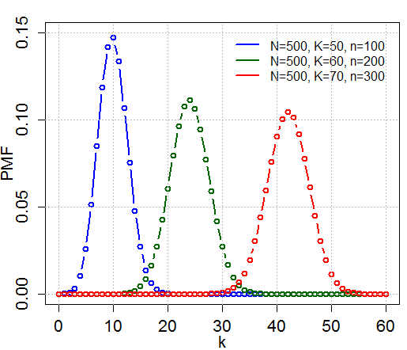
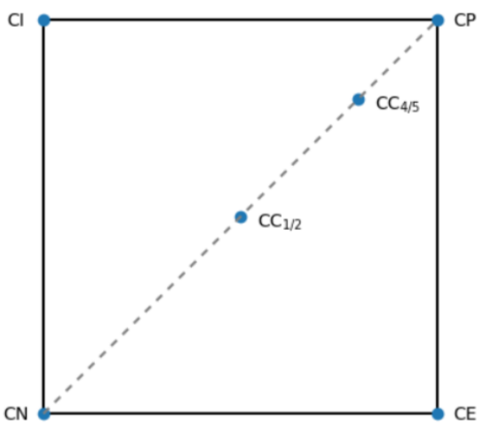

---
title: Statistica e analisi dei dati
date: a.a. 2024-2025
author: Gabriele Fioco
lang: it-IT
geometry: margin=1.5in
toc: true
toc-depth: 2
numbersections: true
header-includes: |
    \usepackage{fancyhdr}
    \usepackage{amsmath}
...

\newcommand{\Var}[1]{\text{Var}#1}
\newcommand{\Cov}[1]{\text{Cov}#1}
\newcommand{\mse}[1]{\text{MSE}#1}

# Introduzione alla statistica

## Definizione

Definizione
: La _statistica_ si occupa della raccolta, descrizione e analisi dei dati, possibilmente traendone delle conclusioni. La statistica è l'arte di apprendere dai dati.

A volte un'analisi statistica comincia con un insieme di dati prestabilito, in questo caso la statistica si usa per descrivere, riassumere e analizzare i dati. In altre situazioni i dati non sono ancora disponibili e si può usare la statistica per progettare un esperimento che li generi. Se ne occupa la _statistica descrittiva_.

Definizione
: La statistica descrittiva è la parte della statistica che descrive e riassume i dati.

Una volta che i dati sono stati raccolti e descritti, si vogliono trarre delle conclusioni. Se ne occupa la _statistica inferenziale_.

Definizione
: La statistica inferenziale è la parte della statistica che trae conclusioni dai dati.

La statistica inferenziale si basa sul modello probabilistico che consiste nel fare un insieme di assunzioni sulle probabilità di ottenere un certo valore. La statistica inferenziale, quindi, richiede la conoscenza della teoria della probabilità. L'inferenza statistica si basa sull'assunzione che importanti aspetti del fenomeno in analisi si possano rappresentare in termini di probabilità e giugne a conclusioni usando i dati per fare inferenza su queste probabilità.

## Popolazioni e campioni

La statistica si interessa a tutto un insieme di elementi detto _popolazione_. A volte questo insieme è troppo numeroso, dunque si utilizza un sottoinsieme detto _campione_.

Definizione
: Si definisce popolazione l'insieme di tutti gli elementi di interesse.

Definizione
: Si definisce campione un sottoinsieme della popolazione che viene studiato in dettaglio.

Affinchè il campione dia informazioni su tutta la popolazione, questi deve essere rappresentativo di tutta la popolazione. Con rappresentativo si intende che il campione deve essere scelto in modo che tutte le parti della popolazione abbiano uguale probabilità di far parte del campione.

Definizione
: Un campione di $k$ membri si dice _campione casuale_ (o _campione casuale semplice_) se i membri sono scelti in modo tale che tutte le possibili scelte dei $k$ membri siano ugualmente probabili.

Solitamente un campione non è rappresentativo se non è casuale; una scelta dei membri non casuale privilegia certi valori piuttosto che altri.

Una volta scelto un campione casuale si può usare l'inferenza statistica per giungere a conclusioni sull'intera popolazione.

\part{Statistica descrittiva}

# Dati, frequenze e diagrammi

## Tipi di dato

I dati misurati possono essere di due tipi:

- _Dati quantitativi_: l'esito della misurazione è una quantità numerica. Si dividono in discreti e continui.
- _Dati qualitativi_: l'esito della misurazione è un'etichetta appartenente a un insieme fissato di etichette. Si dividono in:
	+ _Dati binari/booleani_: la misurazione può avere solo uno tra due valori, tra loro non confrontabili.
	+ _Dati nominali_: i valori misurati non sono confrontabili tra loro, ovvero è possibile stabilire solo una relazione di equivalenza.
	+ _Dati ordinali_: è possibile stabilire una relazione di ordine tra i valori misurati.

Presentare efficacemente i dati ne evidenzia immediatamente le caratteristiche.

## Frequenza e diagrammi per la frequenza

Definizione
: La _frequenza_ è il numero di occorrenze di un dato valore in un insieme di dati.

Se l'insieme di dati contiene un numero ridotto di valori distinti si possono rappresentare con una _tabella delle frequenze_.

{ width=300px }

La tabella delle frequenze può essere rappresentata graficamente con:

- _diagramma a bastoncini_: indica i valori sull'asse orizzontale e rappresenta la frequenza corrispondente con l'altezza di un segmento verticale;
- _diagramma a barre_: rappresentano le frequenze non con linee ma con barre di un dato spessore; 
- _diagramma poligoniale_: rappresenta i valori delle frequenze con punti connessi da frequenze.

{ width=600px }

## Simmetria

Definizione
: Un insieme di dati si dice _simmetrico_ intorno al valore $x_0$ sse le frequenze dei valori $x_0 - c$ e $x_0 + c$ sono le stesse per ogni $c$. L'insieme di dati si dice _quasi simmetrico_ se è approsimativamente simmetrico.

## Frequenza relativa, diagramma a torta

Definizione
: Sia $A = x_1, \dots, x_n$ un insieme di $n$ dati, sia $f_i$ la frequenza di un valore $x_i$ in $A$. Si definisce _frequenza relativa_ di $x_i$ il numero $f_i/n$. 

La frequenza relativa è utile per capire se una frequenza è alta o bassa rispetto al totale dei dati.

Si osserva che la somma di tutte le frequenze relative in un insieme di dati è sempre pari a 1. I grafici delle frequenze relative hanno lo stesso aspetto del grafico delle frequenze assolute, cambiano i valori sull'asse verticale.

Se i dati non sono numerici si utilizza un _diagramma a torta_. Si costruisce usando un cerchio suddiviso in settori, uno per valore distinto dei dati. Dato un valore con frequenza relativa $f/n$ allora l'area del settore è la frazione $f/n$ dell'area del cerchio, ovvero un arco con un angolo di $360 \cdot (f/n)$ gradi.

{ width=400px }

## Frequenze cumulate, diagramma delle frequenze cumulate, diagrammi di Paretos

Definizione
: Dato un campione di $n$ dati ordinabili, sia $x_i$ l'$i$-esimo elemento. Si definiscono _frequenza cumulata_ di $x_i$ il numero totale di elementi $x_j$ tali che $j \leq i$; _frequenza relativa cumulata_ di $x_i$ il rapporto tra la frequenza cumulata di $x_i$ e $n$.

Si può tracciare il _diagramma delle frequenze cumulate_, che sull'asse $x$ pone, ordinati, i valori dei dati; sull'asse $y$ la frazione dei dati che sono minori o uguali al valore sulla $x$.

{ width=300px }

Dal diagramma si osserva che le frequenze cumulate sono monotone crescenti e variano da 0 a $n$.

Il _diagramma di Pareto_ permette di rappresentare frequenze e frequenze cumulate congiuntamente. Si ordinano i dati per frequenza decrescente su un diagramma a barre e si sovrappone con una linea spezzata che collega i valori delle frequenze cumulate. Si osserva che il valore a sinistra ha frequenza e frequenza cumulata sempre uguali. Il diagramma di Pareto permette di identificare sia gli elementi più frequenti sia il loro peso cumulativo.

{ width=300px }

## Raggruppamento dei dati e istogrammi

Se un insieme di dati ha un numero di valori distinti numeroso si suddivide in gruppi (o classi) e si rappresentano i grafici con il numero di valori dei dati che cadono in una certa classe. Il numero di classi scelte dovrebbe essere un compromesso tra poche classi, al costo di perdere informazioni, e troppe classi, ottenendo frequenze troppo basse per ogni classe. Solitamente si scelgono classi di uguale lunghezza.

Si dice _istogramma_ il grafico a barre delle classi. L'asse verticale rappresenta la frequenza o la frequenza assoluta; l'ampiezza di una barra rappresenta l'ampiezza della classe.

## Diagramma ramo-foglia

Per rappresentare un insieme di pochi dati si può usare il diagramma a foglia. Il diagramma a foglia si costruisce dividendo ciascun valore in due parti chiamate ramo a foglia. Per ogni ramo si denota tra parentesi il numero di foglie.

{ width=300px }

La scelta dei rami va fatta in modo che il diagramma ramo-foglia sia informativo, senza troppi rami. Se vi sono troppe foglie, si può duplicare il ramo e disporre su più righe.

{ width=300px }

## Dati a coppie, diagramma di dispersione

A volte i dati consistono in coppie di valori con qualche relazione tra di loro. Per rappresentare dati a coppie si utilizza il diagramma di dispersione. Il diagramma di dispersione è un piano che contiene tanti punti quanto il numero di osservazioni, ogni punto individuato alle coordinate corrispondenti ai suoi valori $x$ e $y$.

{ width=300px }

Il diagramma di dispersione è utile per identificare valori fuori scala dovuti, ad esempio, a una misurazione errata.

# Statistiche

Definizione
: Una _statistica_ è una quantità numerica calcolata a partire da un insieme di dati.

## Indici di centralità

Definizione
: Un _indice di centralità_ descrive la tendenza centrale di un insieme di dati. 

Sia $\{ x_1, x_2, \dots, x_n \}$ un campione di $n$ dati. Si danno tre indici di centralità.

### Media campionaria

Definizione
: La _media campionaria_, denotata con $\bar x$, è definita come segue:

$$
\bar x = \frac{\sum_{i=0}^{n} x_i}{n} = \frac{x_1 + x_2 + \dots + x_n}{n}
$$

Se si traslano o scalano nello stesso modo tutti gli elementi del campione la nuova media è legata con una relazione lineare a quella precedentemtnte calcolata. Ovvero siano $a$ e $b$ due costanti, siano $y_i = ax_i + b$ per $i = 1, \dots, n$ i nuovi valori del campione allora $\bar y = a \bar x + b$.

Si supponga di ordinare il campione ottenendo una $n$-upla $(v_1, v_1, v_1, \dots, v_2, v_2, \dots, v_2, \dots, v_m, \dots, v_n)$. Si definisce frequenza la cardinalità del sottoinsieme $f_i = \{v_i, v_i, \dots, v_i \}$. Si osserva allora che:

$$
\begin{aligned}
\bar x & = \frac{1}{n} (f_1 v_1 + f_2 v_2 + \dots + f_m v_m) \\
& = \frac{f_1}{n}v_1 + \frac{f_2}{n} v_2 + \dots + \frac{f_i}{n} v_i
\end{aligned}
$$

ovvero la media campionaria è la media pesata dell'insieme dei valori distinti rispetto alla loro frequenza relativa.

La media campionaria soffre in caso di valori fuori scala.

Definizione
: Si dice _scarto_ la differenza tra un valore dei dati e la media campionaria. Lo scarto di $x_i$ è $x_i - \bar x$.

Proposizione
: La somma di tutti gli scarti è 0.

Dimostrazione
: Partendo dalla definizione di somma di tutti gli scarti:

$$
\sum_{i=0}^{n} (x_i - \bar x) = \sum_{i = 0}^{n} x_i - \sum_{i=0}^{n} \bar x = n \bar x - n \bar x = 0
$$

### Mediana campionaria

Definizione
: Si denota con $x_{(i)}$ l'$i$-esimo valore nel campione ordinato. Si definisce _mediana campionaria_ la quantità:

$$
m =
\begin{cases}
x_{((n + 1) / 2)} & \text{se $n$ è dispari} \\
\frac{1}{2} (x_{(n / 2)} + x_{(n / 2 + 1)}) & \text{se $n$ è pari}
\end{cases}
$$

Ovvero $m$ è il valore al centro dei dati, una volta ordinati. Se $n$ è pari non esiste un unico valore al centro, quindi si considera la media aritmetica dei due valori al centro.

La mediana campionaria non è influenzata dai valori estremi.

### Moda campionaria

Definizione
: Si definisce _moda campionaria_ il valore che occorre con maggior frequenza nel campione. Se non esiste un unico valore con frequenza più alta nell'insieme allora tutti i valori con la frequenza massima sono detti _valori modali_.

### Percentili campionari

Definizione
: Sia $p \in [0, 1] \subseteq \mathbb{R}$. Si definisce _$100p$-esimo percentile campionario_ (o _quantile di livello $p$_) il valore maggiore o uguale di almeno $100p%$ dei valori dei dati e minore o uguale di almeno $100(1 - p)%$ dei valori dei dati. Se due valori soddisfano questa condizione allora il $100p$-esimo campionario è la media aritmetica tra i due.

Quindi dato un campione di $n$ elementi il $100p$-esimo percentile campionario è quel numero che è maggiore di almeno $np$ dati dell'insieme e minore di almeno $n(1-p)$ dati del campione.

La mediana campionaria è un caso particolare di $100p$-esimo percentile campionario per $p = 0.50$.

Definizione
: Il 25-esimo percentile campionario si dice _primo quartile_, il 50-esimo percentile campionario si dice _secondo quartile_, il 75-esimo percentile campionario si dice _terzo quartile_.

Diagramma a scatola
: I diagrammi a scatola sono utili per presentare statistiche riassuntive. Si traccia un segmento orizzontale a cui si posizionano a sinistra e a destra rispettivamente i valori minimi e massimi. Al segmento si sovrappone un rettangolo che si estende dal primo al terzo quartile; al centro del rettangolo c'è un segmnto verticale al secondo quartile.

{ width=300px }

Diagramma quantile-quantile
: Siano $X = x_1, \dots, x_n$ e $Y = y_1, \dots, y_m$ due campioni. Un diagramma quantile-quantile (diagramma QQ) è un piano in cui il punto $(x_i, y_i)$ è tale che $x_i$ e $y_i$ sono quantili dello per lo stesso livello $p$ in $X$ e $Y$.

I diagrammi QQ permette di valutare se due campioni hanno la stessa distribuzione. Se così fosse allora i quantili di un livello $p$ qualunque sono due numeri molto vicini. Solitamente si effettua una discretizzazione che copre l'intervallo $p \in [0, 1]$. Sul grafico i punti sono allineati approsimativamente sulla bisettrice del primo e del terzo quadrante.

{ width=300px }

## Indici di dispersione

Un _indice di dispersione_ descrive quanto i valori del campione si discostano dal centro. Si potrebbe pensare di calcolare la media aritmetica degli scarti dalla media, tuttavia sappiamo che la differenza tra la somma degli scarti e la media è 0. Si è però interessati all'entità dei singoli scarti, non al segno, dunque non bisogna distinguire tra negativi e positivi. Si calcola quindi il quadrato.

### Varianza campionaria

Definizione
: Sia $x_1, \dots, x_n$ un insieme di dati di media $\bar x$. La _varianza campionaria_ $S^2$ è definita come:

$$
S^2 = \frac{1}{n - 1} \sum_{i=1}^{n} (x_i - \bar x)^2
$$

Si può dimostrare che vale quanto segue:

$$
\sum_{I=1}^{n} (x_i - \bar x)^2 = \sum_{i=1}^{n} x_i^2 - n \bar x^2
$$

Si consideri di scalare tutti i valori per una costante $a$ e di traslare per una costante $b$. Siano quindi $y_i = ax_i + b$ i nuovi valori per $i = 1, \dots, n$. Allora $\bar y = a \bar x + b$ e:

$$
\sum_{i=1}^{n} (y_i - \bar y)^2 = a^2 \sum_{i=1}^{n} (x_i - \bar x)^2
$$

da cui:

$$
S_Y^2 = a^2 S_X^2
$$

quindi traslare i dati non ha effetto sulla varianza campionaria; scalare i dati modifica la varianza campionaria per un fattore pari al quadrato dello scalare.

### Deviazione standard campionaria

Definizione
: La _deviazione standard campionaria_ $S$ è la quantità:

$$
S = \sqrt{S^2} = \sqrt{\frac{1}{n - 1} \sum_{i=1}^{n} (x_i - \bar x)}
$$

Come conseguenza delle osservazioni precedenti traslare i dati non cambia $S$; scalare i dati di un numero $c$ cambia la deviazione standard campionaria come $S_y = |c| S_x$.

Si osserva che la deviazione standard campionara è espressa nella stessa unità di misura dei dati originali. Di conseguenza la variazione campionaria è il quadrato dell'unità di misura originale.

### Scarto interquartile

Definizione
: Si dice _scarto interquartile_ (IQR) la differenza tra il primo quartile e il terzo quartile di un insieme di dati.

L'IQR non è influenzato dai valori fuori scala. Un IQR piccolo indica che la metà centrale dei dati è relativamente concentrata attorno alla mediana, mentre un IQR ampio indica una maggiore dispersione nella arte centrale della distribuzione.

Lo scarto interquartile è utile per trovare i valori fuori scala, in particolare un valore $x$ è fuori scala se o è minore di $Q_1 - 1.5 \text{IQR}$ o maggiore di $Q_3 + 1.5 \text{IQR}$.

## Indici di correlazione

Si consideri un insieme di dati a coppie $(x_1, y_1), (x_2, y_2), \dots, (x_n, y_n)$. Gli indici di correlazione permettono di misurare la corrispondenza tra grandi/piccoli valori di $x$ e grandi/piccoli valori di $y$. Si parla di correlazione positiva quando i dati sono direttamente proporzionali; correlazione negativa quando i dati sono inversamente proporzionali.

>Correlation is not causation! `https://www.tylervigen.com/spurious-correlations`

Si osserva che lo scarto $x_i - \bar x$ è positivo per $x_i$ grande, negativo per $x_i$ piccolo e analogamente per i valori $y_i$. Quindi se grandi/piccoli valori di una variabile sono associati a grandi/piccoli valori dell'altra variabile allora i segni degli scarti $x_i - \bar x$ e $y_i - \bar y$ tendono ad essere gli stessi. Per questo il prodotto $(x_i - \bar x)(y_i - \bar y)$ è positivo, quindi la quantità $\sum (x_i - \bar x)(y_i - \bar y)$ tende a un numero grande positivo. Viceversa se grandi valori di una variabile sono associati a piccoli valori dell'altra variabile allora i segni di $x_i - \bar x$ e $y_i - \bar y$ sono opposti quindi il prodotto $(x_i - \bar x)(y_i - \bar y)$ tende a essere negativo quindi $\sum (x_i - \bar x)(y_i - \bar y)$ tende a un numero grande negativo. Si definisce quindi un indice.

Definizione
: Si definisce _covarianza_ la quantità

$$
s_{x,y} = \frac{1}{n-1} \sum_{i=1}^{n} (x_i - \bar x)(y_i -\bar y)
$$

Ora si standardizza dividendo per le rispettive deviazioni standard.

Definizione
: Siano $s_x$ e $s_y$ la deviazione standard rispettivamente dei valori $x$ e dei valori $y$. Si definisce _coefficiente di correlazione campionaria_ (o _indice di Pearson_) il numero:

$$
r = \frac{1}{n-1} \frac{\sum_{i=1}^{n} (x_i - \bar x)(y_i - \bar y)}{s_x s_y}
$$

Se $r < 0$ allora i dati sono correlati negativamente; se $r > 0$ i dati sono correlati positivamente.

Si osservano diverse proprietà:

- $-1 \leq r \leq 1$
- Siano $a$ e $b$ due costanti con $b > 0$. Se vale la relazione lineare

$$
y_i = ax_i + b
$$

 allora $r = 1$; se $r = 1$ allora esistono $a$ e $b$ costanti con $b > 0$ tali che valga la precedente relazione lineare.

- Siano $a$ e $b$ due costanti con $b < 0$. Se vale la relazione lineare

$$
y_i = ax_i + b
$$

allora $r = -1$; se $r = -1$ allora esistono $a$ e $b$ costanti con $b < 0$ tali che valga la precedente relazione lineare.

- Se si scalano e traslano i dati rispettivamente come $(a + bx_i, c + dy_i)$ se $b$ e $d$ hanno lo stesso segno allora $r$ non cambia.

Ne consegue che $r$ è nei limiti $1$ e $-1$ quando i valori sono in una relazione lineare, ovveri i punti del diagramma di dispersione giacciono su una retta. Inoltre $r$ non dipende dall'unità di misura scelta. Si osserva infine che per $r$ la retta punat verso l'alta; per $r$ negativo la retta punta verso il basso.

Si da una formula per semplificare i calcoli di $r$

Proposizione
: Sia $r$ il coefficiente di correlazione campionaria di due campioni $x$ e $Y$, allora

$$
r = \frac{\sum_{i=1}^{n} x_i y_i - n \bar x \bar y}{\sqrt{(\sum_{i=1}^{n} x_i^2 - n \bar x^2)(\sum_{i=1}^{n} y_i^2 - n \bar y_2)}}
$$
 
## Indici di eterogeneità

Definizione
: Una variabile si distribuisce in modo _eterogeneo_ se ogni suo valore si presenta con la stessa frequenza. Viceversa si dice _omogenea_.

Gli indici di eterogeneità permettono di calcolare la dispersione della distribuzione delle frequenze. Si possono calcolare acnhe per dati qualitativi nominali.

### Indice di Gini

Definizione
: Sia $\{ x_1, x_2, \dots, x_n \}$ un campione con valori distinti $v_1, v_2, \dots, v_m$, sia $f_i$ la frequenza relativa di $v_i$. L'_indice di Gini_ è la quantità:

$$
I = 1 - \sum_{i=0}^{m} f_i^2 
$$

Si osserva che $0 \leq I < 1$, infatti:

- per almeno una $i$ vale $f_i^2 > 0$ quindi $\sum f_i^2 > 0$ quindi $I < 1$;
- per ogni $i$ vale $f_i^2 \leq f_i$ (un numero minore di 1 elevato al quadrato è minore di sè stesso) e $0 \leq f_i \leq 1$ quindi $\sum f^2_i \leq \sum f_i = 1$ quindi $I \geq 0$.

Si osserva poi che vi sono due casi:

- Eterogeneità massima: tutti gli elementi hanno stessa frequenza relativa $f_i = 1/m$, quindi $I = 1 - 1/m$. Per $m$ grande $I \approx 1$. 
- Eterogeneità minima (o omogeneità): tutti gli elementi hanno stesso valore, quindi esiste un singolo $v_i$ per il cui $f_i = 1$, quindi $I = 1 - 1 = 0$.

Definizione
: Dividendo $I$ per il valore massimo $1 - 1/m = (m - 1)/m$ si ottiene l'_indice di Gini normalizzato_:

$$
I' = \frac{I}{\frac{m - 1}{m}} = I \cdot \frac{m}{m - 1} = \frac{I \cdot m}{m - 1}
$$

L'indice di Gini normalizzato serve a confrontare l'indice di Gini per campioni con cardinalità dei valori distinti diversa. Inoltre l'indice di Gini calcolato su un insieme completamente eterogeneo non ha valore 1 ma un valore tendente a 1 dando problemi di interpretazione; l'indice di Gini normalizzato calcolato su un insieme completamente eterogeneo ha valore esattamente pari a 1.

### Entropia

Definizione
: Sia $a_1, \dots, a_n$ un campione con valori distinti $v_1, \dots, v_k$, sia $f_i$ la frequenza dell'elemento $v_i$ per $i = 1, \dots, k$. Si dice _indice di entropia_ la quantità

$$
H = \sum_{i=1}^{k} f_i \log \frac{1}{f_i} = - \sum_{i=1}^{k} f_i \log f_i
$$

questo aggeggio qui vale 0 sse $f_j = 1$.

## Indici di concentrazione

Siano $a_1 \leq a_2, \leq \dots \dots a_n$ i valori ordinati di $n$ osservazioni, sia $\bar a$ la media degli $n$ valori, sia $\text{TOT} = \sum_{i=1}^{n} a_i = n \bar a$ la somma degli $n$ valori.

La concentrazione può essere:

- Minima: si verifica quando tutti i valori assumono lo stesso valore $a_1 = a_2 = \dots = a_n$.
- Massima: si verifica quando tutti i valori assumono il valore 0 tranne l'ultimo che ha valore $n \bar a$. $a_1 = a_2 = \dots = 0$ e $a_n = n \bar a$.

Si vuole avere un indice che vale 0 nel caso di concentrazione minima e 1 nel caso di concentrazione massima. Si definiscono due quantità:

$$
F_i = \frac{i}{n}, Q_i = \frac{\sum_{k=1}^{n} a_k}{\text{TOT}}
$$

$F_i$ è la frequenza relativa comulata fino alla posizione $i$. $Q_i$ è la quantità relativa comulata fino alla posizione $i$

Si verifica che:

- $0 \leq F_i \leq 1$
- $0 \leq Q_i \leq 1$
- $Q_i \leq F_i$ poichè le osservazioni sono in ordine crescente
- $Q_i = F_i$ nel caso di concentrazione minima
- $Q_n = F_n$

Le coppie $(F_i, Q_i)$ indicano che il $100 F_i \%$ della popolazione detiene il $100 Q_i \%$ della ricchezza. Dunque vi sono due casi:

- Concentrazione minima: tutte le coppie giacciono sulla retta $F = Q$.
- Concentrazione massima: per $i = 1, \dots, n - 1$ le coppie $(F_i, Q_i)$ sono del tipo $(F_i, 0)$ quindi giacciono sull'asse $Q = 0$. Per $i = n$ la coppia $(F_n, Q_n)$ vale $(1, 1)$ quindi giace sulla bisettrice.

In generale più i punti sono sotto la bisettrice (la retta $F = Q$) più la concentrazione è massima. L'area compresa tra la bisettrice e la curva dei punti $(F_i, Q_i)$ (curva di Lorentz) è detta area di concentrazione. Maggiore è la concentrazione maggiore è l'area osservata.

{ width=300px }

Il grafico deve essere analizzato qualitativamente, come quantità numerica si definisce un indice che permette di valutare la concentrazione tra due estremi.

Definizione
: Si definisce _indice di concentrazione di Gini_ la quantità:

$$
G' = \frac{\sum_{i=1}^{n-1} (F_i - Q_i)}{\sum_{i=1}^{n-1} F_i}
$$

Si osserva:

$$
\sum_{i=1}^{n-1} F_i = \sum_{i=1}^{n-1} \frac{i}{n} = \frac{1}{n} \sum_{i=1}^{n-1} i = \frac{1}{n} \frac{n - 1}{2} = \frac{n - 1}{2}
$$

sostituendo:

$$
G = \frac{2}{n - 1} \sum_{i=1}^{n-1} (F_i - Q_i)
$$

Inoltre vale $0 \leq G \leq 1$

# Campioni normali

Definizione
: Un campione si dice _normale_ sse l'istogramma ha un solo massimo in corrispondenza della mediana e decresce in entrambi i lati simmetricamente secondo una curva a campana. Un istogramma non normale ma con un aspetto simile a uno normale si dice approsimativamente normale.

Definizione
: Se un insieme di dati presenta un istogramma sensibilmente assimmetrico rispetto alla mediana si dice che è _sbilanciato a sinistra_ o _sbilanciato a destra a destra_ a seconda di dove appare la coda più lunga.

Si osserva che un campione approsimativamente normale ha media e mediana campionaria circa uguali.

Proposizione (Regola empirica)
: Siano $\bar x$ e $s$ rispettivamente media e deviazione standard campionaria di un insieme di dati approsimativamente normale, allora:

- Circa il 68% dei dati rientrano nell'intervallo $\bar x \pm s$
- Circa il 95% dei dati rientrano nell'intervallo $\bar x \pm 2s$
- Circa il 99.7% dei dati rientrano nell'intervallo $\bar x \pm 3s$

A volte un insieme di dati assomiglia a una sovrapposizione di istogrammi normali con due o più massimi locali che si comportano come delle mode. In questi casi potrebbe essere che i dati trattano popolazioni diverse, pertanto ha senso dividere i dati in base a queste popolazioni e ottenere un insieme normale. Questi dati si dicono bimodali.

# Trasformazione dei dati

Si consideri un insieme di valori distinti $X = \{ x_1, \dots, x_n \}$, sia $f_i$ la frequenza relativa di $x_i$. Si consideri ora l'insieme $Y = \{ x_1', \dots, x_n' \}$. Una trasformazione è una funzione $g : X \rightarrow Y$, cioè trasforma ogni elemento $X$ in uno e un solo elemento $Y$. Si considerano solo trasformazioni iniettive. La frequenza relativa $f_i$ degli elementi $x_i'$ rimane la stessa degli elementi $x_i$. Si considerano trasformazioni lineari, cioè tali che per $a, b \in \mathbb{R}$:

$$
g(x) = ax + b
$$

## Traslazione

Per traslare i dati di  una quantità $k > 0$ si applica la funzione $g(x) = x - k$ per traslare a sinistra e $g(x) = x + k$ per traslare a destra. Risulta utile per valori molto grandi e poco dispersi.

Si osserva:

- Media, mediana e quantili vengono traslati della stessa quantità $k$, nello stesso verso.
- Range, distanza interquartile, deviazione e varianza non cambiano.

Inoltre sia $\bar x$ la media campionaria, allora se $k = \ bar x$ traslando a sinistra la nuova media è nulla.

## Scalatura

La scalatura per una costante $k \in \mathbb{R}^{+}$ applica la funzione $g(x) = kx$. Per $h > 1$ i valori vengono dilatati, per $h < 1$ i valori vengono contratti.

Si osserva:

- Mediana, mediana, quantili, range interquartile, distanza interquartile e deviazione vengono scalati della stessa quantità $k$.
- La varianza viene scalata di una quantità $k^2$.

## Cambiamento di origine e scala

Si consideri che i valori in $X$ sono in un intervallo $(a, b)$. Per adattarli a un nuovo intervallo $(c, d)$ bisogna applicare la trasformazione:

$$
g(x) = (x - a) \frac{d - c}{b - a} + c
$$

## Standardizzazione

## Logaritmizzazione (termine inventato lmao)

\part{Teoria della probabilità}

# Calcolo combinatorio

Il calcolo combinatorio è una branca della matematica che studia i modi per raggruppare e/o ordinare gli elementi di un insieme finito di oggetti. Siamo interessati a contare le configurazioni possibili.

## Principio fondamentale del calcolo combinatorio

Il _principio fondamentale del calcolo combinatorio_ afferma che se ci sono $s_1$ modi per operare una scelta a cui corrispondono $s_2$ modi per operare una seconda scelta a cui corrispondono $s_3$ modi per operare una terza scelta, e così via fino a $s_t$ modi per operare la $t$-esima scelta, allora il numero totale $m$ delle sequenze di possibili scelte è:

$$
m = s_1 \cdot s_2 \cdot \dots \cdot s_t = \prod_{i=1}^{t} s_i
$$

## Permutazioni

Sia $A = \{ a_1, \dots, a_n \}$ un insieme di $n$ oggetti.

Permutazione
: Si definisce permutazione di $A$ una sequenza ordinata in cui compaiono tutti gli $n$ oggetti.

Permutazioni semplici
: Se gli oggetti di $A$ sono tutti distinguibili allora le permutazioni di $A$ sono semplici. Per calcolare il numero totale di permutazioni possibili $P_n$ si applica il principio fondamentale del calcolo combinatorio: inizialmente vi sono $n$ scelte, preso un elemento $a_1' \in A$ allora rimangono $n - 1$ scelte, preso un secondo elemento $a_2' \in A$ allora rimangono $n - 2$ scelte e così via, in generale per l'$i$-esimo elemento rimangono $n - (i - 1)$ scelte. Dunque:

$$
P_n = n \cdot (n-1) \cdot (n-2) \cdots 1 = n!
$$

Permutazioni con ripetizione
: Se gli $n$ oggetti non sono tutti indistinguibili allora le permutazioni di $A$ sono con ripetizione. Sia $n_1, n_2, \dots, n_k$ la numerosità dei gruppi indistinguibili. Per calcolare il numero di permutazioni con ripetizione $P_{n;n_1, \dots,n_k}$:

$$
P_{n;n_1,\dots,n_k} = \frac{n!}{n_1! \cdot n_2! \cdot \dots \cdot n_k!} = \binom{n}{n_1, n_2, \dots, n_k}
$$

## Disposizioni

Sia $A = \{ a_1, \dots, a_n \}$ un insieme di $n$ oggetti.

Disposizione
: Sia $k$ un numero intero non negativo. Si definisce disposizione di $n$ oggetti su $k$ posti un sottoinsieme ordinato di $k$ elementi scelti tra gli $n$.

Disposizioni semplici (o senza ripetizione)
: Una disposizione semplice è una disposizione in cui ogni oggetto può apparire solo una volta. Deve valere $k \leq n$. Per calcolare il numero $d_{n,k}$ di disposizioni semplici si procede analogamente alle permutazioni semplici ma fermandosi alla $k$-esima posizione.

$$
\begin{aligned}
d_{n,k} & = n \cdot (n - 1) \cdot (n - 2) \cdots (n - k + 1) \\
& = n \cdot (n - 1) \cdot (n - 2) \cdots (n - k + 1) \cdot \frac{(n - k)!}{(n - k)!} \\
& = \frac{n!}{(n - k)!}
\end{aligned}
$$

Disposizioni con ripetizione
: Una disposizione con ripetizione è una disposizione in cui un oggetto può apparire più volte. Per calcolare il numero di disposizioni con ripetizione $D_{n,k}$ si osserva che alla prima posizione si possono inserire $n$ oggetti, alla seconda posizione $n$ oggetti, etc... in generale alla $i$-esima posizione si possono inserire $n$ oggetti.

$$
D_{n,k} = n^k
$$

## Combinazioni

Sia $A = \{ a_1, \dots, a_n \}$ un insieme di $n$ oggetti.

Combinazione
: Sia $k$ un intero non negativo. Si definisce combinazione di $n$ oggetti presi $k$ alla volta un insieme di $k$ elementi tra gli $n$.

>__*NOTA:*__ La differenza tra combinazioni e disposizioni è che in una combinazione non si è interessati all'ordine in cui sono presi i $k$ oggetti tra gli $n$.

Combinazioni semplici (o senza ripetizione)
: Una combinazione semplice è una combinazione in cui gli oggetti possono essere usati solo una volta. Quindi deve valere $k \leq n$. Dati $n$ oggetti vi sono $n$ scelte per il primo, $n - 1$ per il secondo, e così via fino a $n - k + 1$. Poichè non importa l'ordine non bisogna considerare le combinazioni uguali quindi è necessario dividere per il numero di volte in cui una combinazione appare che è pari a $k!$.

$$
c_{n,k} = \frac{n (n - 1) (n - 2) \cdots (n - k + 1)}{k!} = \frac{n!}{k!(n - k)!} = \binom{n}{k}
$$

Combinazioni con ripetizione
: Una combinazione con ripetizione è una combinazione in cui gli oggetti possono essere usati più volte. Per calcolare il numero $C_{n,k}$ di combinazioni con ripetizioni presi $k$ alla volta si usa la seguente formula.

$$
C_{n,k} = \binom{n + k - 1}{k} = \frac{(n + k - 1)!}{k!(n + k - 1 - k)!} = \frac{(n + k - 1)!}{k!(n - 1)!}
$$

# Introduzione alla probabilità

## Esiti ed eventi

Definizione
: Dato un esperimento si definisce _spazio degli esiti_ e si denota con $\Omega$ l'insieme di tutti gli esiti possibili.

Definizione
: Dato uno spazio degli esiti $\Omega$ si definisce _evento_ un sottoinsieme di $\Omega$.

Se l'esito di un esperimento è in un evento $E$ allora si dice che l'evento $E$ si è verificato. L'evento $\emptyset$ si dice _evento impossibile_ ed è l'evento che non si verifica mai. L'evento $\Omega$ si dice _evento certo_.

Dato uno spazio degli esiti $\Omega$ e un insieme di $n$ eventi $E_i$ per $i = 1, \dots, n$, utilizzando le operazioni insiemistiche si osserva che:

- L'evento $E_1 \cup E_2 \cup \dots \cup E_n = \bigcup_{i=1}^{n} E_i$ si verifica sse si verifica almeno uno degli eventi $E_i$. Ovvero è l'evento formato da tutti gli esiti che appartengo ad almeno un $E_i$.
- L'evento $E_1 \cap E_2 \cap \dots \cap E_n = \bigcap_{i=1}^{n} E_i$ si verifica sse si verificano tutti gli eventi $E_i$. Ovvero è l'evento formato dagli esiti che appartengono a tutti gli $E_i$. Se $\bigcap_{i=1}^{n} E_i = \emptyset$ gli $E_i$ si dicono _eventi disgiunti_.

Inoltre siano $E$ ed $F$ due eventi:

- L'evento $E^C$, detto complementare di $E$, è l'insieme di tutti gli esiti contenuti in $\Omega$ che non sono in $E$. Si osserva che $\Omega^C = \subseteq$.
- L'evento $E \minus F$ si verifica sse si verifica $E$ ma non $F$. Ovvero è l'evento formato da tutti gli eventi che sono in $E$ meno quelli che sono in $F$.

## Probabilità

Definizione
: Sia $\Omega$ uno spazio degli esiti, sia $a$ una $\sigma$-algebra in $\Omega$. Si dice _probabilità_ una misura $P: a \rightarrow [0, + \infty]$ tale che $P(\Omega) = 1$. $a$ si dice _algebra degli eventi_. La terna $(\Omega, a, P)$ si dice _spazio di probabilità_.

Le proprietà date dalla definizone di $\sigma$-algebra permettono che l'unione, l'intersezione e il complemento di un evento sia sempre un evento.

### Assiomi di Kolmogorov

La definizione di probabilità scritta precedentemente è un modo per riassumere gli _assiomi di Kolmogorov_ che permettono di formalizzare il concetto di probabilità con tre assiomi.

Sia $(\Omega, a)$ uno spazio misurabile. Si dice probabilità dell'evento $E$ e si scrive $P(E)$ un numero associato ad $E$ che soddisfa i seguenti tre assiomi, detti di Kolmogorov:

- $(K1) \ \forall E \in a \ P(E) \geq 0$
- $(K2) \ P(\Omega) = 1$
- $(K3) \ \forall E_1, E_2, \dots, E_n \in a$ se $i \neq j \implies E_i \cap E_j = \emptyset$ (ovvero tutti gli eventi sono disgiunti) allora:

$$
P(\bigcup_{i=1}^{n} E_i) = \sum_{i=1}^{n} P(E_i)
$$

Si osserva che dalla $K2$ si ottiene $\forall E \in \Omega P(E) \leq 1$, assieme $K1$ si può concludere $\forall E \in \Omega 0 \leq P(E) \leq 1$.

### Proprietà

Sia $(\Omega, a, P)$ uno spazio di probabilità. Si mostrano una serie di risultati utili.

Proposizione
: $\forall E \in a \ P(E) = 1 - P(E^C)$

Dimostrazione
: Si osserva che $E \cup E^C = \Omega$, quindi $P(E \cup E^C) = P(\Omega) = 1$ applicando il $K2$. Inoltre $E \cap E^C = \emptyset$ quindi applicando il $K3$ vale $1 = P(E \cup E^C) = P(E) + P(E^C)$ da cui $P(E) = 1 - P(E^C)$.

Teorema (Teorema delle probabilità totali)
: Sia $a$ un'algebra degli eventi, sia $E$ ed $F$ due eventi in $a$. Allora:

$$
P(E \cup F) = P(E) + P(F) - P(E \cap F)
$$

Dimostrazione
: Siano $I = E - F$, $II = E \cap F$, $III = F - E$. Si può dimostrare che $I \cap II \cap III = \emptyset$, quindi applicando $K3$:

$$
\begin{aligned}
P(E \cup F) & = P(I) + P(II) + P(III) \\
P(E) & = P(I) + P(II) \\
P(F) & = P(II) + P(III)
\end{aligned}
$$

sostituendo:

$$
\begin{aligned}
P(E \cup F) & = P(E) + P(F) - P(II) \\
& = P(E) + P(F) - P(E \cap F)
\end{aligned}
$$

Proposizione
: $P(\emptyset) = 0$

Dimostrazione
: \hfill

$$
P(\emptyset) = 1 - P(\Omega) = 1 - 1 = 0
$$

Proposizione
: Siano $E, F \in a$. Se $E \subseteq F$ allora $P(E) \leq P(F)$.

Dimostrazione
: Poichè $E \subseteq F$ si può scrivere

$$
F = E \cup (F - E)
$$

si osserva che $E \cap (F - E) = \emptyset$ quindi si può applicare $K3$

$$
P(F) = P(E \cup (F - E)) = P(E) + P(F - E)
$$

## Spazi di esiti equiprobabili

Definizione
: Uno spazio degli esiti $\Omega = \{ 1, 2, \dots, N \}$ si dice _equiprobabile_ sse $\forall i \ P(\{i\}) = p$ ovvero sse ogni evento ha la stessa probabilità di verificarsi.

Regola classica per il calcolo delle probabilità
: Sia $\Omega = \{ 1, 2, \dots, N \}$ uno spazio degli esiti equiprobabile finito, sia $E \subseteq \Omega$ un evento, allora:

$$
P(E) = \frac{|E|}{N}
$$

Dimostrazione
: Per ipotesi ogni esito $i \in S$ ha la stessa probabilità di verificarsi:

$$
P(\{1 \}) = P(\{ 2 \}) = \dots = P(\{ N \}) = p
$$

Applicando $K2$ e $K3$ si ottiene:

$$
1 = P(S) = P(\{ 1 \}) + P(\{ 2 \}) + \dots + P(\{ N \}) = Np 
$$

da cui:

$$
p = \frac{1}{N} = P(\{i\})
$$

Dalla precedente e applicando il $K3$, la probabilità dell'evento $E$ è:

$$
P(E) = P(\{ 1 \}) + P(\{ 2 \}) + \dots + P(\{ |E| \}) = \sum_{i=1}^{|E|} \frac{1}{N}  = \frac{|E|}{N}
$$

Per $|\Omega| = \infty$ allora $p \rightarrow 0$ quindi la regola non vale.

## Probabilità condizionata

Definizione
: Si dice _probabilità condizionata_ di un evento $E$ dato $F$ e si scrive $P(E|F)$ la probabilità che si verifichi $E$ sapendo che si è verificato $F$.

Per calcolare la probabilità condizionata $P(E|F)$ si osserva che se si è verificato $F$ allora lo spazio degli esiti è ridotto a $F$. Inoltre affinchè si verifichi anche $E$ il caso favorito è in $E \cap F$, dunque vale la seguente formula:

$$
P(E | F) = \frac{P(E \cap F)}{P(F)} \ \text{con} \ P(F) \neq 0
$$

per $P(F) = 0$ la probabilità è indefinita.

## Teorema della probabilità composta

Teorema (Teorema della probabilità composta)
: Siano $E$ ed $F$ due eventi, allora, dalla definizione di probabilità condizionata:

- se $P(F) \neq 0$:

$$
P(E \cap F) = P(E | F) P(F) 
$$

- se $P(E) \neq 0$:

$$
P(E \cap F) = P(F | E) P(E)
$$

Il teorema della probabilità composta dice che la probabilità che si verifichino due eventi è dato dal prodotto della probabilità che si verifichi uno di essi per la probabilità condizionata che si verifichi il secondo condizionata al verificarsi del primo.

## Fattorizzazione delle probabilità

Si consideri due eventi qualsiasi $E$ ed $F$, allora ogni esito in $E$ o è in $E$ e in $F$ o è in $E$ ma non in $F$:

$$
E = (E \cap F) \cup (E \cap F^C)
$$

Si osserva che $E \cap F$ e $E \cap F^C$ sono disgiunti, quindi si può applicare il $K3$ alla precedente:

$$
\begin{aligned}
P(E) & = P(E \cap F) + P(E \cap F^C) \\
& = P(E | F)P(F) + P(E | F^C) P(F^C) & \ \text{teorema della probabilità composta} \\
& = P(E | F)P(F) + P(E | F^C) (1 - P(F)) & \ \text{teorema della probabilità dell'evento complemento}
\end{aligned}
$$

La fattorizzazione delle probabilità permette di ricavare la probabilità di un evento $E$ come media pesata della probabilità condizionale di $E$ sapendo che $F$ si è verificato e come media pesata della probabilità condizionale di $E$ sapendo che $F$ non si è verificato, con il peso assegnato in baso alla probabilità che $F$ si è verificato o meno.

## Generalizzazione della fattorizzazione delle probabilità

Si consideri una partizione $F_1, F_2, \dots, F_n$ dello spazio degli esiti $\Omega$. Allora un qualsiasi evento $E$ si può scrivere come:

$$
E = \bigcup_{i=1}^{n} (E \cap F_i)
$$

Gli $E \cap F_i$ sono tra loro disgiunti, quindi si applica $K3$:

$$
P(E) = \sum_{i=1}^{n}P(E \cap F_i)
$$

applicando il teorema della probabilità composta si ottiene la _formula di fattorizzazione delle probabilità_:

$$
P(E) = \sum_{i=1}^{n} P(E | F_i)P(F_i)
$$

Questa permette di calcolare la probabilità di un evento $E$ condizionando rispetto a un insieme di eventi $F_i$ che formano una partizione dello spazio degli esiti $\Omega$

## Teorema di Bayes

Teorema (Teorema di Bayes)
: Siano $E$ ed $F$ due eventi tali che $P(E), P(F) \neq 0$. Allora:

$$
P(E | F) = \frac{P(F | E)P(E)}{P(F)}
$$

Dimostrazione
: Per ipotesi $P(F) \neq 0$ quindi si può applicare la definizione di probabilità condizionata:

$$
P(E | F) = \frac{P(E \cap F)}{P(F)}
$$

per ipotesi anche $P(E) \neq 0$ quindi si può applicare il teorema della probabilità composta:

$$
P(E \cap F) = P(F | E)P(E)
$$

sostituendo nella definizione di probabilità condizionata si ottiene la tesi:

$$
P(E | F) = \frac{P(F | E)P(E)}{P(F)}
$$

Corollario
: Si consideri una partizione dello spazio degli esiti $F_i$, allora fattorizzando a denominatore:

$$
P(F_i | E) = \frac{P(E | F_i)P(F_i)}{P(E)} = \frac{P(E | F_i)P(F_i)}{\sum P(E | F_i)P(F_i)}
$$

Il corollario permette di ricalcolare le probabilità di una serie di ipotesi $F_i$ dopo che l'esperimento ha dato esito $E$.

## Eventi indipendenti

Definizione
: Due eventi $E$ ed $F$ si dicono _indipendenti_ sse $P(E | F) = P(E)$. Viceversa si dicono _dipendenti_.

La precedente definizione si può riscrivere come $E$ è indipendente da $F$ sse $P(E \cap F) = P(E)P(F)$, infatti:

$$
\begin{aligned}
P(E | F) & = \frac{P(E \cap F)}{P(F)} = P(E) \\
\\
P(E \cap F) & = P(E)P(F)
\end{aligned}
$$

Definizione (Generalizzazione delle definizione di eventi indipendenti)
: Un insieme di eventi $E_1, \dots, E_n$ si dicono indipendenti sse per ogni sottoinsieme $E_1', \dots, E_r'$ con $r \leq n$ vale $P(E_1' \cap E_2' \cap \dots \cap E_r') = P(E_1')P(E_2') \cdots P(E_r')$.

Teorema (Teorema di indipendenza con l'evento complemento)
: Siano $E$ ed $F$ eventi indipendenti, allora $E$ e $F^C$ sono eventi indipendenti.

Dimostrazione
: Bisogna mostrare che $P(E \cap F^C) = P(E)P(F^C)$. Si può mostrare che $E = (E \cap F) \cup (E \cap F^C)$ e $(E \cap F) \cap (E \cap F^C) = \emptyset$ quindi si applica il $K3$:

$$
\begin{aligned}
P(E) & = P(E \cap F) + P(E \cap F^C) \\
& = P(E)P(F) + P(E \cap F^C) & \text{per l'indipendenza di $E$ ed $F$} \\
P(E \cap F^C) & = P(E) - P(E)P(F) \\
& = P(E)(1 - P(F)) \\
& = P(E)P(F^C)
\end{aligned}
$$

Teorema
: Siano $E$, $F$, $G$ eventi indipendenti, allora $E$ e $F \cup G$ sono indipendenti.

Dimostrazione
: \hfill

$$
\begin{aligned}
P(E \cap (F \cup G)) & = P((E \cap F) \cup (E \cap G) = P(E \cap F) + P(E \cap G) - P(E \cap F \cap G) \\
& = P(E)P(F) + P(E)P(G) - P(E)P(F \cap G) = P(E)(P(F) + P(G) + P(F \cap G)) \\
& = P(E)P(E \cup G)
\end{aligned}
$$

# Variabili aleatorie

## Variabili aleatorie

Definizione
: Sia $\Omega$ uno spazio degli esiti. Una _variabile aleatoria_ è una funzione $X : \Omega \rightarrow \mathbb{R}$. Si dice _dominio di supporto_ l'insieme dei valori che la variabile aleatoria può assumere. Gli elementi nel dominio di supporto si dicono _specificazioni_.

Si tratta dunque di un numero reale associato ad ogni esito elementare.

Con aleatorio si intende che fa riferimento a un esito con risultato casuale. Una volta che l'esperimento è stato effettuato la variabile aleatoria è determinata.

Si può vedere una variabile aleatoria come una codifica dell'esito di un esperimento casuale.

Definizione
: La _funzione di distribuzione cumulativa_ (o _funzione di ripartizione_) di una variabile aleatoria $X$ è definita come:

$$
F(x) = P\{ X \leq x \}
$$

Tramite la distribuzione cumulativa si possono calcolare tutte le probabilità di $X$. Si osserva che l'evento $X \leq b$ è l'unione dei due eventi disgiunti $X \leq a$ e $a < X \leq b$, quindi per $K3$

$$
P(X \leq b) = P(X \leq a) + P(a < X \leq b)
$$

da cui

$$
P(a < X \leq b) = P(X \leq b) - P(X \leq a) = F_X(b) - F_X(a)
$$

Osservazione (Quantili per variabili aleatoria)
: Si osserva che il percentile campionario di livello $p \in [0, 1]$ di una variabile aleatoria $X$ è l'inversa della sua funzione di distribuzione, ovvero $q_p = F_X(p)^{-1}$. Viceversa la funzione di distribuzione per un valore $x$ ne restituisce il livello $p$.

## Variabili aleatorie discrete

Definizione
: Una variabile aleatoria $X$ si dice _discreta_ sse la sua immagine è un insieme discreto.

Definizione
: Sia $X$ una variabile aleatoria, si definisce _funzione di massa di probabilità_ la funzione $p : \mathbb{R} \rightarrow [0, 1] \subseteq \mathbb{R}$ definita come segue:

$$
p(a) = P(X = a)
$$

Si osserva che:

$$
\sum_{i=1}^{\infty} p(x_i) = 1
$$

La funzione di ripartizione si può riscrivere con la funzione di massa:

$$
F(a) = \sum_{x \leq a} p(x)
$$

Il grafico della funzione di ripartizione di una variabile aleatoria discreta è un grafico a scalini con un salto di $p(x_i)$ ad ogni $x_i$.

[Grafico della funzione di ripartizione di una variabile aleatoria discreta](img/grafico_ripartizione_aleatoria_discreta.png)

## Variabili aleatorie continue

Definizione
: Una variabile aleatoria $X$ si dice continua sse esiste una funzione non negativa $f(x)$ tale che per ogni insieme reale $B$:

$$
P(X \in A) = \int_A f(x) dx
$$

$f(x)$ è detta _funzione di densità_ di $X$. Per essere tale deve soddisfare:

$$
P(X \in (- \infty, \infty) = \int_{- \infty}^{\infty} f(x)dx = 1
$$

Si osserva che per $B = [a, b]$ allora:

$$
P(X \in [a, b]) = P(a \leq x \leq b) = \int_{a}^{b} f(x)dx
$$

quindi per $a = b$:

$$
P(X = a) = \int_{a}^{a} f(x)dx = 0
$$

quindi la probabilità che una variabile aleatoria continua assuma un valore particolare è nulla. La funzione di densità, infatti, misura la probabilità che la variabile aleatoria sia vicino al valore dato.

Proposizione
: La funzione di densità di una variabile aleatoria continua è la derivata della funzione di ripartizione.

Dimostrazione
: Siano $f$ la funzione di densità e $F$ la funzione di ripartizione di una variabile aleatoria continua $X$. Si scrive $F$ come:

$$
F(a) = P(X \in (- \infty, a)) = \int_{- \infty}^{a} f(x)dx
$$

differenziando a destra e a sinistra:

$$
\frac{d}{da} F(a) = f(a)
$$

## Variabili aleatorie congiunte

In un esperimento si potrebbe essere interessati non solo alla distribuzione di una variabile aleatoria ma alla relazione tra due o più variabili aleatorie. 

Definizione
: Siano $X, Y$ due variabili aleatorie discrete. Si definisce _funzione di distribuzione cumulativa congiunta_ (o _funzione di ripartizione congiunta_) come

$$
F(x, y) = P(X \leq x \cap Y \leq y)
$$

Proposizione
: Le funzioni ripartizione di $X$ e $Y$, rispettivamente $F_X$ e $F_Y$ si possono scrivere come:

$$
F_X(x) = P\{ X \leq x \} = P\{ X \leq x \cap Y \leq \infty \} = F(x, \infty) 
$$

con lo stesso procedimento $F_Y(y) = F(\infty, y)$.

Definizione
: Siano $X$ e $Y$ variabili aleatorie discrete, si definisce la _funzione di massa congiunta_ come:

$$
p(x_i, y_j) = P(X = x_i \cap Y = y_i)
$$

Si osserva che si possono calcolare le funzioni di massa di $X$ e $Y$ usando la funzione di massa congiunta, infatti:

$$
X = x_i = \bigcup_j (X = x_i \cap Y = y_j)
$$

poichè gli eventi a secondo membro sono tutti disgiunti si applica $K3$:

$$
\begin{aligned}
P(X = x_i) & = \bigcup_j (X = x_i \cap Y = y_j) \\ 
& = \sum_j P(X = x_i \cap Y = y_j)
& = \sum p(x_i, y_j)
\end{aligned}
$$

seguendo lo stesso procedimento vale $P(Y = y_j) = \sum_i p(x_i, y_j)$.

Definizione
: La funzione di massa di una singola variabile aleatoria è detta anche _probabilità di massa marginale_.

Si vedono ora gli stessi concetti per variabili aleatoria continue.

Definizione
: Siano $X, Y$ variabili aleatoria continue. Si dice che $X$ e $Y$ sono _congiuntamente continue_ sse esiste una funzione $f(x, y)$ detta _funzione di densità congiunta_ tale che per ogni insieme di coppie di numeri reali $C$

$$
P((x, y) \in C) = {\int \int}_{(x, y) \in C} f(x, y) dx dy
$$

## Variabili aleatorie indipendenti

Definizione
: Due variabili aleatorie $X$ e $Y$ si dicono _indipendenti_ sse:

$$
\forall A, B \in \mathbb{R} \ P(X \in A \cap Y \in B) = P(X \in A)P(Y \in B)
$$

altrimenti si dicono _dipendenti_.

Ovvero $X$ e $Y$ sono indipendenti sse per ogni insieme reale $A$ e $B$ gli eventi $X \in A$ e $Y \in B$ sono indipendenti. La semantica è che conoscere il valore di una variabile non influisce la distribuzione dell'altra.

Nel caso di variabili aleatorie discrete si può riscrivere la definizione come $X$ e $Y$ sono indipendenti sse $\forall x,y \ p(x, y) = p(x)p(y)$ con $p$ funzione di massa di probabilità.

Si vede ora una definizione analoga, ottenuta usando gli assiomi di Kolmogorov sulla definizione precedente.

Proposizione
: Due variabili aleatorie $X$ e $Y$ sono indipendenti sse:

$$
\forall a, b \ P(X \leq a \cap Y \leq b) = P(X \leq a)P(X \leq b)
$$

Utilizzando la funzione di ripartizione congiunta $F$, $X$ e $Y$ sono indipendenti sse $\forall a,b \ F(a, b) = F_X(a)F_Y(b)$.

## Valore atteso

Definizione (Valore atteso di una variabile aleatoria discreta)
: Sia $X$ una variabile aleatoria discreta, sia $p_X$ la funzione di massa di probabilità di $X$, si definisce _valore atteso_ di $X$ (o _media_) la quantità

$$
E[X] = \sum_{x \in D_X} x P(X = x) = \sum_{x \in D_X} x p_x(x)
$$

Definizione (Valore atteso di una variabile aleatoria continua)
: Sia $X$ una variabile aleatoria discreta, sia $f_X$ la funzione di densità di $X$, si definisce valore atteso (o media) di $X$ la quantità:

$$
E[X] = \int_{- \infty}^{+ \infty} f(x) g(x) dx
$$

Il valore atteso si può vedere come la media pesata delle specificazioni di una variabile aleatoria.

Proposizione
: Sia $X$ una variabile aleatoria continua sempre positiva con funzione di densità $f$, allora

$$
E[X] = \int_0^{+\infty} (1 - f(x)) dx
$$

Osservazione
: Si supponga di voler predire il valore assunto da una variabile aleatoria, allora si può dimostrare che la media è la miglior previsione. Si supponga di fare una previsione $c$ e di calcolare l'errore quadratico commesso, allora

$$
\begin{aligned}
E[(X - c)^2] & = E[(X - \mu + \mu - c)^2] \\
& = E[(X - \mu)^2 + (\mu - c)^2 + 2(X - \mu)(\mu - c)] \\
& = E[(X - \mu)^2] + (\mu - c)^2 + 2(\mu - c)E[X - \mu] \\
& = E[(X - \mu)^2] + (\mu - c)^2 \ \text{poichè $E[X - \mu] = E[X] - \mu = 0$} \\
& \geq E[(X - \mu)^2]
\end{aligned}
$$

## Proprietà del valore atteso

Sia $X$ una variabile aleatoria discreta con funzione di massa $p$, si è interessati a calcolare il valore atteso di una funzione di $X$, denotata $g(X)$. La funzione $g(X)$ assume il valore $g(x)$ per $X = x$ e la probabilità che assuma tale valore è $p(x)$

Proposizione (Valore atteso di una funzione)
: Sia $g(X)$ una funzione in $X$, per definizione di valore atteso:

$$
E[g(X)] = \sum_{x} g(x)p(x)
$$

Si può dire lo stesso per $X$ continua

Proposizione
: Sia $X$ una variabile aleatoria continua, sia $g(X)$ una funzione in $X$, allora:

$$
E[g(X)] = \int_{- \infty}^{+ \infty} g(x) f(x) dx
$$

Da cui il seguente teorema.

Teorema
: Siano $a$ e $b$ due costanti, allora:

$$
E[aX + b] = aE[X] + b
$$

Dimostrazione
: Applicando la definizione di valore atteso:

$$
\begin{aligned}
E[aX + b] & = \sum_{x} (ax + b)p(x) \\
& = \sum_{x} (ax p(x) + b p(x)) \\
& = a \sum_{x} x p(x) + b \sum_{x} p(x) \\
& = aE[x] + b
\end{aligned}
$$

Si osserva che per $a = 0$ vale $E[b] = b$, per $b = 0$ vale $E[aX] = aE[X]$.

## Valore atteso di più variabili aleatorie

Siano $X$ e $Y$ due variabili aleatorie, sia $g$ una funzione in $X$ e $Y$. Applicando la definizione di valore atteso:

$$
E[g(x, y)] = \sum_{y} \sum_x g(x, y) p(x, y)
$$

Si mostra ora che il valore atteso gode della proprietà additiva.

Teorema
: Siano $X$ e $Y$ due variabili aleatorie, allora $E[X + Y] = E[X] + E[Y]$.

Dimostrazione
: Si consideri $g(x, y) = x + y$ allora:

$$
\begin{aligned}
E[g(x, y)] & = \sum_y \sum_x g(x, y) p(x, y) \\
& = \sum_y \sum_x (x + y)p(x, y) \\
& = \sum_y \sum_x x p(x, y) + \sum_y \sum_x y p(x, y) \ \text{ponendo g(x, y) = x e g(x, y) = y} \\
& = E[X] + E[Y]
\end{aligned}
$$

Corollario
: Applicando ripetutamente il teorema si può generalizzare. Siano $X_1, X_2, \dots, X_n$ un insieme di $n$ variabili aleatorie, allora:

$$
E[X_1 + X_2 + \dots + X_n] = E[X_1] + E[X_2] + \dots + E[X_n]
$$

## Varianza di variabili aleatorie

Definizione
: Sia $X$ una variabile aleatoria, si dice _varianza_ di $X$ e si scrive $\Var(X)$ la quantità

$$
\Var(X) = E[(X - E[X])^2]
$$

Si vede ora un modo per calcolare in maniera semplice la varianza di una variabile aleatoria.

Proposizione
: Sia $X$ una variabile aleatoria con media $\mu$, allora $\Var(X) = E[X^2] - (E[X])^2$.

Dimostrazione
: Ponendo $E[X] = \mu$:

$$
\begin{aligned}
\text{var}(X) & = E[(X - \mu)^2] \\
& = E(X^2 + \mu^2 - 2X\mu) \\
& = E[X^2] + E[\mu^2] - E[2 X \mu] \\
& = E[X^2] + \mu^2 - 2 \mu E[X] \\
& = E[X^2] + \mu^2 - 2 \mu^2 \\
& = E[X^2] - \mu^2 \\
& = E[X^2] - (E[X])^2
\end{aligned}
$$

Proposizione
: Sia $X$ una variabile aleatoria, siano $a$ e $b$ due costanti, allora:

$$
\Var(aX + b) = a^2 \Var(X)
$$

da cui seguono direttamente $\Var(aX) = a^2 \Var(X)$, $\Var(b) = 0$ e $\Var(X + b) = \Var(X)$.

Dimostrazione
: Si consideri che $X$ abbia media $\mu$ e che valga $E[X] = \mu$, applicando la definizione di varianza:

$$
\begin{aligned}
\Var(aX + b) & = E[(aX + b - E[aX + b])^2] \\
& = E[(aX + b - a \mu - b)^2] \\
& = E[(aX - a \mu)^2] \\
& = E[(a(X - \mu))^2] \\
& = E[a^2(X - \mu)^2] \\
& = a^2E[(X - \mu)^2] \\
& = a^2 \Var(X)
\end{aligned}
$$

Definizione
: Sia $X$ una variabile aleatoria, si definisce _deviazione standard_ la quantità $\sqrt{\Var(X)}$.

## Covarianza di variabili aleatorie

Definizione
: Siano $X$ e $Y$ due variabili aleatorie. Si dice _covarianza_ di $X$ e di $Y$ e si scrive $\Cov(X, Y)$ la quantità:

$$
\begin{aligned}
\Cov(X, Y) = E[(X - E[X])(Y - E[Y])]
\end{aligned}
$$

Dalla definizione segue direttamente che $\Cov(X, Y) = \Cov(Y, X)$ e $\Cov(X, X) = \Var(X)$.

Proposizione
: Siano $X$ e $Y$ due variabili aleatorie, allora:

$$
\text{Cov}(X, Y) = E[XY] - E[X]E[Y]
$$

Dimostrazione
: \hfill

$$
\begin{aligned}
\text{Cov}(X, Y) & = E[(X - E[X])(Y - E[Y])] \\
& = E[XY - XE[Y] - YE[X] + E[X]E[Y]] \\
& = E[XY] - E[XE[Y]] - E[YE[X]] + E[E[X]E[Y]] \\
& = E[XY] - E[X]E[Y] - E[Y]E[X] + E[X]E[Y] \\
& = E[XY] - E[X]E[Y]
\end{aligned}
$$

Proposizione
: Siano $X$ e $Y$ due variabili aleatoria, sia $a$ una costante, allora:

$$
\text{Cov}(aX, Y) = a \text{Cov}(X, Y)
$$

Dimostrazione
: \hfill

$$
\begin{aligned}
\text{Cov}(aX, Y) & = E[(aX - E[aX])(Y - E[Y])] \\
& = E[aXY - aXE[Y] - YE[aX] + E[aX]E[Y]] \\
& = E[aXY - aXE[Y] - aYE[X] + aE[X]E[Y]] \\
& = E[a(XY - XE[Y] - YE[X] + E[X]E[Y]] \\
& = aE[(X - E[X])(Y - E[Y])] \\
& = a \text{Cov}(X, Y)
\end{aligned}
$$

Si mostra ora la proprietà additiva della covarianza. Prima si mostra per una sola variabile, poi per entrambe.

Lemma
: Siano $X_1, X_2, Y$ variabili aleatorie. Allora:

$$
\text{Cov}(X_1 + X_2, Y) = \text{Cov}(X_1, Y) + \text{Cov}(X_2, Y)
$$

Dimostrazione
: \hfill

$$
\begin{aligned}
\text{Cov}(X_1 + X_2, Y) & = E[(X_1 + X_2)Y] - E[X_1 + X_2]E[Y] \\
& = E[X_1 Y + X_2 Y] - (E[X_1] + E[X_2])E[Y] \\
& = E[X_1 Y] + E[X_2 Y] - E[X_1]E[Y] - E[X_2]E[Y] \\
& = \text{Cov}(X_1, Y) + \text{Cov}(X_2, Y)
\end{aligned}
$$

Corollario
: Applicando ripetutamente la formula si ottiene:

$$
\Cov(\sum_{i=1}^{n} X_i, Y) = \sum_{i=1}^{n} \Cov(X_i, Y)
$$

Dal precedente lemma si dimostra quindi il seguente teorema.

Teorema
: Siano $X_1, \dots, X_n$ e $Y_1, \dots, Y_m$ variabili aleatorie. Allora:

$$
\Cov(\sum_{i=1}^{n} X_i, \sum_{j=1}^{m} Y_j) = \sum_{i=1}^{n} \sum_{j=1}^{m} \Cov(X_i, Y_j)
$$

Dimostrazione
: \hfill

$$
\begin{aligned}
\Cov(\sum_{i=1}^{n} X_i, \sum_{j=1}^{m} Y_j) \\
& = \sum_{i=1}^{n} \Cov(X_i, \sum_{j=1}^{m} Y_j) \\
& = \sum_{i=1}^{n} \Cov(\sum_{j=1}^{m} Y_j, X_i) \\
& = \sum_{i=1}^{n} \sum_{j=1}^{m} \Cov(X_i, Y_j)
\end{aligned}
$$

Questo teorema permette di ottenere il seguente corollario per il calcolo della varianza di somme.

Corollario
: Siano $X_1, \dots, X_n$ variabili aleatorie. Allora:

$$
\Var(\sum_{i=1}^{n} X_i) = \sum_{i=1}^{n} \Var(X_i) + \sum_{i=1}^{n} \sum_{j=1, j \neq i}^{n} \Cov(X_i, X_j)
$$

Dimostrazione
: \hfill

$$
\begin{aligned}
\Var(\sum_{i=1}^{n} X_i) & = \Cov(\sum_{i=1}^{n} X_i, \sum_{j=1}^{n} X_j) \\
& = \sum_{i=1}^{n} \sum_{j=1}^{n} \Cov(X_i, X_j) \\
& = \sum_{i=1}^{n} (\sum_{j=1, j \neq i}^{n} \Cov(X_i, X_j) + \Cov(X_i, X_i)) \\
& = \sum_{i=1}^{n} \sum_{j=1, j \neq i}^{n} \Cov(X_i, X_j) + \sum_{i=1}^{n} \Cov(X_i, X_i) \\
& = \sum_{i=1}^{n} \sum_{j=1, j \neq i}^{n} \Cov(X_i, X_j) + \sum_{i=1}^{n} \Var(X_i)
\end{aligned}
$$

Si mostra ora che se due variabili aleatorie sono indipendenti allora la covarianza è 0 e la somma delle varianze è uguale alla varianza della somma delle variabili.

Teorema
: Siano $X$ e $Y$ due variabili aleatorie indipendenti, allora:

$$
\Cov(X, Y) = 0
$$

Dimostrazione
: Si mostra che se $X$ e $Y$ sono indipendenti allora $E[XY] = E[X][Y]$ e quindi $\Cov(X, Y) = E[XY] - E[X]E[Y] = 0$.

$$
\begin{aligned}
E[XY] & = \sum_y \sum_x y x P(X = x \cap Y = y) \\
& = \sum_y \sum_x y x P(X = x)P(Y = y) \ \text{per ipotesi di indipendenza} \\
& = \sum_y y P(Y = y) \sum_x P(X = x) \\
& = E[X]E[Y]
\end{aligned}
$$

Da questo teorema si ottiene un importante risultato sulla varianza di somme di variabili indipendenti.

Corollario
: Siano $X_1, \dots, X_n$ variabili aleatorie indipendenti, allora:

$$
\Var(\sum_{i=1}^{n} X_i) = \sum_{i=1}^{n} \Var(X_i)
$$

Dimostrazione
: Sappiamo che $\Var(\sum_{i=1}^{n} X_i) = \sum_{i=1}^{n} \Var(X_i) + \sum_{i=1}^{n} \sum_{j=1, j \neq i}^{n} \Cov(X_i, X_j)$. Ma le $X_i$ sono indipendenti quindi $\forall i,j \ \Cov(X_i, X_j) = 0$ e quindi si ottiene la tesi.

## Disuguaglianze di Markov e di Chebyshev

Proposizione (Disuguaglianza di Markov)
: Sia $X$ una variabile aleatoria che prende solo valori negativi, allora:

$$
\forall a > 0 \ P(X \geq a) \leq \frac{E[X]}{a}
$$

Dimostrazione
: 

$$
\begin{aligned}
E[X] & = \sum_{x \in D_X} x P(X = x) \\
& = \sum_{x < a} x P(X = x) + \sum_{x \geq a} x P(X = x) \\
& \geq \sum_{x \geq a} x P(X = x) \\
& \geq \sum_{x \geq a} a P(X = x) \\
& = a \sum_{x \geq a} P(X = x) \\
& = a P(X \geq a) \ \text{vale $\bigcap_{x \geq a} P(X = x) = \emptyset$ quindi si applica $K3$}
\end{aligned}
$$

da cui:

$$
\begin{aligned}
E[X] & \geq a P(X \geq a) \\
P(X \geq a) & \leq \frac{E[X]}{a}
\end{aligned}
$$

La seguente è un corollario.

Proposzione (Disuguaglianza di Chebyshev)
: Sia $X$ una variabile aleatoria di media $\mu$ e varianza $\sigma^2$, allora:

$$
\forall k > 0 \ P(|X - \mu| \geq k) \leq \frac{\sigma^2}{k^2}
$$

Dimostrazione
: $(X - \mu)^2$ è una variabile aleatoria non negativa, quindi si può applicare la disuguaglianza di Markov:

$$
P((X - \mu)^2 \geq k^2) \leq \frac{E[(X - \mu)^2}{k^2}
$$

vale $(X - mu)^2 \geq k^2 \iff |X - \mu| \geq k$, inoltre $E[(X - \mu)^2]$ è la definizione di varianza, quindi sostituendo:

$$
P(|X - \mu| \geq k) \leq \frac{\sigma^2}{k^2}
$$

Si osserva che ponendo $k = k \sigma^2$ la diseguaglianza diventa:

$$
P(|X - \mu| \geq k \sigma^2) \leq \frac{1}{k^2}
$$

quindi la probabilità che una variabile aleatoria differisca dalla media più di $k$ deviazioni standard è al massimo $1 / k^2$.

Le diseguaglianze di Markov e di Chebyshev permettono di porre dei limiti alle probabilità senza conoscere le distribuzioni, ma conoscendo solo o la media o la media e la varianza.

## Legge dei grandi numeri debole

Sia $\bar X$ uno stimatore, allora la diseguaglianza $|\bar X - E[X]| > \epsilon$ tende a non essere vera.

$P(|\bar X - E[X]|) \rightarrow^{n \rightarrow +\infty} 0 \forall \epsilon 0$

## Legge dei grandi numeri forte

Si consieri $\bar X = E[X]$. Allora $P(\lim_{n \rightarrow +\infty} \bar X = E[X]) = 1$. Cioè se avessimo a disposizione una quantità infinita di elementi la media campionaria è una variabile aleatoria degenere che è il valore atteso della popolazione.

# Modelli di distribuzione

## Modello di Bernoulli

Definizione (Modello di Bernoulli)
: Sia $p \in (0, 1)$. Una variabile aleatoria discreta $X$ si dice _di Bernoulli_ con parametro $p$ e si scrive $X \sim B(p)$ sse la funzione di massa di probabilità è data da:

$$
P(X = 1) = p, P(X = 0) = 1 - p 
$$

Il modello di Bernoulli si può vedere come una variabile aleatoria che descrive un esperimento i cui risultati sono o positivo di probabilità $p$ o negativo di probabilità $1 - p$.

Proposizione
: Il valore atteso di una variabile aleatoria di Bernoulli $X \sim B(p)$ è:

$$
E[X] = 1 \cdot p + 0 \cdot (1 - p) = p
$$

Proposizione
: La varianza di una variabile aleatoria di Bernoulli $X \sim B(p)$ è:

$$
\Var(X) = E[X^2] - (E[X])^2 = p - p^2 = p(1 - p)
$$

Proposizione
: La funzione di ripartizione di una variabile aleatoria di Bernoulli $X \sim B(p)$ è

$$
F_X(x) = P(X \leq x) =
\begin{cases}
0 & \text{se} \ x < 0 \\
p_X(x) & \text{se} \ 0 \leq x \leq 1 \\
1 & \text{se} \ x > 1
\end{cases}
$$

## Modello binomiale

Definizione (Modello binomiale)
: Siano $p \in (0, 1)$ e $n \in \mathbb{N}$. Una variabile aleatoria discreta $X$ si dice _binomiale_ con parametri $(n, p)$ e si scrive $X \sim B(n, p)$ sse la funzione di massa di probabilità è data da:

$$
P(X = i) = \binom{n}{i} p^i (1 - p)^{n - i} I_{\{ 0, \dots, n \}} (i)
$$

Si osserva che si può verificare che la somma di tutte le probabilità fa 1, per il teorema binomiale:

$$
\sum_{i=0}^{n} p(i) = \sum_{i=0}^{n} \binom{n}{i} p^i (1 - p)^{n - i} = (p + (1 - p))^n = 1
$$

{ width=300px }

Il modello binomiale si può interpretare come una variabile aleatoria che descrive il numero di positivi in $n$ esperimenti indipendenti che seguono una distribuzione di Bernoulli con parametro $p$. La formula del modello binomiale vale perchè la probabilità di $i$ successi su $n$ esperimenti, per ipotesi indipendenza, è data dal prodotto delle loro probabilità; si moltiplica il tutto per $\binom{n}{i}$ per contare il numero di combinazioni possibili con $i$ successi.

Proposizione (Valore atteso e varianza di una variabile aleatoria binomiale)
: Per calcolare il valore atteso e la varianza di una variabile aleatoria binomiale $X \sim B(n, p)$ si osserva che essa può essere scritta come:

$$
X = \sum_{i=0}^{n} X_i
$$

con:

$$
X_i =
\begin{cases}
1 & \text{se l'$i$-esimo esperimento ha successo} \\
0 & \text{altrimenti}
\end{cases}
$$

si osserva che le $X_i$ sono variabili aleatorie di Bernoulli. A questo punto è facile calcolare valore atteso e varianza di $X$ ricordando che le $X_i$ sono indipendenti:

$$
\begin{aligned}
E[X] = \sum_{i=1}^{n} E[X_i] = np \\
\Var(X) = \sum_{i=1}^{n} \Var(X_i) = np(1 - p)
\end{aligned}
$$

Proposizione
: La funzione di ripartizione di una variabile aleatoria binomiale $X \sim B(n ,p)$ è

$$
F_X(x) = P(X \leq x) = \sum_{i=1}^{n} \binom{n}{i} p^i (1 - p)^{n - i} I_{[0, n]} + I_{(n, + \infty)}(x)
$$

Proposizione
: Siano $X_1 \sim B(n_1, p), X_2 \sim B(n_2, p)$, allora $X_1 + X_2 \sim B(n_1 + n_2, p)$.

## Modello di Poisson

Definizione (Variabile aleatoria di Poisson)
: Una variabile aleatoria discreta $X$ si dice _di Poisson_ con parametro $\lambda > 0$ e si scrive $X \sim P(\lambda)$ sse la funzione di massa di probabilità è data da:

$$
P(X = i) = e^{-\lambda} \frac{\lambda^i}{i!}
$$

si osserva che la somma per ogni $i$ è 1 e quindi la funzione data è di massa di probabilità:

$$
\sum_{i=0}^{n} p(i) = e^{-\lambda} \sum_{i=0}^{n} \frac{\lambda^i}{i!} = e^{-\lambda}{e^\lambda} = 1
$$

per lo sviluppo in serie di $e^\lambda$.

{ width=300px }

Una variabile aleatoria di Poisson è una buona approsimazione di una variabile aleatoria binomiale con parametri $(n, p)$ dove $n$ è molto grando e $p$ molto piccolo con $\lambda = np$. Cioè una distribuzione di Poisson rappresenta un esperimento di media $\lambda$. Infatti:

$$
\begin{aligned}
P(X = i) & = \frac{n!}{(n - i)!i!} p^i (1 - p)^{n - i} \\
& = \frac{n!}{(n - i)!i!} \left(\frac{\lambda}{n} \right)^i \left(1 - \frac{\lambda}{n} \right)^{n - i} \\
& = \frac{n(n-1) \cdots (n - i + 1)(n - i)!}{(n - i)!i!} \frac{\lambda^i}{n^i} \left(1 - \frac{\lambda}{n} \right)^n \left( 1 - \frac{\lambda}{n} \right)^{-i} \\
& = \frac{n(n-1) \cdots (n - i + 1)}{n^i} \left(1 - \frac{\lambda}{n} \right)^n \left(1 - \frac{\lambda}{n} \right)^{-i} \frac{\lambda^i}{i!}
\end{aligned}
$$

passando al limite per $n \rightarrow + \infty$:

$$
\frac{n(n - 1) \cdots (n - i + 1)}{n^i} = 1, \left( 1 - \frac{\lambda}{n} \right)^n = e^{-\lambda}, \left(1 - \frac{\lambda}{n} \right)^{-i} = 1
$$

concludendo:

$$
\lim_{n \rightarrow + \infty} P(X = i) = e^{-\lambda} \frac{\lambda^i}{i!}
$$

Proposizione (Valore atteso di una variabile aleatoria di Poisson)
: Il valore atteso di una variabile aleatoria $X$ di Poisson è:

$$
\begin{aligned}
E[X] & = \sum_{i=0}^{+ \infty} i P(X = i)
= \sum_{i=0}^{+ \infty} i e^{- \lambda} \frac{\lambda^i}{i!}
= e^{- \lambda} \sum_{i=1}^{+ \infty} i \frac{\lambda^i}{i!}
= e^{- \lambda} \sum_{i=1}^{+ \infty} \frac{\lambda^i}{(i - 1)!} \\
& = \lambda e^{-\lambda} \sum_{i=1}^{+ \infty} \frac{\lambda^{i - 1}}{(i - 1)!}
= \lambda e^{- \lambda} \sum_{j=0}^{+ \infty} \frac{\lambda^j}{j!} \ \text{ponendo $j = i - 1$} \\
& = \lambda e^{- \lambda} e^{\lambda} \ \text{per lo sviluppo in serie di $e^x$} \\
& = \lambda
\end{aligned}
$$

Proposizione (Varianza di una variabile aleatoria di Poisson)
: La varianza di una variabile aleatoria $X$ di Poisson è:

$$
\begin{aligned}
E[X^2] & = \sum_{i=0}^{+ \infty} i^2 e^{-\lambda} \frac{\lambda^i}{i!}
= \sum_{i=1}^{+ \infty} i^2 e^{-\lambda} \frac{\lambda^i}{i!}
= \sum_{i=1}^{+ \infty} i e^{-\lambda} \frac{\lambda^i}{(i - 1)!}
= \lambda \sum_{i=1}^{+\infty} i e^{-\lambda} \frac{\lambda^{i-1}}{(i - 1)!} \\
& = \lambda \sum_{i=1}^{+\infty} (i - 1 + 1) e^{-\lambda} \frac{\lambda^{i -1}}{(i  - 1)!}
= \lambda \left[\sum_{i=1}^{+\infty} (i - 1) e^{-\lambda} \frac{\lambda^{i-1}}{(i - 1)!} + \sum_{i = 1}^{+\infty} e^{-\lambda} \frac{\lambda^{i-1}}{(i - 1)!}\right] \\
& = \lambda \left[\sum_{j=0}^{+\infty} j e^{-\lambda} \frac{\lambda^j}{j!}\right]
= \lambda (E[X] + 1)
= \lambda(\lambda + 1)
= \lambda^2 + \lambda \\[10pt]
\Var(X) & = E[X^2] - (E[X])^2 = \lambda^2 + \lambda - \lambda^2 = \lambda
\end{aligned}
$$

Dalle due precedenti proposizioni si osserva che media e varianza sono sempre uguali al parametro della distribuzione.

Proposizione
: La distribuzione di Poisson è riproducibile. Ovvero siano $X_1 \sim P(\lambda_1), \dots, X_n \sim P(\lambda_n)$ variabili aleatorie di Poisson indipendenti, allora:

$$
\sum_{i=0}^{n} X_i \sim P(\sum_{i=0}^{n} \lambda_i)
$$

## Modello uniforme discreto

## Modello geometrico

Definizione
: Una variabile aleatoria discreta $X$ si dice _geometrica_ con parametro $p \in (0, 1]$ e si scirve $X \sim G(p)$ sse la funzione di massa di probabilità è data da:

$$
f_X(i) = p(1 - p)^i I_{\mathbb{N} \cup 0}(i)
$$

Si mostra che $p_X$ è una funziona di massa:

$$
\sum_{i=0}^{+\infty} p_X(i) = \sum_{i=0}^{+\infty} p(1 - p)^i = p \sum_{i=0}^{+\infty} (1 - p)^i = \frac{1}{1 - (1 - p)} = 1
$$

{ width=300px }

Una variabile aleatoria geometrica con parametro $p$ descrive il numero di esiti negativi prima di ottenere un esito positivo in una successione di esperimenti indipendenti ed identicamente distribuiti che seguono una distribuzione di Bernoulli con parametro $p$. Si osserva che il caso $p = 0$ va escluso in quanto sarebbe altrimenti impossibile ottenere un esito positivo; nel caso $p = 1$ la variabile aleatoria degenera in una costante pari a 0. La funzione di massa si spiega perchè la probabilità di esito positivo dopo $i$ esiti negativi è pari a calcolare la probabilità di $i$ insuccessi seguiti da un successo.

Prima di calcolare il valore atteso si dimostra quanto segue.

Lemma
: \hfill

$$
\sum_{i=0}^{+\infty} i \alpha^i = \frac{1}{(1 - \alpha)^2}
$$

Dimosrazione
: \hfill

$$
\begin{aligned}
\sum_{i=0}^{+\infty} i \alpha^i & = \alpha \sum_{i=0}^{+\infty} i \alpha^{i-1}
= \alpha \sum_{i=0}^{+\infty} \frac{d}{d \alpha} \alpha^i \\
& = \alpha \frac{d}{d \alpha} \sum_{i=0}^{+\infty} \alpha^i
= \alpha \frac{d}{d \alpha} \frac{1}{1 - \alpha} \\
& = \alpha \frac{1}{(1 - \alpha)^2}
\end{aligned}
$$

Proposizione
: Sia $X \sim G(p)$ una variabile aleatoria geometrica, allora il suo valore atteso è:

$$
\begin{aligned}
E[X] & = \sum_{i=0}^{+\infty} i p(1 - p)^i
= p \sum_{i=0}^{+\infty} i(1 - p)^i
= p \frac{1 - p}{(1 - (1 - p))^2}
= p \frac{1 - p}{p^2}
= \frac{1 - p}{p}
\end{aligned}
$$

Proposizione
: Sia $X \sim G(p)$ una variabile aleatoria geometrica, allora la sua varianza è:

$$
\begin{aligned}
E[X^2] & = \sum_{i=0}^{+\infty} i^2 p (1 - p)^i
= p(1 - p) \sum_{i=0}^{+\infty} i^2 (1 - p)^{i - 1}
= p(1 - p) \sum_{i=0}^{+\infty} \frac{d}{dp} (-i(1 - p)^i) \\
& = -p(1 - p) \frac{d}{dp} \sum_{i=0}^{+\infty} i(1 - p)^i
= -p(1 - p) \frac{d}{dp} \frac{1}{1 - (1 - p))^2}
= -p(1 - p) \frac{d}{dp} \frac{1}{p^2} \\
& = -p(1 - p) \frac{p - 2}{p^3} = - \frac{(1 - p)(p - 2)}{p^2}
= \frac{(1 - p)(2 - p)}{p^2} \\[10pt]
\Var(X) & = E[X^2] - (E[X])^2
= \frac{(1 - p)(2 - p)}{p^2} - (\frac{1 - p}{p})^2
= \frac{(1 - p)(2 - p)}{p^2} - \frac{(1 - p)^2}{p^2} \\
& = \frac{(1 - p)(2 - p) - (1 - p)^2}{p^2}
= \frac{p^2 - 3p + 2 - p^2 - 1 + 2p}{p^2}
= \frac{-p + 1}{p^2}
= \frac{1 - p}{p^2}
\end{aligned}
$$

Si calcola ora la funzione di ripartizione. Prima si dimostra un altro risultati

Lemma
: Sia $X \sim G(p)$ una variabile aleatoria geometrica, allora

$$
P(X > n) = (1 - p)^{n + 1}
$$

Dimostrazione
: \hfill

$$
\begin{aligned}
P(X > n) & = \sum_{i=n+1}^{+\infty} f_X(i)
= \sum_{i=n+1}^{+\infty} (1 - p)^i p
= p(1 - p)^{n-1} \sum_{i=n+1}^{+\infty} (1 - p)^{i - (n + 1)} \\
& = p(1 - p)^{n + 1} \sum_{j=0}^{+\infty} (1 - p)^j
= p(1 - p)^{n + 1} \frac{1}{1 - (1 - p)}
= (1 - p)^{n+1}
\end{aligned}
$$

Proposizione (Funzione di ripartizione)
: La funzione di ripartizione di una variabile aleatoria geometrica $X \sim G(p)$ è

$$
F_X(x) = P(X \leq x) = 1 - P(X > x) = 1 - (1 - p)^{n + 1}
$$

Proposizione (Assenza di memoria)
: Sia $X \sim G(p)$ una variabile aleatoria geometrica. $X$ vale della proprietà di assenza di memoria, ovvero:

$$
P(X \geq x + y | X \geq y) = P(X \geq x)
$$

Dimostrazione
: \hfill

$$
\begin{aligned}
P(X \geq x + y | X \geq x)
& = \frac{P(X \geq x + y \cap X \geq x)}{P(X \geq x)}
= \frac{P(X \geq x + y)}{P(X \geq x)} \\
& = \frac{(1 - p)^{x + y}}{(1 - p)^x}
= (1 - p)^y
= P(X \geq y)
\end{aligned}
$$

La proprietà di assenza di memoria dice in una distribuzione geometrica, dopo $x$ esiti negativi, non si può dire nulla sulla probabilità di ottenere un successo dati questi $x$ negativi.

## Modello ipergeometrico

Definizione
: Una variabile aleatoria $X$ si dice _ipergeometrica_ con parametri $(N, M, n)$ e si scrive $X \sim H(N, M, n)$ sse la funzione di massa di probabilità è data da:

$$
P(X = i) = \frac{\binom{N}{i} \binom{M}{n - i}}{\binom{N + M}{n}}
$$

{ width=300px }

Dati $N + M$ esperimenti, rispettivamete di esiti $N$ positivi e $M$ negativi, una variabile aleatoria ipergeometrica $X \sim H(N, M, n)$ denota il numero di esperimenti di esito positivo presi $n$ tra gli $N + M$. Dunque la funzione di massa di probabilità è corretta in quanto lo spazio degli esiti è ridotto a $\binom{N + M}{n}$ e per $\binom{N}{i}$ esperimenti positivi ne restano da prendere $\binom{M}{n - i}$ negativi.

Proposizione (Valore atteso e varianza di una variabile aleatoria ipergeometrica)
: Per calcolare il valore atteso e la varianza di una variabile aleatoria ipergeometrica $X \sim H(N, M, n)$ si inizia osservando che:

siano:

$$
X_i =
\begin{cases}
1 & \text{se l'$i$-esimo esperimento è positivo} \\
0 & \text{altrimenti}
\end{cases}
$$

con:

$$
P(X_i = 1) = \frac{N}{N + M} 
$$

dunque le $X_i$ sono variabili aleatorie di Bernoulli con parametro $p = N/(N+M)$. A questo punto si riscrive $X$ come:

$$
X = \sum_{i=1}^{n} X_i
$$

allora il valore atteso è

$$
E[X] = E[\sum_{i=1}^{n} X_i] = \sum_{i=1}^{n} E[X_i] = n\frac{N}{N+M}
$$

per il calcolo della varianza si applica il risultato dimostrato nei capitoli precedenti

$$
\Var(X) = \Var(\sum_{i=1}^{n} X_i) = \sum_{i=1}^{n} \Var(X_i) + \sum_{i=1}^{n} \sum_{j=1, i \neq j}^{n} \Cov(X_i, X_j)
$$

si calcolano ora gli elementi dell'equazione

$$
\begin{aligned}
\Var(X_i) & = p(1 - p) = \frac{N}{N + M} \frac{M}{N + M} \\
\Cov(X_i, X_j) & = E[X_i X_j] - E[X_i]E[X_j] \\
E[X_i X_j] & = P(X_i = 1 \cap X_j = 1) = P(X_i X_j = 1) = P(X_i = 1) P(X_j = 1 | X_i = 1) = \frac{N}{N + M} \frac{N - 1}{N + M - 1} \\
\Cov(X_i, X_j) & = \frac{N}{N + M} \frac{N - 1}{N + M - 1} - \left( \frac{N}{N + M} \right)^2 \\
& = \frac{N(N - 1)(N + M) - N^2(N + M - 1}{(N + M)^2(N + M - 1)} \\
& = \frac{(N^2 - N)(N + M) - N^3 - N^2M + N^2}{(N + M)^2 (N + M - 1)} \\
& = \frac{N^3 + N^2M - N^2 - NM - N^3 - N^2M + N^2}{(N + M)^2 (N + M - 1)} \\
& = \frac{-NM}{(N + M)^2 (N + M - 1)}
\end{aligned}
$$

concludendo:

$$
\begin{aligned}
\Var(X) & = n \frac{N}{N + M} \frac{M}{N + M} + n(n - 1) \frac{-NM}{(N + M)^2 (N + M - 1)} \\
& = n \frac{NM}{(N + M)^2} \left( 1 - \frac{n - 1}{N + M - 1} \right)
\end{aligned}
$$

## Modello uniforme continuo

Definizione
: Una variabile aleatoria continua $X$ si dice _uniforme_ con parametri $(a, b)$ tali che $a, b \in \mathbb{R}$ e $a < b$ e si scrive $X \sim U(a, b)$ sse la funzione di densità è:

$$
f_X(x) = \frac{1}{b-a} I_{[a, b]}(x)
$$

Una variabile aleatoria uniforme $X$ con parametri $(0, 1)$ è detta _numero casuale_.

Si mostra che $f_X$ è di densità:

$$
\int_{-\infty}^{+\infty} \frac{1}{b - a} I_{[a, b]}(x) = \frac{1}{b - a} \int_{a}^{b} dx = 1
$$

{ width=300px }

Una variabile aleatoria uniforme si usa quando una certa variabile aleatoria ha la stessa probabilità di essere in un intervallo $[a, b]$

Proposizione
: La funzione di ripartizione di una variabile aleatoria uniforme continua $X \sim U(a, b)$ è:

$$
\begin{aligned}
F(x)
= \int_{-\infty}^{x} f_X(x) dx
= \int_{-\infty}^{x} \frac{1}{b-a} I_{[a, b]}(x) dx
= \frac{1}{b-a} \int_{a}^{x} dx
= \frac{1}{b-a} [ x ]_{a}^{x}
= \frac{1}{b-a} (x - a)
= \frac{x - a}{b - a}
\end{aligned}
$$

Proposizione (Valore atteso di una variabile aleatoria uniforme)
: Il valore atteso di una variabile aleatoria uniforme continua $X \sim U(a, b)$ è:

$$
\begin{aligned}
E[X] & = \int_{-\infty}^{+\infty} x \frac{1}{b-a} 1_{[a, b]}(x) dx
= \int_a^b x \frac{1}{b-a} dx
= \frac{1}{b-a} \int_a^b x dx \\
& = \frac{1}{b-a} \left[ \frac{x^2}{2} \right]_a^b
= \frac{1}{b-a} (\frac{b^2}{2} - \frac{a^2}{2}) = \frac{b^2}{2(b - a)} - \frac{a^2}{2(b - a)} \\
& = \frac{b^2 - a^2}{2(b - a)}
= \frac{(b + a)(b - a)}{2(b - a)}
= \frac{b + a}{2}
\end{aligned}
$$

Proposizione (Varianza di una variabile aleatoria uniforme)
: La varianza di una variabile aleatoria uniforme $X \sim U(a, b)$ è:

$$
\begin{aligned}
E[X^2] &= \int_{-\infty}^{+\infty} x^2 \frac{1}{b-a} \, I_{[a, b]}(x) dx 
= \frac{1}{b-a} \int_a^b x^2 dx 
= \frac{1}{b-a} \left[ \frac{x^3}{3} \right]_a^b \\
&= \frac{1}{b-a} \left( \frac{b^3}{3} - \frac{a^3}{3} \right) 
= \frac{b^3 - a^3}{3(b - a)} 
= \frac{(b-a)(b^2 + ab + a^2)}{3(b - a)} 
= \frac{a^2 + ab + b^2}{3} \\[10pt]
\Var(X) &= E[X^2] - (E[X])^2 
= \frac{a^2 + ab + b^2}{3} - \left( \frac{a + b}{2} \right)^2 
= \frac{a^2 + ab + b^2}{3} - \frac{(a + b)^2}{4} \\
&= \frac{4(a^2 + ab + b^2) - 3(a^2 + 2ab + b^2)}{12} 
= \frac{4a^2 + 4ab + 4b^2 - 3a^2 - 6ab - 3b^2}{12} \\
&= \frac{a^2 - 2ab + b^2}{12} 
= \frac{(a - b)^2}{12}
\end{aligned}
$$

## Modello esponenziale

Definizione
: Una variabile aleatoria continua $X$ si dice _esponenziale_ con parametro $\lambda > 0$ e si scrive $X \sim E(\lambda)$ sse la sua funzione di densità è:

$$
f_X(x) = \lambda e^{-\lambda x} I_{\mathbb{R}^+}(x)
$$

si dimostra che $p_X$ è una funzione di massa:

$$
\begin{aligned}
\int_0^{+ \infty} \lambda e^{-\lambda x} dx
& = \int_0^{+\infty} e^{-u} du \ \text{sostituendo $u = \lambda x, du = \lambda dx$} \\
& = [ -e^{-u} ]_0^{+\infty}
= [ -e^{-\lambda x} ]_0^{+\infty}
= 0 - (-1)
= 1
\end{aligned}
$$

{ width=300px }

Solitamente una variabile aleatoria esponenziale modella la distribuzione di tempo fino al verificarsi di un certo evento.

Proposizione (Funzione di ripartizione di una variabile aleatoria esponenziale)
: Sia $X \sim E(\lambda)$, allora:

$$
\begin{aligned}
F(x) & = P(X \leq x)
= \int_{0}^{x} \lambda e^{-\lambda y} dy
= [ -e^{-\lambda x} ]_0^x
= 1 - e^{-\lambda x}
\end{aligned} 
$$

da cui:

$$
P(X > x) = 1 - P(X \leq x) = e^{-\lambda x}
$$

Proposizione (Valore atteso di una variabile aleatoria esponenziale)
: Sia $X \sim E(\lambda)$ allora:

$$
\begin{aligned}
E[X] & = \int_{0}^{+\infty} x e^{-\lambda x} dx \\
& \text{integrando per parti, siano $f(x) = x, g'(x) = \lambda e^{-\lambda x}$ quindi $f'(x) = 1, g(x) = -e^{-\lambda x}$} \\
& = \left[ -e^{-\lambda x} x \right] _0^{+\infty} + \int_0^{+\infty} e^{-\lambda x} dx
= \left[ -e^{-\lambda x} x \right]_0^{+\infty} + \frac{1}{\lambda} \int_0^{+\infty} \lambda e^{-\lambda x} dx \\
& = \left[ -e^{-\lambda x} \right]_0^{+\infty} + \frac{1}{\lambda} \left[ (-e^{-\lambda x}) \right]_0^{+\infty}
= (0 - 0) + \frac{1}{\lambda}(1)
= \frac{1}{\lambda}
\end{aligned}
$$

Proposizione (Varianza del modello esponenziale)
: La varianza di una variabile aleatoria esponenziale $X \sim E(\lambda)$ è:

$$
\begin{aligned}
E[X^2] & = \int_{0}^{+\infty} x^2 \lambda e^{-\lambda x} dx \\
& \text{integrado per parti, siano $f(x) = x^2, g'(x) = \lambda e^{-\lambda x}$ quindi $f'(x) = 2x, g(x) = -e^{-\lambda x}$} \\
& = [ x^2 (-e^{-\lambda x}) ]_0^{+\infty} + \int_0^{+\infty} 2x e^{-\lambda x}
= [ x^2 (e^{-\lambda x}) ]_0^{+\infty} + 2\frac{1}{\lambda} \int_0^{+\infty} \lambda x e^{-\lambda x}
= (0 - 0) + \frac{2}{\lambda} \frac{1}{\lambda} \\
& = \frac{2}{\lambda^2} \\[10pt]
\Var(X) & = E[X^2] - (E[X])^2
= \frac{2}{\lambda^2} - \frac{1}{\lambda^2}
= \frac{1}{\lambda^2}
\end{aligned}
$$

Proposizione (Assenza di memoria)
: Una variabile aleatoria esponenziale $X \sim E(\lambda)$ gode della proprietà di assenza di memoria. Ovvero:

$$
\forall s, t \geq 0 \ P(X > s + t | X > t) = P(X > s)
$$

da cui:

$$
\begin{aligned}
P(X > s) & = \frac{P(X > s + t \land X > t}{P(X > t)} \\
P(X > s + t) & = P(X > s)P(X > t)
\end{aligned}
$$

Dimostrazione
: Sappiamo che $P(X > x) = e^{-\lambda x}$ e poichè $e^{-\lambda (s + t)} = e^{-\lambda s} e^{-\lambda t}$ si ottiene $P(X > s + t) = P(X > s) P(X > t)$.

Proposizione
: Siano $X_1 \sim E(\lambda_1), \dots, X_n \sim E(\lambda_n)$ variabili aleatorie esponenziali indipendenti. Allora $Y = \min_{1 \leq i \leq n} X_i$ è una variabile aleatorie indipendente con  parametro $\lambda_i$

Proposizione
: Sia $c > 0$, sia $X \sim E(\lambda)$, allora $cX \sim(\lambda / c)$.

Dimostrazione
: \hfill

$$
P(cX \leq x) = P(X \leq x / c) = 1 - e^{-\lambda x / c}
$$

## Modello normale/Gaussiano

Definizione
: Una variabile aleatoria continua $X$ si dice _normale_ (o _gaussiana_) con parametri $(\mu, \sigma^2)$ e si scrive $X \sim N(\mu, \sigma^2)$ sse la sua funzione di densità è:

$$
f(x) = \frac{1}{\sqrt{2 \pi} \sigma} e^{-(x - \mu)^2 / 2 \sigma^2}
$$

Il modello normale approsima il modello binomiale con parametri $(n, p)$ per $n$ molto grande. Si è osservato che molti fenomeni seguono questo tipo di distribuzione. Il grafico della funzione di densità è una curva simmetrica in $x = \mu$ e con massimo nello stesso punto con valore $\frac{1}{\sqrt{2 \pi} \sigma}$.

{ width=300px }

Proposizione
: Il valore atteso di una variabile aleatoria normale $X \sim N(\mu, \sigma^2)$ è:

$$
E[X] = \mu
$$

Dimostrazione
: \hfill

Si osserva che

$$
E[X - \mu]
= \frac{1}{\sqrt{2 \pi} \sigma} \int_{-\infty}^{+\infty} x e^{-(x - \mu)^2 / 2 \sigma^2} dx
$$

sostituendo $y = (x - \mu) / \sigma$

$$
E[X - \mu]
= \frac{1}{2 \pi} \int_{-\infty}^{+\infty} y e^{-y^2/2} dy
= - \frac{1}{2 \pi} \int_{-\infty}^{+\infty} - y e^{-y^2/2} dy
= - \frac{1}{2 \pi} [- e^{-y^2/2} ]_{-\infty}^{+\infty}
= 0
$$

Quindi abbiamo mostrato che

$$
E[X - \mu]
= E[X] - \mu
= 0
$$

Equivalente a

$$
E[X] = \mu
$$

Proposizione
: La varianza di una variabile aleatoria normale $X \sim N(\mu, \sigma^2)$ è:

$$
\Var(X) = \sigma^2
$$

Quindi $\mu$ e $\sigma^2$ rappresentano rispettivamente valore atteso e varianza di una variabile aleatoria normale $X \sim N(\mu, \sigma^2)$.

Si vede ora uno speciale caso di variabile aleatoria normale, prima si dimostra quanto segue.

Proposizione
: Sia $X \sim N(\mu, \sigma^2)$, sia $Y = a + bX$, allora $Y \sim(a + b \mu, b^2 \sigma^2)$:

Dimostrazione
: \hfill

$$
\begin{aligned}
& E[Y] = E[a + bX] = a + bE[X] = a + b\mu \\
& \Var(Y) = \Var(a + bX) = b^2 \Var(X) = b^2 \sigma^2
\end{aligned}
$$

Si vede la funzione di ripartizione di $Y$ per $b > 0$

$$
F_Y(y)
= P(Y \leq y)
= P(a + bX \leq y)
= P(X \leq \frac{y - a}{b})
= F_X(\frac{y - a}{b})
$$

per $b < 0$

$$
F_Y(y)
= P(a + bX \leq y)
= P(X \geq \frac{y - a}{b})
= 1 - F_X(\frac{y - a}{b})
$$

quindi derivando si ottiene la funzione di densità:

$$
f_Y =
\begin{cases}
& \frac{1}{b} f_X(\frac{y - a}{b}) b > 0 \\
& - \frac{1}{b} f_X(\frac{y - a}{b}) b < 0
\end{cases} 
$$

ovvero:

$$
f_Y(y) = \frac{1}{|b|} f_X(\frac{y - a}{b}) = \frac{1}{\sqrt{2 \pi \sigma |b|}}          e^{-(y - a - b\mu)^2/2 b^2 \sigma^2}
$$

arrivando al risultato $Y \sim N(a + b \mu, b^2 \sigma^2)$.

Corollario
: Sia $X \sim N(\mu, \sigma^2)$ una variabile aleatoria normale, allora la variabile aleatoria:

$$
Z = \frac{X - \mu}{\sigma} 
$$

è normale con parametri $(0, 1)$ cioè $Z \sim N(0, 1)$.

Dimostrazione
: Espandendo $Z$:

$$
Z = \frac{X - \mu}{\sigma} = - \frac{\mu}{\sigma} + \frac{1}{\sigma} X
$$

applicando il risultato precedente con $a = \mu / \sigma$ e $b = 1 / \sigma$ allora:

$$
Z  \sim N(-\frac{\mu}{\sigma} + \frac{1}{\sigma} \mu, \frac{1}{\sigma^2} \sigma^2) \iff Z \sim N(0, 1)
$$

La variabile aleatoria $Z$ prende un nome particolare

Definizione
: Una variabile aleatoria normale $Z \sim N(0, 1)$ con parametri $(0, 1)$ è detta _normale standard_.

La funzione di densità di $Z$ è

$$
f_Z = \frac{1}{\sqrt{2 \pi}} e^{\frac{-x^2}{2}}
$$

La funzione di ripartizione di una variabile aleatoria normale non ha una forma analitica. Vi sono però delle tabelle che restituiscono il valore della funzione di ripartizione della variabile aleatoria normale standard. Queste tabelle valgono solo per valori di $x$ positivi, ma il seguente risultato permette di utilizzarle anche per $x$ negativi.

Proposizione
: Sia $X \sim N(\mu, \sigma^2)$ una variabile aleatoria normale con funzione di ripartizione $F_X$. Allora:

$$
F_X(-x) = 1 - F_X(x)
$$

Dimostrazione
: \hfill

$$
F_X(-x) = P(X \leq -x) = P(X \geq x) = 1 - P(X < x) = 1 - P(X \leq x) = 1 - F_X(x)
$$

Questi risultati sono molto importanti. Permettono di computare tutte le probabilità di una variabile aleatoria normale qualsiasi $X$ tramite la normale standard $Z$. Infatti

$$
P(X < b) = P(\frac{X - \mu}{\sigma} < \frac{b - \mu}{\sigma}) = F_Z(\frac{b - \mu}{\sigma})
$$

da cui

$$
\begin{aligned}
P(a < X < b)
& = P(\frac{a - \mu}{\sigma} < \frac{X - \mu}{\sigma} < \frac{b - \mu}{\sigma})
= P(\frac{a - \mu}{\sigma} < Z < \frac{b - \mu}{\sigma}) \\
& = P(Z < \frac{b - \mu}{\sigma}) - P(Z < \frac{a - \mu}{\sigma})
= F_Z(\frac{b - \mu}{\sigma}) - F_Z(\frac{a - \mu}{\sigma})
\end{aligned} 
$$

poichè i valori di $F_Z$ sono noti è facile calcolare queste probabilità.

Proposizione (Riproducibilità del modello normale)
: Siano $X_1 \sim N(\mu_1, \sigma^2_1), \dots, X_n \sim N(\mu_n, \sigma^2_n)$ variabili aleatorie normali, allora

$$
\sum_{i=1}^{n} X_i \sim N(\sum_{i=1}^{n} \mu_i, \sum_{i=1}^{n} \sigma^2_i)
$$

## Processo di Poisson

Definizione
: Sia $N(t)$ il numero di occorrenze di un dato evento in un intervallo $[0, t]$. Questi eventi si dicono _processo di Poisson di frequenza $\lambda$_ sse valgono:

1. $N(0) = 0$
2. (Incremento indipendente) Il numero di eventi in intervalli di tempo disgiunti sono indipendenti
3. (Incremento stazionario) La distribuzione del numero di eventi in un dato intervallo di tempo dipende solo dalla lunghezza dell'intervallo (non dalla sua posizione)
4. $\lim_{h \rightarrow 0} \frac{P(N(h) = 1)}{h} = \lambda$
5. $\lim_{h \rightarrow 0} \frac{P(N(h) > 2)}{h} = 0$

Proposizione
: In un processo di Poisson con frequenza $\lambda$, il numero di eventi $N(t)$ in un intervallo di lunghezza $t$ è una variabile aleatoria di Poisson di parametro $\lambda t$. Ovvero:

$$
P(N(t) = k) = e^{-\lambda t} \frac{(\lambda t)^k}{k!} 
$$

Dimostrazione
: Si vuole calcolare la probabilità $P(N(t) = k)$. Si consideri di dividere l'intervallo $[0, t]$ in $n$ sottointervalli lunghi $t/n$. Se $N(t) = k$ allora _(i)_ o c'è al più un evento in ogni sottointervallo _(ii)_ o almeno uno dei sottointervalli contiene 2 o più eventi. Si verifica che: (i) e (ii) sono mutualmente esclusivi; (i) vale sse $k$ dei $n$ sottointervalli contengono un solo evento e $n - k$ contengono 0 eventi, quindi:

$$
\begin{aligned}
P(N(t) = k) & = P((i) \cup (2))
= P((i)) + P((ii)) \\
& = P(\text{$k$ degli $n$ intervalli contengono un solo evento $\cap$ $n - k$ degli $n$ intervalli contengono 0 eventi}) \\
& + P(\text{$N(t) = k$ e almeno un sottointervallo contiene 2 o più eventi})
\end{aligned}
$$

Si passa ora al limite per $n \rightarrow + \infty$, vale quanto segue. Per la condizione (5)

$$
P(\text{$N(t) = k$ e almeno un sottointervallo contiene 2 o più eventi}) = 0
$$

dalle condizioni (4) e (5)

$$
\begin{aligned}
& P(\text{un intervallo contiene uno e un solo evento}) = \lambda \frac{t}{n} \\
& P(\text{un intervallo contiene 0 eventi}) = 1 - \lambda \frac{t}{n}
\end{aligned}
$$

dalla condizione di indipendenza (2) si ottiene

$$
\begin{aligned}
P(N(t) = k) & = P(\text{$k$ degli $n$ intervalli contengono un solo evento $\land$ $n - k$ degli $n$ intervalli contengono 0 eventi}) \\
& = P(\text{$k$ degli $n$ intervalli contengono 1 evento}) P(\text{$n - k$ degli $n$ intervalli contengono 0 eventi}) \\
& = (P(\text{un intervallo contiene 1 solo evento}))^k (P(\text{un intervallo contiene 0 eventi}))^{n - k} \\
& = \binom{n}{k} \left( \frac{\lambda t}{n} \right)^k \left( 1 - \frac{\lambda t}{n} \right)^{n - k}
\end{aligned}
$$

quindi si è ottenuta la funzione di probabilità di massa di una variabile aleatoria binomiale con parametri $n$ e $p = \lambda t / n$. Per ipotesi $n \rightarrow + \infty$ quindi $p$ è molto piccolo e quindi si approssima in una variabile di Poisson con parametri $n \lambda t / n = \lambda t$.

Si vede ora come l'istante di tempo in cui accade l'$i$-esimo evento in un intervallo di tempo è una distribuzione esponenziale.

Definizione
: Dato un processo di Poisson sia $X_1$ il tempo di arrivo del primo evento, sia quindi $X_n$ per $n > 1$ l'intervallo di tempo fra l'$(n-1)$-esimo evento e l'$n$-esimo evento. La sequenza $X_1, \dots, X_n$ si dice _sequenza dei tempi di interarrivo_.

Per esempio se $X_1 = 5$ e $X_2 = 10$ allora il primo evento del processo è arrivato al tempo 5 e il secondo evento al tempo 15.

Proposizione
: Sia $X_1, \dots, X_n$ una sequenza dei tempi di interarrivo di un processo di Poisson di frequenza $\lambda$. Allora le $X_i$ sono variabili aleatorie esponenziali con parametro $\lambda$.

Dimostrazione
: \hfill

## Teorema centrale del limite

Il teorema centrale del limite è un importante risultato che afferma che la somma di molte variabili aleatorie i.i.d. è approsimativamente una distribuzione normale. Mostra che molte distribuzioni naturali sono normali. 

Teorema
: Siano $X_1, \dots, X_n$ variabili aleatorie i.i.d. ognuna con media $\mu$ e varianza $\sigma^2$. Allora per $n$ molto grande la variabile aleatoria $X_1 + \dots + X_n$ è approsimativamente normale con media $n \mu$ e varianza $n \sigma^2$.

Quindi la variabile aleatoria

$$
Z = \frac{X_1 + \dots + X_n - n \mu}{\sigma \sqrt{n}} 
$$

è approsimativamente normale standard. Segue che

$$
P \left(\frac{X_1 + \dots + X_n - n \mu}{\sigma \sqrt{n}} < x \right) \approx P(Z < x) = F_Z(x).
$$

Una conseguenza del teorema centrale del limite è che la distribuzione normale è una buona approsimazione per variabili aleatorie binomiali $(n, p)$ per $n$ molto grande. Infatti sia $X \sim B(n, p)$, siano le $X_i$ i singoli esperimenti di Bernoulli per $i = 1, \dots, n$, allora si può scrivere $X = X_1 + \dots + X_n$ che per $n$ grande è approsimativamente normale con media $np$ e varianza $np(1 - p)$. Inoltre

$$
\frac{X - np}{\sqrt{np(1 - p)}}
$$

è normale standard.

La distribuzione binomiale ha ora due approsimazioni. La distribuzione di Poisson per $n$ grande e $p$ piccolo; la distribuzione normale per $np(1 - p)$ grande (circa da $np(1 - p) \geq 10$).

Un'altra conseguenza è che la media campionaria $\bar X$, per $n$ grande, è approsimativamente normale con media $\mu$ e varianza $\sigma / \sqrt{n}$. Quindi

$$
\frac{\bar X - \mu}{\sigma / \sqrt{n}}
$$

è normale standard.

\part{Statistica inferenziale}

# Stimatori

## Introduzione

Data una popolazione con dei valori misurabili si può estrarre un campione, analizzarlo e trarre delle conclusioni sull'intera popolazione. Per fare inferenza sulla popolazione partendo dal campione bisogna assumere che i valori misurati sono indipendenti e seguono la stessa distribuzione. Si tratta di assunzioni ragionevoli se il campione è scelto con un processo casuale.

Definizione
: Una collezione di variabili aleatorie $X_1, \dots, X_n$ indipendenti e identicamente distribuite (i.i.d.) secondo una distribuzione $F$ si dice _campione_ (o _campione casuale_)

Definizione
: Siano $X_1, \dots, X_n$ un campione di una popolazione che segue una distribuzione $F$. Se $F$ non è nota si ha un problema di _statistica inferenziale non parametrica_; se $F$ non è nota si ha un problema di _statistica inferenziale parametrica_.

Definizione
: Siano $X_1, \dots, X_n$ un campione di una popolazione che segue una distribuzione $F(\theta)$, si dice _statistica_ (o _stimatore puntuale_) per il parametro $\tau(\theta)$ di una popolazione una variabile aleatoria $T : D_X^n \rightarrow \mathbb{R}$ che associa al campione il numero $\tau(\theta)$ di interesse. Il valore ottenuto è detto _stima_.

Si noti che $\theta$ è il parametro sconosciuto della distribuzione della popolazione, mentre $\tau(\theta)$ è un numero associato alla popolazione. Si indicano con $\hat \theta$ e $\hat \tau(\theta)$ i valori effettivi. Il numero $\tau(\theta)$ è una caratteristica della popolazione (es. media, varianza) o i parametri della distribuzione che segue la popolazione.

## Valutare uno stimatore

Sia $X_1, \dots, X_n$ un campione di una popolazione che segue una distribuzione $F$ con parametro $\theta$. Sia $T$ uno stimatore per un valore $\tau (\theta)$ della popolazione campionata. Si danno una serie di quantità utili a definire la bontà di uno stimatore.

Definizione
: Si dice _errore quadratico medio_ la quantità

$$
\mse_{\tau(\theta)}(T) = E[(T - \tau(\theta))^2]
$$

Definizione
: Si dice _bias_ di $T$ come stimatore per $\tau (\theta)$ la quantità:

$$
b_{\tau(\theta)} (T) = E[T] - \tau(\theta)
$$

Definizione
: Se $b_{\tau(\theta)}(T) = 0$ allora $T$ si dice _non deviato_, altrimenti si dice _deviato_.

Equivalentemente, $T$ si dice non deviato sse $b_{\tau(\theta)}(T) = E[T]$.

Proposizione
: Se esiste uno stimatore non distorto, questo non è l'unico.

Si vede ora un modo più semplice per calcolare l'errore quadratico medio.

Proposizione
: \hfill

$$
\mse_{\tau(\theta)}(T) = \Var(T) + b^2_{\tau(\theta)}(T)
$$

Dimostrazione
: \hfill

$$
\begin{aligned}
\mse_{\tau(\theta)}(T) & = E[(t - \tau(\theta))^2] = E[(T - E[T] + E[T] - \tau(\theta))^2] \\
& = E[(T - E[T])^2 + (E[T] - \tau(\theta))^2 + 2(T - E[T])(E[T] - \tau(\theta))] \\
& = E[(T - E[T])^2] + E[(E[T] - \tau(\theta))^2] + E[2(T - E[T])(E[T] - \tau(\theta))] \\
& \text{poichè T - E[T] = 0} \\
& = E[(T - E[T])^2] + (E[T] - \tau(\theta))^2 = \Var(T) + b^2_{\tau(\theta)}(T)
\end{aligned}
$$

Da cui segue che se $T$ non è deviato allora $\mse_{\tau(\theta)}(T) = \Var(T)$ perchè $b_{\tau(\theta)} = 0$.

Infine si vede il concetto di consistenza

Definizione
: $T$ si dice _consistente in media quadratica_ sse $\lim_{n \rightarrow + \infty} \mse_{\tau(\theta)} = 0$.

Definizione
: $T$ si dice _debolmente consiste rispetto a $\tau(\theta)$_ sse

$$
\forall \varepsilon > 0 \forall \theta \ \lim_{n \rightarrow +\infty} P(\tau(\theta) - \varepsilon < T < \tau(\theta) + \varepsilon) = 1 
$$

ovvero $T$ è buono se al crescere del campione la probabilità di avere un errore molto piccolo è uguale a 1.

Proposizione
: Se $T$ è consistente in media quadratica rispetto a $\tau(\theta)$ allora $T$ è debolmente consistente.

Dimostrazione
: \hfill

$$
\begin{aligned}
& -\varepsilon < T - \tau(\theta) < \varepsilon \\
& P(|T - \tau(\theta)| < \varepsilon)
= P((T - \tau(\theta)^2 < \varepsilon^2)
= 1 - P((T - \tau(\theta))^2 \geq \varepsilon^2) \\
& \text{applicando Markov} \\
& P(\tau(\theta) - \varepsilon < T < \tau(\theta) + \varepsilon) = 1 - P((T - \tau(\theta) \geq \varepsilon)^2) \geq 1 - \frac{E[(T - \tau(\theta))^2]}{\varepsilon^2} = 1 - \frac{\mse_{\tau(\theta)}(T)}{\varepsilon^2}
\end{aligned}
$$

## Media campionaria

Sia $X_1, \dots, X_n$ un campione di una popolazione $X$ con media $\mu$ e varianza $\sigma^2$.

Definizione
: Si dice media campionaria lo stimatore:

$$
\bar X = \frac{X_1 + \dots + X_n}{n} 
$$

anche $\bar X$ è una variabile aleatoria, con valore atteso e varianza calcolati come segue

$$
\begin{aligned}
E[\bar X] & = E[\frac{X_1 + \dots + X_n}{n}] \\
& = \frac{1}{n} (E[X_1] + \dots + E[X_n]) & \text{per la linearità del valore atteso} \\
& = \mu \\[10pt]
\Var(\bar X) & = \Var(\frac{X_1 + \dots + X_n}{n}) \\
& = \frac{1}{n^2} (\Var(X_1) + \dots + \Var(X_n)) & \text{per ipotesi di indipendenza} \\
& = \frac{n \sigma^2}{n^2} = \frac{\sigma^2}{n}
\end{aligned} 
$$

si conclude quindi che $\bar X$ è centrato sulla media della popolazione, quindi è uno stimatore non distorto per la media, e la sua dispersione diminuisce all'aumentare del numero di campioni.

Si valuta ora lo stimatore. Prima di tutto si osserva che l'errore quadratico medio è

$$
\mse_{\tau(\theta)}(T)
$$

Proposizione (Media campionaria di un campione binomiale)
: Sia $X_1 \sim B(n_1, p), \dots, X_n \sim B(n_n, p)$ un campione che segue una distribuzione binomiale, allora la media campionaria $\bar X$ segue una distribuzione binomiale scalata di $1/n$ con parametri $(\sum_i n_i, p)$, ovvero $\bar X \sim 1/n B(\sum_i n_i, p)$.

Proposizione (Media campionaria di un campione di Poisson)
: Sia $X_1 \sim P(\lambda_1), \dots, X_n \sim B(\lambda_n)$ un campione che segue una distribuzione di Poisson, allora la media campionaria $\bar X$ segue una distribuzione di Poisson scalata di $1/n$ con parametro $(\sum_i \lambda_i)$, ovvero $\bar X \sim 1/n P(\sum_i \lambda_i)$.

Proposizione (Media campionaria di un campione normale)
: Sia $X_1 \sim N(\mu_1, \sigma^2_1), \dots, X_n \sim N(\mu_n, \sigma^2_n)$ un campione che segue una distribuzione di Poisson, allora la media campionaria $\bar X$ segue una distribuzione di Poisson con parametri $(\sum_i \mu_i, \sum_i \sigma^2_i)$, ovvero $\bar X \sim N(\sum_i \mu_i, \sum_i \sigma^2_i)$.

## Varianza campionaria

Sia $X_1, \dots, X_n$ un campione di una popolazione $X$ con media $\mu$ e varianza $\sigma^2$. Sia $\bar X$ la media campionaria.

Definizione
: Si dice _varianza campionaria_ lo stimatore

$$
S^2 = \frac{\sum_{i=1}^{n} (X_i - \bar X)^2}{n - 1}
$$

si dice _varianza campionaria standard_ lo stimatore $S = \sqrt{S^2}$.

Per calcolare la varianza si ricorda che

$$
\sum_{i=1}^{n} (x_i - \bar x) = \sum_{i=1}^{n} x_i^2 - n \bar x^2
$$

da cui

$$
(n - 1)S^2 = \sum_{i=1}^{n} X_i^2 - n \bar X^2
$$

calcolando il valore atteso da entrambe le parti

$$
\begin{aligned}
E[(n - 1)S^2] & = E[\sum_{i=1}^{n} (X_i - \bar X)^2]
= E[\sum_{i=1}^{n} X_i^2 - n \bar X^2]
= \sum_{i=1}^{n} E[X_i^2] - nE[\bar X^2] \\
& = \sum_{i=1}^{n} - nE[\bar X^2]
= nE[X^2] - n E[\bar X^2]
= n(E[X^2] - E[\bar X^2]) \\
& = n(\Var(X) + E^2[X] - \Var(\bar X) - E[\bar X^2])
= n(\Var(X) - \Var(\bar X)) \\
& = n(\sigma^2 - \frac{\sigma^2}{n})
= n \sigma^2 - \sigma^2
= \sigma^2 (n - 1)
\end{aligned}
$$

quindi

$$
E[(n - 1)S^2] = (n - 1)S^2 = \sigma^2(n - 1)
$$

concludendo

$$
S^2 = \sigma^2
$$

quindi il valore atteso della varianza campionaria è uguale alla varianza della popolazione quindi è uno stimatore non distorto per la varianza.

## Stimatore di massima verosimiglianza

Sia $X_1, \dots, X_n$ un campione di una popolazione $X$ che segue una distribuzione $F$ di parametro $\theta$, sia $f(X_1, \dots, X_n; \theta)$ la funzione di massa (o di densità) congiunta di $X_1, \dots, X_n$. $f$ rappresenta la probabilità che i valori $x_1, \dots, x_n$ sono osservati dato un certo $\theta$, quindi si può costruire uno stimatore per $\theta$ che assegna $\hat \theta$ che massimizza $f$ per i valori osservati $x_1, \dots, x_n$.

Definizione
: Si dice _funzione di massima verosimiglianza_ la funzione:

$$
f_{X_1, \dots, X_n}(x_1, \dots, x_n ; \theta) = P(X_1 = x_1 \cap \dots \cap X_n = x_n | p ) = \prod_{i=1}^{n} i f_{X_i}(x_i;\theta) = \prod_{i=1}^{n} f_X{X_i; \theta}
$$

Definizione
: Lo _stimatore di massima verosimiglianza_ è definito come segue

$$
T = \arg \max f(x_1, \dots, x_n ; \theta) = \arg \max f_X(\theta)
$$

dove $f$ è la funzione di massima verosimiglianza e $f_X$ è $f$ una volta che i valori degli $X_i$ sono stati osservati e quindi dipende solo da $\theta$.

Proposizione
: \hfill

$$
\max f_X(\theta) = \max \ln (f_X(\theta))
$$

quindi $T = \arg \max \ln (f_X(\theta))$.

### Stimatore di massima verosimiglianza per una distribuzione di Bernoulli

Sia $X_1, \dots, X_n$ un campione di $n$ variabili aleatorie di Bernoulli di parametro $p$ da stimare.

La massa di probabilità di $X_i$ è

$$
P(X_i = 0) = 1 - p, P(X_i = 1) = p 
$$

ovvero

$$
P(X_i = x) = p^x (1 - p)^{1 - x}
$$

la massa di probabilità congiunta ottenuta è

$$
\begin{aligned}
f(x_1, \dots, x_n ; p) & = P(X_1 = x_1 \cap \dots \cap X_n = x_n | p) \\
& = p^{x_1} (1 - p)^{1 - x_i} \cdots p^{x_n}(1 - p)^{1 - x_n} \\
& = p^{\sum_{i=1}^{n} x_i} (1 - p)^{n - \sum_{i=1}^{n} x_i}
\end{aligned}
$$

passando al logaritmo

$$
\ln f(x_1, \dots, x_n | p)
= \ln [ p^{\sum_{i=1}{n} x_i} (1 - p)^{n - \sum_{i=1}^{n} x_i} ]
= (\sum_{i=1}^{n} x_i) \ln(p) + (n - \sum_{i=1}^{n} x_i) \ln (1 - p)
$$

differenziando e calcolando il punto per cui la derivata prima è zero si ottiene il massimo

$$
\frac{d}{dp} \ln f(x_1, \dots, x_n | p) = \sum_{i=1}^{n} x_i \frac{1}{p} - (n - \sum_{i=1}^{n} x_i) \frac{1}{1 - p}
$$

che è pari a 0 per

$$
\begin{aligned}
& \sum_{i=1}^{n} x_i \frac{1}{p} = (n - \sum_{i=1}^{n} x_i) \frac{1}{1 - p} \\
& (1 - p) \frac{1}{p} = \frac{n - q}{q} \ \text{sostituendo} \ q = \sum_{i=1}^{n} x_i \\
& \frac{1}{p} - 1 = \frac{n - q}{q} \\
& \frac{1}{p} = \frac{n - q}{q} + 1 \\
& \frac{1}{p} = \frac{n - q + q}{q} \\
& p = \frac{q}{n} \\
& p = \frac{\sum_{i=1}^{n} x_i}{n}
\end{aligned}
$$

quindi lo stimatore di massima verosimiglianza del parametro $p$ di una distribuzione di Bernoulli è

$$
T = \frac{1}{n} \sum_{i=1}^{n} x_i
$$

### Stimatore di massima verosimiglianza per una distibuzione di Poisson

Sia $X_1, \dots, X_n$ un campione di $n$ variabili aleatorie di Poisson di parametro $\lambda$. La funzione di verosimiglianza è

$$
f(x_1, \dots, x_n | p)
= e^{-\lambda} \frac{\lambda^{x_1}}{x_1!} \cdots e^{-\lambda} \frac{\lambda^{x_n}}{x_n!}
= e^{-n \lambda} \frac{\lambda^{\sum_{i=1}^{n}}}{x_1! \dots x_n !}
$$

passando al logaritmo

$$
\ln f(x_1, \dots, x_n | lambda) = -n \lambda + \sum_{i=1}^{n} x_i \ln \lambda - \ln (x_1 ! \cdots x_n !)
$$

derivando

$$
\frac{d}{d \lambda} f(x_1, \dots, x_n | lambda) = -n + \frac{\sum_{i=1}^{n} x_i}{\lambda}
$$

che è uguale a 0 per

$$
\lambda = \frac{\sum_{i=1}^{n} x_i}{n}
$$

quindi lo stimatore di massima verosimiglianza del parametro $\lambda$ per una distribuzione di Poisson

$$
T = \frac{\sum_{i=1}^{n} x_i}{n}
$$

### Stimatore di massima verosimiglianza per una distribuzione esponenziale

Sia $X_1, \dots, X_n$ un campione di $n$ variabili esponenziali di parametro $\lambda$. La funzione di verosimiglianza è

$$
f(x_1, \dots, x_n | \lambda) = \prod_{i=1}^{n} \lambda e^{\lambda x} = \lambda^n e^{-\lambda \sum_{i=1}^{n} x_i}
$$

passando al logaritmo

$$
\ln(\lambda^n e^{-\lambda \sum_{i=1}^{n} x_i}) = \ln(\lambda^n) + \ln(e^{-\lambda \sum_{i=1}^{n} x_i}) = n \ln(\lambda) - \lambda \sum_{i=1}^{n} x_i
$$

derivando

$$
\frac{d}{d \lambda} (n \ln(\lambda) - \lambda \sum_{i=1}^{n} x_i) = n \frac{1}{\lambda} - \sum_{i=1}^{n} x_i
$$

uguale a 0 per

$$
\begin{aligned}
& \frac{n}{\lambda} = \sum_{i=1}^{n} x_i \\
& \lambda = \frac{n}{\sum_{i=1}^{n} x_i}
\end{aligned}
$$

quindi lo stimatore di massima verosimiglianza del parametro $\lambda$ di una distribuzione esponenziale è

$$
T = \frac{n}{\sum_{i=1}^{n} x_i}
$$

## Metodo plug-in

La linearità del valore atteso permette di sfruttare le trasformazioni lineari per determinare uno stimatore non distorto. Si supponga di voler stimare un parametro $\theta$ con uno stimatore $T$ tale che

$$
E[T] = a + b \theta
$$

allora si possono applicare i seguenti passi

$$
\begin{aligned}
E[T] = a + b \theta \\
E[T] - a = b \theta \\
E[T - a] = b \theta \\
\frac{1}{b} E[T - a] = \theta \\
E[\frac{T - a}{b}] = \theta
\end{aligned}
$$

e quindi si è ottenuto un nuovo stimatore non distorto

$$
\bar T = \frac{T - a}{b}
$$

si noti che si possono applicare soltanto trasformazioni lineari. Ad esempio se

$$
E[T] = 1/ \theta
$$

non si può dire che $\bar T = 1/T$ sia non distorto.

## Taglia del campione per stimare la media

Sia $X_1, \dots, X_n$ un campione di una popolazione con media $\mu$, sia $\bar X = 1/n \sum_{i=1}^{n}$ la media campionaria del campione. Sia $F_Z$ la funzione di ripartizione della distribuzione normale standard. Ci si chiede come determinare la taglia di un campione perchè si ottenga una buona stima della media usando come stimatore la media campionaria. Ovvero fissati $\delta$ e $\varepsilon$ si vuole calcolare la probabilità

$$
P(|\bar X - \mu| \leq \varepsilon) \geq 1 - \delta
$$

con $\delta$ molto piccolo. Cioè si vuole avere una probabilità bassa che l'errore tra la media campionaria e la media effettiva sia inferiore di un numero basso. Prima si dimostra quanto segue

Lemma
: \hfill

$$
P(|\bar X - \mu| \leq \varepsilon) = 2 F_Z(\frac{\varepsilon}{\sigma} \sqrt{n}) - 1
$$

Dimostrazione
: \hfill

Proposizione
: Il numero $n$ per determinare la taglia di un campione è dato da

$$
n \geq \left( \frac{\sigma}{\varepsilon} F_Z^{-1} \left( 1 - \frac{\delta}{2} \right) \right)^2
$$

Dimostrazione
: \hfill

$$
P(|\bar X - \mu| \leq \varepsilon) \geq 1 - \delta
\iff 2 F_Z(\frac{\varepsilon}{\sigma} \sqrt{n}) - 1 \geq 1 - \delta
\iff F_Z(\frac{\varepsilon}{\sigma} \sqrt{n}) \geq 1 - \frac{\delta}{2} \\
\iff n \geq \left( \frac{\varepsilon}{\sigma} F_Z^{-1} \left( 1 - \frac{\delta}{2} \right) \right)^2
$$

## Leggi dei grandi numeri

Dalla diseguaglianza di Chebyshev si può dimostrare un risultato detto legge debole dei grandi numeri che dice che la probabilità che la media di una sequenza di $n$ variabili aleatorie indipendenti e identicamente distribuite differisce dalla media più di $\varepsilon$ è 0 per $n$ che va ad infinito.

Proposizione (Legge debole dei grandi numeri)
: Sia $X_1, \dots, X_n$ un campione con media $E[X_i] = \mu$, sia $\bar X_n$ la media campionaria delle $X_i$, allora

$$
\lim_{n \rightarrow +\infty} P(\bar X_n - \mu > \varepsilon) = 0 \ \forall \varepsilon > 0
$$

La legge dei grandi numeri forte dice che la probabilità che la media campionaria $\bar X_n$ sia uguale alla media della popolazione è uguale ad 1 per $n$ molto grande.

Proposizione (Legge forte dei grandi numeri)
: Sia $X_1, \dots, X_n$ un campione di una popolazione con media $\mu$, sia $\bar X_n$ la media campionaria del campione, allora

$$
P(\lim_{n \rightarrow +\infty} \bar X_n = \mu) = 1
$$

# Classificatori

Un classificatore associa ad un oggetto una classe. Si considerano classificatori binari su due classi dette positiva e negativa, i cui oggetti si dicono rispettivamente positivi e negativi.

## Analisi di classificatori

Dato un classificatore e un insieme di oggetti su cui è già nota la classificazione corretta, si può applicare il classificatore per valutarne l'efficacia. Un errore può essere di due tipi:

- Falso positivo: un oggetto viene classificato come positivo, ma in realtà è negativo.
- Falso negativo: un oggetto viene classificato come negativo, ma in realtà è positivo.

In alcuni casi il peso di un falso positivo e di un falso negativo sono equivalenti; in altri casi uno dei due è più grave dell'altro.

Si può costruire la matrice di confusione che mostra il numero di falsi positivi/negativi e il numero di veri positivi/negativi.

{ width=300px }

Si definiscono due indici:

- _Sensibilità_: rapporto tra gli oggetti positivi correttamente classificati e il numero totale di oggetti classificati positivi

$$
\text{sensibilita} \ = \frac{\text{VP}}{\text{TP}} 
$$

- _Specificità_: rapporto tra gli oggetti negativi correttamente classificati e il numero totale di oggetti classificati negativi

$$
\text{specificita} \ = \frac{\text{VN}}{\text{TN}}
$$

Si mettono questi due indici su un grafico nei punti $(1 - \text{specificita}, \text{sensibilita})$. Si osserva che $1 - \frac{\text{VN}}{\text{TN}} = \frac{\text{FP}}{\text{TN}}$ quindi i punti sul piano possono essere intesi anche come $(\frac{\text{FN}}{\text{TN}}, \frac{\text{VP}}{\text{TP}})$.

Si osserva che un classificatore è tanto migliore quanto più si colloca sopra la diagonale; viceversa è tanto peggiore quanto pià si colloca sotto la diagonale.

Si analizzano ora diversi classificatori.

## Classificatori costanti

Un primo classificatore costante assegna a tutti gli oggetti la classe positiva. Pertanto gli oggetti positivi vengono correttamente classificati come positivi, viceversa gli oggetti negativi vengono erroneamente classificati come positivi. La sensibilità dunque è pari a 1, la specificità pari a 0. Sul piano corrisponde al punto $(1, 1)$. Il classificatre costante che assegna a tutti gli oggetti si comporta in modo duale: la sensibilità è 0 e la specificità 1, corrispondendo al punto $(0, 0)$. Dunque i due classificatori costanti individuano la diagonale del primo quadrante.

## Classificatore ideale

Il classificatore ideale associa ad ogni oggetto la classe corretta. Dunque sia sensibilità che specificità sono pari a 1. Sul piano corrisponde al punto $(0, 1)$.

## Classificatore errato

Il classificatore errato associa ad ogni oggetto la classe sbagliata. Sensibilità e specificità sono entrambi uguali a 0, sul piano corrisponde al punto $(1, 0)$. Si osserva che invertendo ogni osservazione si può facilmente ottenere il classificatore ideale.

Siano CP e CN rispettivamente i classificatori costanti positivi e negativi, CI e CE rispettivamente il classificatore ideale e il classificatore errato. Allora il piano cartesiano è così composto.

{ width=300px }

## Classificatori casuali

Si consideri un classificatore che assegna casualmente ad ogni oggetto una classe. Si può concludere che circa il 50% degli oggetti sono classificati correttamente, dunque sensibilità e specificità sono entrambi pari a $1/2$. Sul piano corrisponde al punto $(1/2, 1/2)$. Si consideri ora un altro classificatore che assegna casualmente la classe, ma con una proporzionalità maggiore per una delle due, ad esempio 80% positvi e 20% negativi. Questo classificatore in esempio ha sensibilità $4/5$ e specificità $1/5$, corrisponde sul piano al punto $(4/5, 4/5)$. Ma allora questo nuovo classificatore è equivalente a quello casuale con uniformità 50%. Sul piano appartengono entrambi alla diagonale del quadrante. 

Dai classificatori casuali si conclude che, qualsiasi classificatore vicino alla diagonale, è indistinguibile da un classificatore costante.

## Classificatori a soglia

## Classificatore naive Bayes

Si consideri un individuo con $X_1, \dots, X_n$ attributi che assumono i valori $x_1, \dots, x_n$. Si denota con $X_i = x_i \ i = 1, \dots, n$ l'evento che l'attributo $X_i$ assume il valore $x_i$. Si consideri ora che l'individuo possa appartenere ad una tra le classi $Y_1, \dots, Y_m$, si denota con $Y = y_i \ i = 1, \dots, m$ l'evento che l'individuo appartiene alla classe $y_i$. Si è interessati, dati i valori degli attributi $X_i$, ad assegnare  $Y_i$. Si tratta quindi di calcolare la probabilità al variare di $k$ tra:

$$
P(Y = y_k | X_1 = x_1 \cap \cdots \cap X_n = x_n) = \frac{P(X_1 = x_1 \cap \cdots \cap X_n = x_n | Y = y_k)P(Y = y_k)}{P(X_1 = x_1 \cap \cdots \cap X_n = x_n)}
$$

e assegnare all'individuo la classe $y_k$ che massimizza la probabilità. Si noti che per il calcolo della probabilità condizionata si è applicato il teorema di Bayes.

Dato un dataset, le probabilità si possono calcolare come segue:

- $P(X_1 = x_1 \cap \cdots \cap X_n = x_n | Y = y_k)$: è la frequenza relativa degli individui di classe $y_k$ i cui attributi $X_1, \dots, X_n$ assumono i valori $x_1, \dots, x_n$.
- $P(Y = y_k)$: è la frequenza relativa degli individui di classe $y_k$.
- $P(X_1 = x_1 \cap \cdots \cap X_n = x_n)$: è la frequenza relativa degli individui i cui attributi $X_1, \dots, X_n$ assumono i valori $x_1, \dots, x_n$.

Per calcolare $P(X_1 = x_1 \cap \cdots \cap X_n = x_n | Y = y_k)$ bisogna calcolare, nel caso peggiore - quando tutti gli individui hanno valori diversi per gli attributi - $|X_1||X_2|\cdots|X_n|$ probabilità. Pertanto si applica l'approsimazione:

$$
P(X_1 = x_1 \cap \cdots \cap X_n = x_n | Y = y_k) \approx \prod_{i=1}^{n} P(X_i = x_i | Y = y_k)
$$

che permette di calcolare, nel caso peggiore, $|X_1| + |X_2| + \dots + |X_n|$ probabilità.

A questo punto la probabilità da calcolare è:

$$
P(Y = y_k | X_1 = x_1 \cap \cdots X_n = x_n) = \frac{P(Y = y_k) \prod_{i=1}^{n} P(X_i = x_i | Y = Y_k}{P(X_1 = x_1 \cap \cdots \cap X_n = x_n)}
$$

Anche il denominatore $P(X_1 = x_1 \cap \cdots \cap X_n = x_n)$ richiede di calcolare, nel caso peggiore, $|X_1||X_2|\cdots|X_n|$ probabilità. Tuttavia noi stiamo cercando $k$ che massimizza la probabilità $P(Y = y_k)$ e il denominatore non dipende da $k$. Quindi si può calcolare solo il denominatore, e la classe $y_k^{\star}$ da selezionare è:

$$
k^{\star} = \arg \max_{k \in [1, m]} \{ P(Y = y_k) \prod_{i=1}^{n} P(X_i = x_i) \}
$$

## Alberi di decisione

# Analisi della varianza

L'_analisi della varianza_ () permette di confrontare gruppi di dati calcolandone la varianza interna e tra gruppi.

Si consideri un campione di $n$ valori in $G$ gruppi. Si denota con $x_j^i$ l'osservazione $j$-esima nell'$i$-esimo gruppo. Si denota con $n_i$ la numerosità del gruppo $i$. La numerosità totalè è $n = n_1 + \dots + n_G$.

Siano $\bar x$ la media di tutti i valori, sia $\bar x^G$ la media dei valori nel gruppo $G$. Si definiscono:

- Somma totale degli scarti quadratici:

$$
{SS}_T = \sum_{i=1}^{G} \sum_{j=1}^{n_i} (x_j^i - \bar x)^2
$$

- Somma degli scarti quadratici entro i gruppi:

$$
{SS}_W = \sum_{i=1}^{G} \sum_{j=1}^{n_i} (x_j^i - \bar x^i)^2
$$

- Somma degli scarti quadratici tra i gruppi pesata rispetto alla numerosità del gruppo:

$$
{SS}_B = \sum_{i=1}^{G} n_i(\bar x^i - \bar x)
$$

A questo punto si possono calcolare le relative varianze campionarie:

- Varianza campionaria su tutti i valori:

$$
s_T^2 = \frac{1}{n-1} {SS}_T
$$

- Varianza campionaria dei valori entro i gruppi:

$$
s_W^2 = \frac{1}{n-G} {SS}_W
$$

- Varianza campionaria delle medie tra i gruppi:

$$
s_B^2 = \frac{1}{n-G} {SS}_B
$$

Si può dimostrare che $SS_T = SS_W +  SS_B$, da cui:

$$
\frac{SS_T}{n-1} = \frac{SS_W}{n-1} + \frac{SS_B}{n-1} \\
= \frac{n-G}{n-1}\frac{SS_W}{n-1} + \frac{G-1}{n-1}\frac{SS_B}{n-1} \\
$$

\appendix

# Concetti di teoria della misura

Sia $X$ un insieme, sia $P(X)$ l'insieme delle parti di $X$.

Definizione (Algebra)
: Si definisce _algebra_ in $X$ un sottoinsieme non vuoto $a$ di $P(X)$ tale che:

- $\emptyset, X \in a$
- $A, B \in a \implies A \cup B \in a$
- $A \in a \implies A^C \in a$

Definizione ($\sigma$-algebra)
: Sia $a$ un'algebra in $X$, si dice che $a$ è una _$\sigma$-algebra_ sse vale:

$$
\bigcup_{i \in \mathbb{N}} A_n \in a
$$

Data $a$ algebra in $X$ la coppia $(X, a)$ si dice _spazio misurabile_. Gli elementi in $a$ si dicono _elementi misurabili_.

Dunque un'algebra $a$ si dice $\sigma$-algebra se è anche chiusa rispetto all'unione numerabile. Si può dimostrare che una $\sigma$-algebra è chiusa rispetto all'intersezione. L'intersezione $K$ di tutte le $\sigma$-algebre in $X$ è una $\sigma$-algebra e si dice _generata_ da $K$.

Definizione (Funzioni additive)
: Sia $a$ un'algebra in $X$, sia $\mu : a \rightarrow [0, \infty]$ una funzione tale che $\mu(\emptyset) = 0$. $\mu$ si dice:

- _additiva_ sse $\forall A_1, \dots, A_n \in a$ disgiunti vale:

$$
\mu(\bigcup_{k=1}^{n} A_k) = \sum_{k=1}^{n} \mu(A_k)
$$

- _$\sigma$-additiva_ sse $\forall (A_n)_n \subset a$ disgiunti tale che $\bigcup_{i=1}^{n} A_i \in a$ vale:

$$
\mu(\bigcup_{k=1}^{n} A_k) = \sum_{k=1}^{n} \mu(A_k)
$$

- _$\sigma$-subadditiva_ sse $\forall (A_n)_n \subset a$ tale che $\bigcup_{i=1}^{n} A_i \in a$ vale:

$$
\mu_(\bigcup_{k=1}^{n} A_k) \leq sum_{k=1}^{n} \mu(A_k)
$$

Una funzione $\sigma$-additiva su $a$ è anche additiva e $\sigma$-subadditiva.

Definizione (Misura)
: Sia $a$ una $\sigma-algebra$ su $X$, si dice _misura_ una funzione $\sigma$-additiva $\mu : a \rightarrow [0, \infty]$ tale che $\mu(\emptyset) = 0$. La terna $(X, a, \mu)$ si dice _spazio di misura_.

Teorema
: Sia $(X, a, \mu)$ uno spazio di misura, siano $A, B \in a$ con $A \subseteq B$, allora $\mu(A) \leq \mu(B)$.

# TIPS

- Non fare istogramma per valori non raggruppati, fare bastoncini per evitare ambiguità
- Per confutare o meno l'ipotesi che una v.c. segue una distribuzione bisogna confrontare il grafico a bastoncini con quello della distribuzione. Se è simile allora si guardino media e varianza.
- Per calcolare numerosità campione di un dataset controllare valori nulli